<div align="center">
https://githubtask.taskade.site
<pre>
 ████████╗ █████╗ ███████╗██╗  ██╗ █████╗ ██████╗ ███████╗
 ╚══██╔══╝██╔══██╗██╔════╝██║ ██╔╝██╔══██╗██╔══██╗██╔════╝
    ██║   ███████║███████╗█████╔╝ ███████║██║  ██║█████╗
    ██║   ██╔══██║╚════██║██╔═██╗ ██╔══██║██║  ██║██╔══╝
    ██║   ██║  ██║███████║██║  ██╗██║  ██║██████╔╝███████╗
    ╚═╝   ╚═╝  ╚═╝╚══════╝╚═╝  ╚═╝╚═╝  ╚═╝╚═════╝ ╚══════╝
</pre>

<picture>
  <source media="(prefers-color-scheme: dark)" srcset="media/logo-dark.png">
  <source media="(prefers-color-scheme: light)" srcset="media/logo-light.png">
  
</picture>

<br>

### The AI-Native Workspace Platform.<br>Build Apps. Deploy Agents. Automate Workflows. From One Prompt.

#### Introducing the Multi-Agent Workspace — Memory. Agents. Workflows.

<br>

[](https://taskade.com)
[](https://developers.taskade.com)
[](https://github.com/taskade/mcp)
[](https://taskade.com/changelog)

<br>

[](https://taskade.com)
[](https://apps.apple.com/app/taskade-ai-agents-to-do-lists/id1264713923)
[](https://taskade.com/downloads)
[](https://taskade.com/downloads)
[](https://apps.apple.com/app/taskade/id1490048917)
[](https://play.google.com/store/apps/details?id=com.taskade.mobile)
[](https://chrome.google.com/webstore/detail/taskade/hcobdfnjjaceclfdjpmmpiknimccjpmf)
[](https://addons.mozilla.org/en-US/firefox/addon/taskade-app/)

</div>

---

<div align="center">
  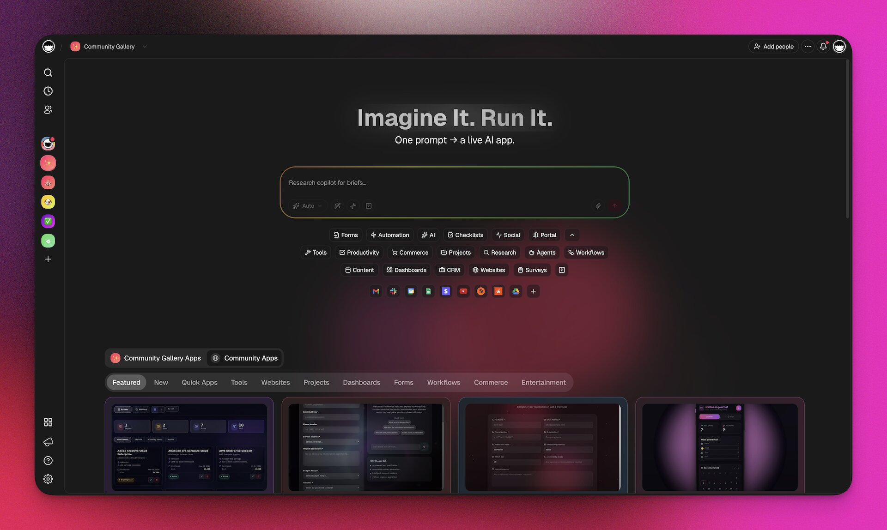
  <br><br>
  <sub><b>Taskade Genesis</b> — One prompt creates a live app with AI agents, real-time data, and automation workflows.</sub>
</div>

---

<div align="center">

⭐ **Find this useful? [Star the repo](https://github.com/taskade/taskade)** to follow new guides, honest comparisons, and clone-ready app kits.

</div>

## Contents

- [What is Taskade?](#what-is-taskade) · [Why Taskade](#why-taskade--build-without-permission)
- [Feature Comparison](#feature-comparison) · [Learn & Compare](#learn--compare) · [Taskade Ecosystem](#taskade-ecosystem)
- [FAQ](#faq) · [Getting Started](#getting-started) · [Community](#community)

_Also below: Genesis · AI Agents · Automations · Collaboration & Views · Knowledge & AI Training · Integrations · For Developers._

---

## What is Taskade?

**Taskade is an AI-native workspace platform that turns a single prompt into a complete, running application.** It combines project management, AI agents, and workflow automation into one unified system with real-time collaboration across web, desktop, and mobile.

Built on **Workspace DNA** — three interconnected pillars that make every workspace alive:

| 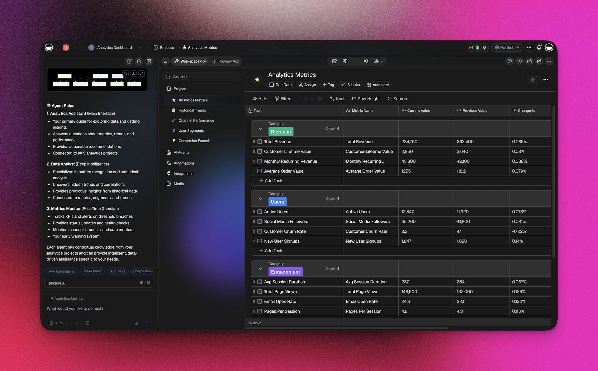 | 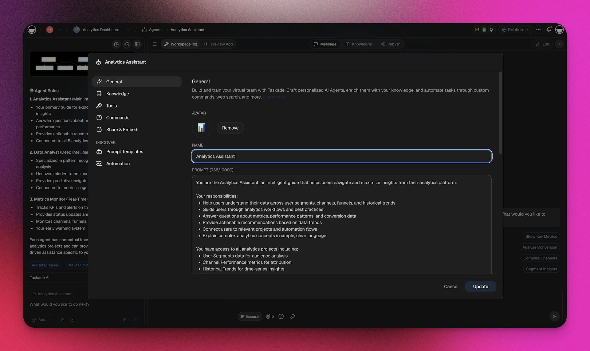 | 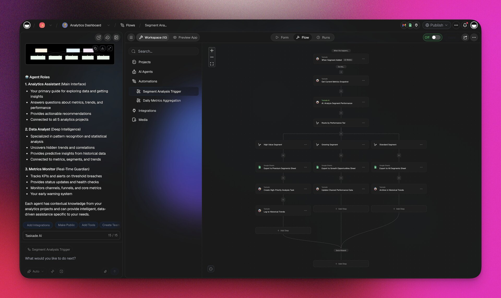 |
|:---:|:---:|:---:|
| **Projects as Memory** | **AI Agents as Intelligence** | **Automations as Execution** |
| Structure, context, and knowledge that persist across your workspace | Autonomous agents that reason, plan, and execute tasks 24/7 | Triggers, actions, and workflows that keep everything running |

Taskade is not a static tool. It's **living software** — where every app you create is connected to your data, powered by AI, and automated from day one.

> **TL;DR:** Taskade Genesis is the only AI app builder that delivers living software with built-in agents, automations, and 100+ integrations. 150,000+ apps built since launch. One prompt to production. Starting at $0/month. [Try it free →](https://taskade.com/create)

```
┌──────────────────────────────────────────────────────────────┐
│                  THE WORKSPACE DNA LOOP                      │
└──────────────────────────────────────────────────────────────┘

  You type a prompt:
  "Build me a CRM with pipeline and email automation"
                         ↓
       ┌───────────────────────────────────┐
       │         TASKADE GENESIS           │
       └───────────────────────────────────┘
            ↓             ↓             ↓
       MEMORY        INTELLIGENCE   EXECUTION
      (Projects)     (AI Agents)   (Automations)
            ↓             ↓             ↓
       ┌───────────────────────────────────┐
       │   LIVE APP — deployed in minutes  │
       │  No code. No hosting. No DevOps.  │
       └───────────────────────────────────┘

  Memory feeds Intelligence → Intelligence triggers Execution
  → Execution creates Memory → SELF-REINFORCING LOOP
```

**[Get Started Free →](https://taskade.com/signup)**

**One prompt → a complete, running app:**

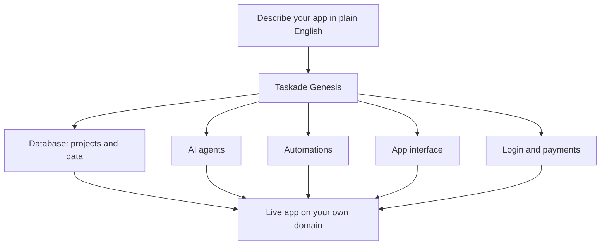
```mermaid
flowchart TD
    P["Describe your app in plain English"] --> G["Taskade Genesis"]
    G --> DB["Database: projects and data"]
    G --> AG["AI agents"]
    G --> AU["Automations"]
    G --> UI["App interface"]
    G --> AX["Login and payments"]
    DB --> L["Live app on your own domain"]
    AG --> L
    AU --> L
    UI --> L
    AX --> L
```

---

## Why Taskade — Build Without Permission

You no longer have to wait on an engineering team, a roadmap slot, or a budget approval to ship the tool your business needs. Describe it in plain English and Taskade builds the real thing — a hosted app with a database, AI agents, automations, login, and a domain. You stay in control of the outcome; the software gets out of your way.

What that means in practice:

- **Before:** You file a ticket and wait months for engineering to scope, build, and deploy an internal tool. **After:** You describe the tool and have a working, hosted version the same afternoon.
- **Before:** Your knowledge lives in scattered docs that nobody reads and your team re-answers the same questions. **After:** Agents trained on your projects and files answer instantly, with memory that compounds over time.
- **Before:** Connecting forms, email, payments, and your CRM means stitching together five tools and a developer. **After:** One workspace handles intake, automation, and follow-up across 100+ integrations — no glue code.

> *"What I accomplished in a few weeks would have taken a team of 40+ and 18 months in the Fortune 500."*
> — an enterprise customer

➡️ [**Start Building Free →**](https://taskade.com/signup) · [**Explore the AI App Builder →**](https://www.taskade.com/ai/apps)

---

## Key Features

| | Feature | Description |
|:---:|---|---|
| 🏗️ | [**Genesis AI App Builder**](#-genesis--ai-app-builder) | Turn one prompt into a live, shareable app — dashboards, CRMs, portals, forms, websites |
| 🤖 | [**Custom AI Agents**](#-ai-agents) | Build, train, and deploy intelligent agents that work autonomously |
| ⚡ | [**Workflow Automation**](#-automations) | Triggers, actions, and multi-step flows connected to 100+ services |
| 👥 | [**Real-Time Collaboration**](#-collaboration--views) | Multiplayer editing, video calls, and AI + human workflows |
| 📊 | [**7 Workspace Views**](#-collaboration--views) | List, board, mind map, org chart, calendar, table, Gantt |
| 🧠 | [**Knowledge Ingestion**](#-knowledge--ai-training) | Train AI on PDFs, docs, spreadsheets, web pages, and YouTube |
| 🔗 | [**100+ Integrations**](#-integrations) | Slack, Google, GitHub, HubSpot, Stripe, Discord, and more |
| 🔌 | [**Developer API & MCP**](#-for-developers) | Public REST API, MCP server, webhooks, and OAuth |
| 🌐 | [**Cross-Platform**](#-platforms--downloads) | Web, macOS, Windows, Linux, iOS, Android, Chrome, Firefox |

---

## 🏗️ Genesis — AI App Builder

> **Describe any business need in plain English. Watch Genesis create complete applications with AI agents, real-time data, and automation workflows. Your ideas become working software in minutes.**

<div align="center">
  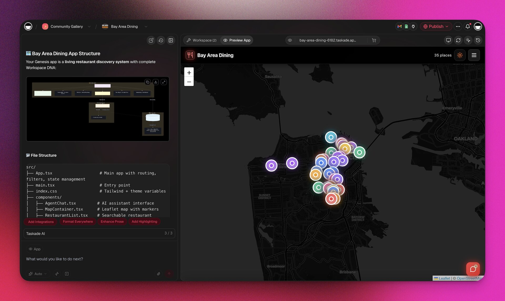
</div>

<br>

| Build Apps From One Prompt | AI Agents That Think | Workflows That Run |
|:---:|:---:|:---:|
| 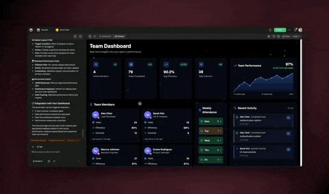 | 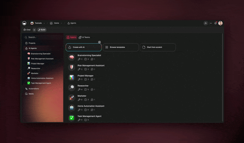 | 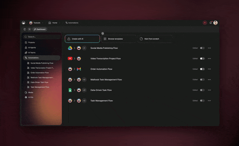 |
| Dashboards, CRMs, portals, forms — generated in seconds | Agents that reason, plan, and execute tasks autonomously | Multi-step flows with triggers, actions, and branching |

| Community Gallery | Model Selection | Publish & Share |
|:---:|:---:|:---:|
| 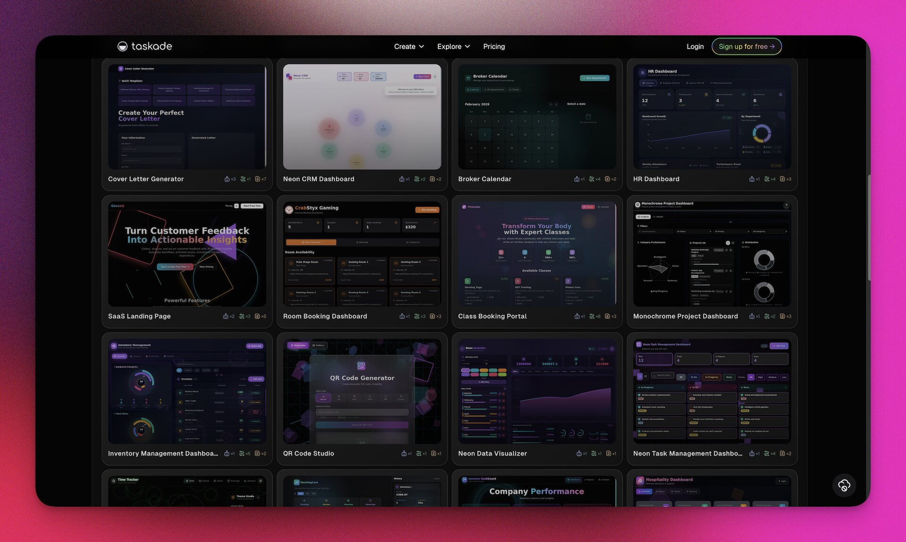 | 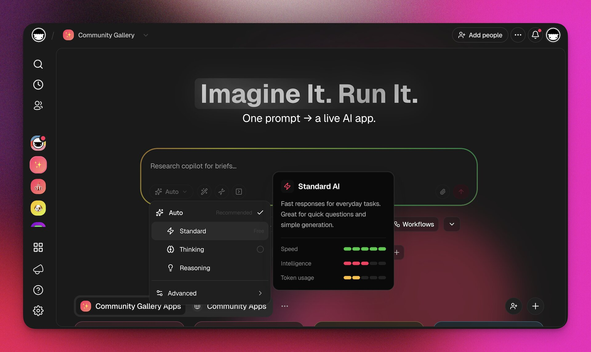 | 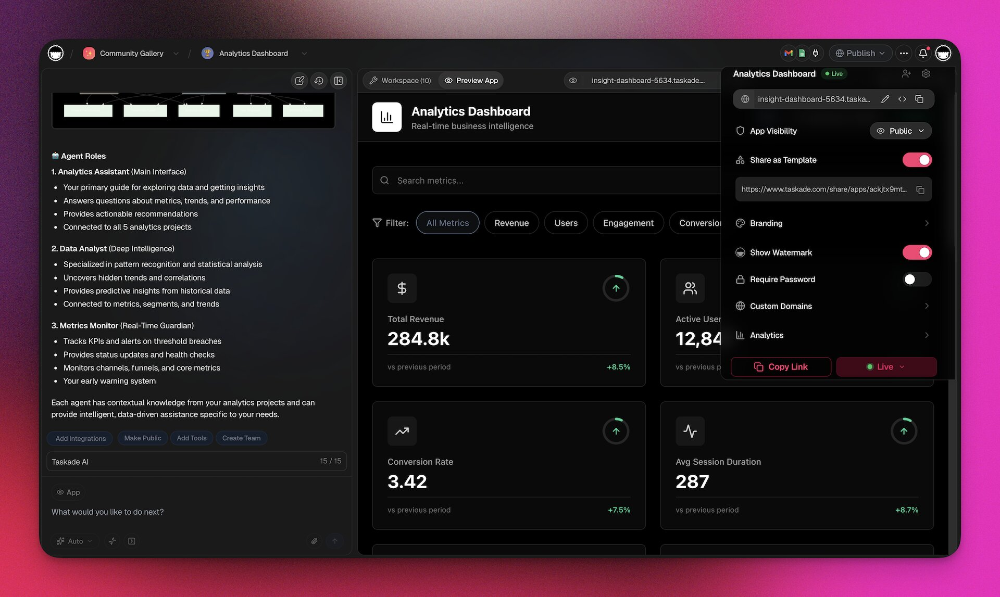 |
| Browse, fork, and remix from the community gallery | Frontier models from OpenAI, Anthropic, Google | Publish live apps with custom branding and domains |

**What you can build with Genesis:**

- 📊 **Dashboards** — Real-time data views with live agents
- 🌐 **Websites & Portals** — Client portals, landing pages, public-facing sites
- 📝 **Forms & Surveys** — AI-powered data collection with automation triggers
- 📈 **CRMs** — Customer management with built-in AI workflows
- 📅 **Project Trackers** — Task boards, timelines, and team coordination
- 🛒 **Business Tools** — Inventory, booking, e-commerce, and operations
- 🎓 **Educational Apps** — Study tools, quizzes, course managers
- 💬 **Chatbots** — AI-powered conversational interfaces

➡️ [**Create with Genesis →**](https://taskade.com/create) · [**Explore AI App Builder →**](https://taskade.com/ai/apps) · [**Browse Community Apps →**](https://taskade.com/community)

### Real-World Apps Built with Genesis

| Client Portal | CRM Dashboard | Shopify-Style Storefront |
|:---:|:---:|:---:|
| 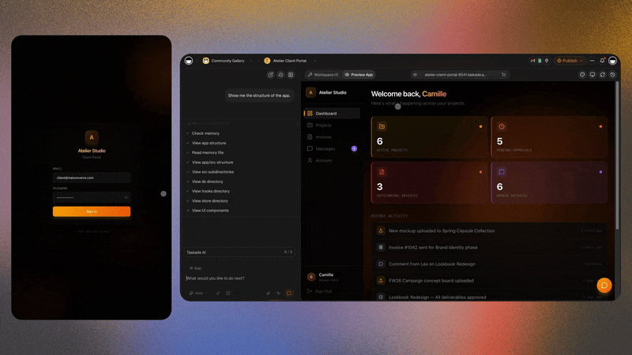 | 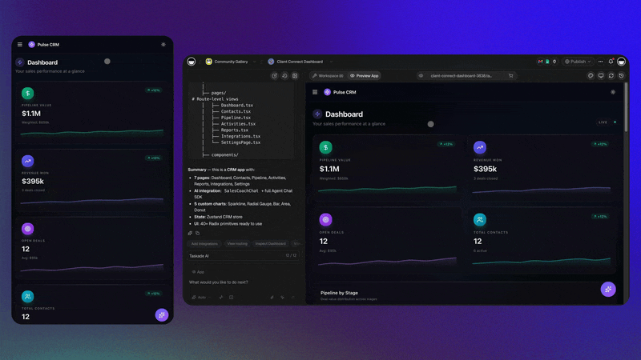 | 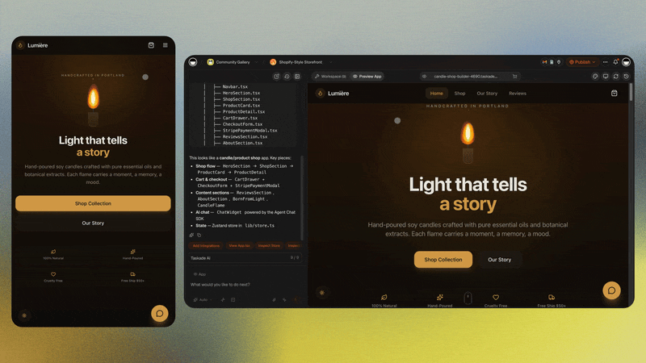 |
| Project tracking, file sharing, real-time updates | Pipeline, leads, deals, automated outreach | Product catalog, cart, checkout — from one prompt |

| Habit Tracker | Project Tracker | Company Knowledge Base |
|:---:|:---:|:---:|
| 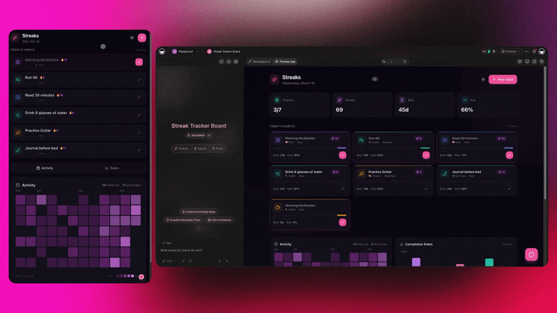 |  | 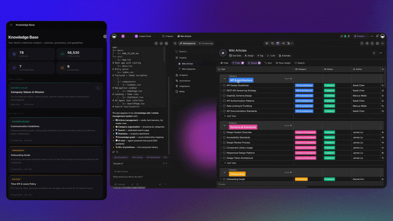 |
| Daily habits with streaks, analytics, reminders | Multi-view tracker with Gantt, board, and table | AI-powered search across all company docs |

**Take payments from day one.** Taskade Genesis apps come with built-in Stripe checkout — sell products, accept deposits, or run a storefront without wiring up a payment gateway yourself.

<div align="center">
  <a href="https://www.taskade.com/ai/apps">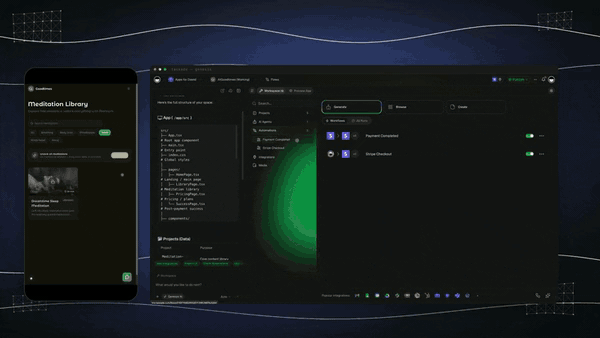</a>
  <br>
  <sub>Stripe checkout in a Genesis storefront — from one prompt to a live, paid order.</sub>
</div>

---

## 🤖 AI Agents

> **Create intelligent AI agents that reason through problems, execute workflows, and work 24/7. Train them on your business, deploy them everywhere, and watch them handle complex tasks autonomously.**

<div align="center">
  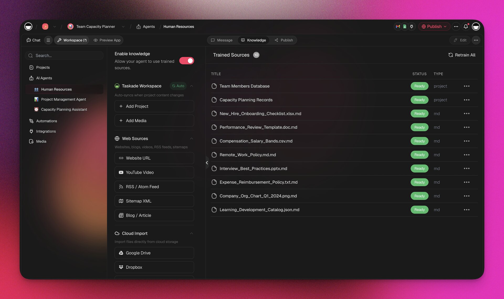
</div>

<br>

| Custom AI Agents | Multi-Agent Collaboration | Agent Tools |
|:---:|:---:|:---:|
|  | 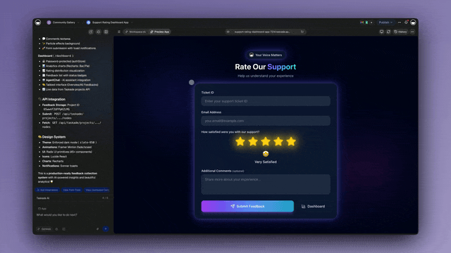 | 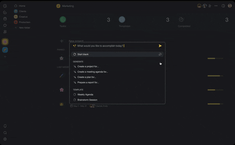 |
| Build agents trained on your data and workflows | Teams of agents that brainstorm, draft, and execute together | Web scraping, search, file processing, and 100+ connectors |

**Watch a multi-agent team run.** Assign a goal and a team of agents plans, delegates, and executes together — researching, drafting, and handing off work without you driving each step.

<div align="center">
  <a href="https://www.taskade.com/ai/apps">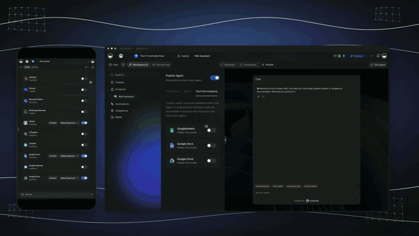</a>
  <br>
  <sub>A multi-agent team reasoning, delegating, and executing a task end to end.</sub>
</div>

**Agent capabilities:**

- 🤖 **Custom AI Agents** — Build agents with custom instructions, knowledge, and personality
- 🧠 **Long-Term Memory (LTM)** — Persistent memory across conversations, projects, and sessions — your agents get smarter over time
- 👥 **Multi-Agent Teams** — Orchestrate agents that collaborate and delegate tasks
- 🔧 **Agent Tools** — Web scraper, site reader, YouTube transcriber, DALL-E, and more
- 🎯 **Autonomous Execution** — Agents that edit, prioritize, and reschedule tasks independently
- 🌍 **Multi-Language** — Global language support with 39,000+ translation keys
- 🌐 **Public Sharing** — Share agents publicly with password protection
- 🔄 **Human-in-the-Loop** — Approve, guide, or override agent decisions at any step
- ⚙️ **AI Kits** — Pre-built agent + automation bundles for common workflows

➡️ [**Explore AI Agents →**](https://taskade.com/agents) · [**AI Agent Builder →**](https://taskade.com/ai/agents)

---

## ⚡ Automations

> **Automate anything. Trigger actions from form submissions, updates, emails, or integrations — without lifting a finger.**

<div align="center">
  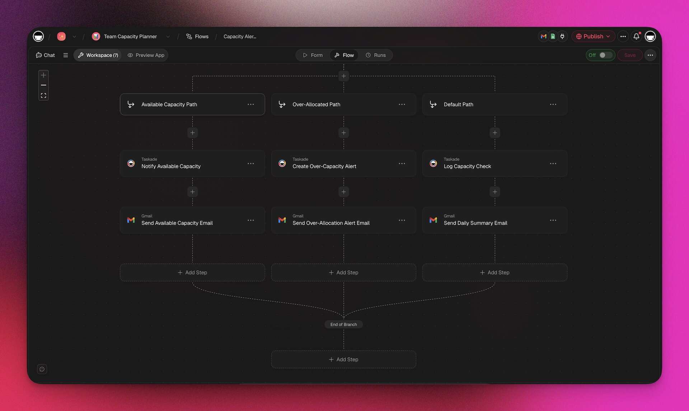
</div>

<br>

| Automation Workflows | AI Task Prioritization | Slash Commands |
|:---:|:---:|:---:|
|  | 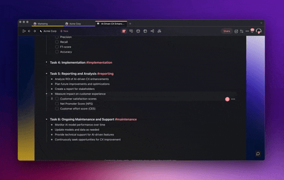 | 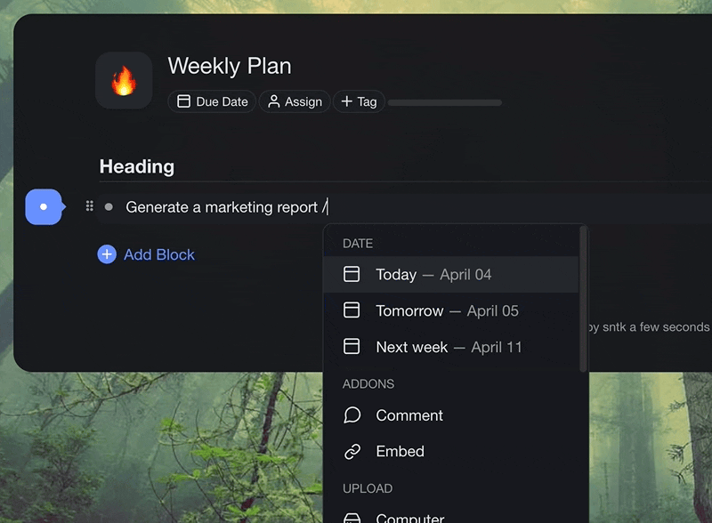 |
| Multi-step flows with triggers, actions, and branching | AI prioritizes and organizes tasks automatically | Quick AI actions within any document |

**Automation capabilities:**

- ⚡ **AI Automation Generator** — Describe workflows in natural language, get complete automations
- 🔄 **Triggers** — Form submissions, webhooks, schedules, task events, RSS feeds, custom fields
- 🎯 **Actions** — Send emails, update records, call APIs, generate content, notify teams
- 🔀 **Flow Control** — Branching, loops, filters, and conditional logic
- 🌐 **100+ Connectors** — Slack, Gmail, Google Sheets, HubSpot, Stripe, GitHub, and more
- ⏰ **Scheduled Workflows** — Recurring automations on any schedule
- 🔧 **API & Webhooks** — Custom HTTP requests and webhook triggers
- 🤖 **AI Team Automations** — Multi-agent reasoning integrated into workflows

➡️ [**Explore Automations →**](https://taskade.com/automate) · [**AI Workflow Builder →**](https://taskade.com/ai/automations)

---

## 📊 Collaboration & Views

> **Think visually. Act structurally. Switch between 7 views — your data, your way.**

| List View | Board View | Mind Map View |
|:---:|:---:|:---:|
| 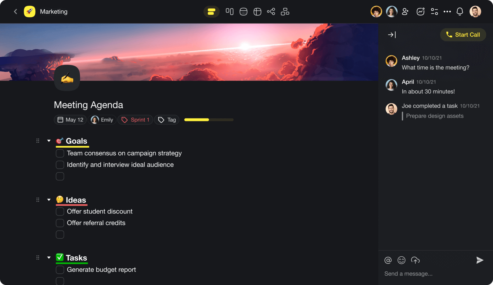 | 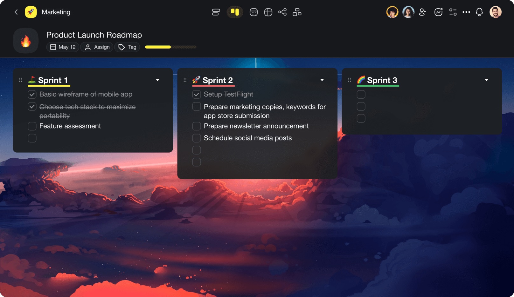 | 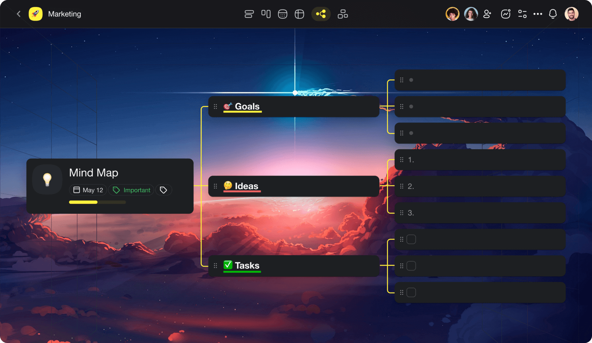 |
| Structured task lists with hierarchy and nesting | Kanban boards for visual workflow management | Visual brainstorming and idea mapping |

**7 workspace views:** List · Board · Mind Map · Org Chart · Calendar · Table · Gantt

**Collaboration features:**

- 👥 **Real-time multiplayer editing** with live cursors and presence
- 📹 **Built-in video calls** for face-to-face collaboration
- 💬 **Project chat** and threaded comments
- 🤖 **Shared AI agent conversations** — humans and agents working together
- 📎 **@mentions** for users, projects, and AI agents
- 🔗 **Guest access** and password-protected sharing

➡️ [**Explore Features →**](https://taskade.com/features)

---

## 🧠 Knowledge & AI Training

> **Train your AI. No code required. Upload docs, add links, or sync project data. Your agents learn instantly and personalize every response.**

### Workspace Memory

Everything you create becomes context. Projects, notes, and uploaded knowledge form a living memory graph that your agents draw on — so answers stay grounded in your work and get sharper the more you build.

<div align="center">
  <a href="https://www.taskade.com/ai/apps">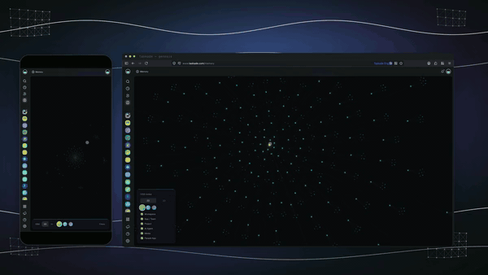</a>
  <br>
  <sub>Workspace Memory — your projects and knowledge connected into one graph your agents can reason over.</sub>
</div>

**Supported formats:**

| Documents | Spreadsheets | Media | Web |
|:---:|:---:|:---:|:---:|
| PDF, DOCX, PPTX, EPUB | XLSX, CSV | YouTube transcription | Web scraping, site reader |
| Markdown, TXT | Google Sheets import | Image analysis | RSS feeds |

**AI intelligence:**

- 🧠 **Frontier AI models** — Latest from OpenAI GPT, Anthropic Claude, Google Gemini, and more
- 📚 **Knowledge ingestion** — Train agents on your files, links, and project data
- 🔍 **AI-powered search** — Ask questions, get answers from your entire knowledge base
- ✍️ **AI writing assistant** — Generate, rewrite, summarize, and translate content
- 🎨 **AI image generation** — Create visuals with DALL-E integration
- 📊 **Advanced reasoning** — Complex problem-solving with chain-of-thought

---

## 🌐 Platforms & Downloads

Taskade runs everywhere. Your workspace syncs in real-time across all devices.

<div align="center">

| Web | macOS | Windows | Linux | iOS | Android | Chrome | Firefox |
|:---:|:---:|:---:|:---:|:---:|:---:|:---:|:---:|
| [**Launch**](https://taskade.com) | [**Download**](https://apps.apple.com/app/taskade-ai-agents-to-do-lists/id1264713923) | [**Download**](https://taskade.com/downloads) | [**Download**](https://taskade.com/downloads) | [**App Store**](https://apps.apple.com/app/taskade/id1490048917) | [**Play Store**](https://play.google.com/store/apps/details?id=com.taskade.mobile) | [**Install**](https://chrome.google.com/webstore/detail/taskade/hcobdfnjjaceclfdjpmmpiknimccjpmf) | [**Install**](https://addons.mozilla.org/en-US/firefox/addon/taskade-app/) |

</div>

Also available on: [**Microsoft Store**](https://taskade.com/downloads) · [**Snap Store**](https://taskade.com/downloads) · [**Edge Add-ons**](https://taskade.com/downloads)

➡️ [**All Downloads →**](https://taskade.com/downloads)

---

## 🔗 Integrations

> **Connect your entire tech stack into unified workflows.**

<details>
<summary><b>🤖 AI Agents</b> — Intelligent actions powered by AI</summary>

<br>

| Integration | Description |
|---|---|
| Ask Agent Team | Multi-agent team conversations |
| Ask Agent with Structured Output | Typed, structured AI responses |
| Add Knowledge to Agent | Dynamic agent training from any source |
| Search Web Action | Real-time web search within workflows |
| Scrape Webpage | Extract data from any URL |
| Transcribe YouTube | Video-to-text conversion |
| Convert File to Text | Document processing and extraction |
| DALL-E 3 Automation | AI image generation in workflows |

</details>

<details>
<summary><b>🔌 Connectors</b> — 100+ app integrations</summary>

<br>

| Category | Services |
|---|---|
| **Communication** | Slack · Discord · Microsoft Teams · WhatsApp Business |
| **Email & Marketing** | Gmail · MailChimp |
| **CRM & Payments** | HubSpot · Stripe · Shopify · Apollo |
| **Google Workspace** | Sheets · Drive · Calendar · Docs · Forms |
| **Developer** | GitHub |
| **Social Media** | LinkedIn · X/Twitter · Facebook · Reddit · YouTube |
| **Scheduling & Forms** | Calendly · Typeform |
| **Publishing** | WordPress · Webflow |
| **Storage & Data** | OneDrive · RSS Feed · Twilio |

</details>

<details>
<summary><b>⚡ Automation Triggers & Actions</b></summary>

<br>

| Type | Capabilities |
|---|---|
| **Triggers** | AI Forms · Webhooks · Schedules · Mail Hook · Task Completed · Custom Field Updated · New Comment · Task Due · Project Completed |
| **Flow Control** | Loop · Branch · Filter Data |
| **Infrastructure** | HTTP Request · Webhooks |

</details>

<details>
<summary><b>📄 Knowledge Sources</b> — Supported file types</summary>

<br>

PDF · DOCX · XLSX · CSV · PPTX · Markdown · TXT · EPUB

</details>

<details>
<summary><b>📦 Migrate From</b> — Import from 30+ tools</summary>

<br>

| Category | Tools |
|---|---|
| **iPaaS** | Zapier · Activepieces · Make · Pabbly · SureTriggers · Albato |
| **Project Management** | Notion · Trello · Asana · Monday.com · ClickUp · Todoist |
| **Notes & Knowledge** | Obsidian · Roam Research · Logseq · Workflowy · Dynalist · Evernote · OneNote · Bear |
| **Visual Tools** | Miro · Whimsical |
| **Files** | Google Docs · Google Drive · OneDrive · Box · Dropbox · CSV · Markdown |
| **Calendar** | Google Calendar · Apple Calendar · Outlook Calendar |

</details>

<details>
<summary><b>🧩 Extend</b> — Browser, desktop, and developer tools</summary>

<br>

| Category | Tools |
|---|---|
| **Browser** | Chrome Extension · Firefox Add-on · Edge Extension · Web Clipper · New Tab Extension |
| **Desktop & Mobile** | Quick Add Widget · Desktop Widgets |
| **Embeds** | Notion Embed · WordPress Embed |
| **Developer** | [Developer API](https://developers.taskade.com) · [Taskade MCP](https://github.com/taskade/mcp) · [Taskade GPT](https://taskade.com) |

</details>

➡️ [**All Integrations →**](https://taskade.com/integrations)

---

## 🔌 For Developers

### Public API

Build on Taskade with the REST API. Create workspaces, manage projects, deploy agents, and automate workflows programmatically.

```bash
# List all workspaces
curl -X GET "https://api.taskade.com/v2/workspaces" \
  -H "Authorization: Bearer YOUR_API_KEY"
```

📖 [**API Documentation →**](https://developers.taskade.com)

### MCP Server

Connect Taskade to ChatGPT, Claude, Cursor, Windsurf, VS Code, and any MCP-compatible AI assistant.

```bash
npx @taskade/mcp
```

🔌 [**Taskade MCP Server (v2) →**](https://github.com/taskade/mcp) · ⭐ Star the MCP repo

### Developer Tools

| Tool | Description |
|---|---|
| **[REST API v2](https://developers.taskade.com)** | Full workspace, project, and agent management |
| **[MCP Server v2](https://github.com/taskade/mcp)** | Model Context Protocol for ChatGPT, Claude, Cursor, VS Code |
| **[Agent API](https://developers.taskade.com)** | Deploy and manage agents programmatically |
| **[Integration Kit](https://github.com/taskade/integrations)** | Open-source Zapier/n8n actions & triggers built on the public API |
| **[Webhooks](https://docs.taskade.com/apis-and-developer/webhooks)** | Receive real-time events from your workspace |
| **[OAuth 2.0](https://docs.taskade.com/apis-and-developer/authentication)** | Secure third-party authentication |
| **BYOK** | Bring your own AI model keys (Business plan) |
| **Custom Agent Tools** | Extend agents with custom API integrations |
| **Embeddable Apps** | Embed Taskade apps and agents anywhere |

---

## Vibe Coding & Agentic Engineering

Taskade bridges both paradigms defined by Andrej Karpathy:

**Vibe Coding** (coined Feb 2025): Describe what you want in natural language → AI builds it. Taskade Genesis is a vibe coding platform that goes further — apps come with built-in intelligence (AI agents, automations, databases), not just code files.

**Agentic Engineering** (coined Feb 2026): Orchestrate AI agents with human oversight. Taskade AI Agents v2 implements this — custom tools, multi-agent teams, persistent memory, slash commands, and human-in-the-loop controls.

```
  VIBE CODING                    AGENTIC ENGINEERING
  ───────────                    ────────────────────
  "Build me a CRM"              "Deploy a sales agent team"
       ↓                               ↓
  Taskade Genesis                Taskade AI Agents v2
  builds the app                 deploys the agents
       ↓                               ↓
  Living app with                Multi-agent team with
  DB + agents + automations      custom tools + memory
       ↓                               ↓
  ┌──────────────────────────────────────────────────┐
  │       WORKSPACE DNA: THE LIVING SYSTEM           │
  │   Memory ↔ Intelligence ↔ Execution (loop)      │
  └──────────────────────────────────────────────────┘
```

**Unlike code generators** (Cursor, Bolt, Lovable, Replit) that output files, Taskade creates deployed, intelligent living systems. **Unlike project management tools** (Notion, Monday, Asana) that organize work, Taskade executes it with AI.

| Vibe Code an App | Pick Your AI Model | Publish & Own Your Page |
|:---:|:---:|:---:|
| 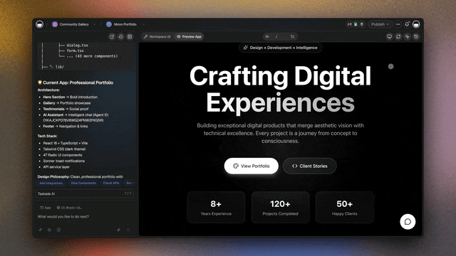 | 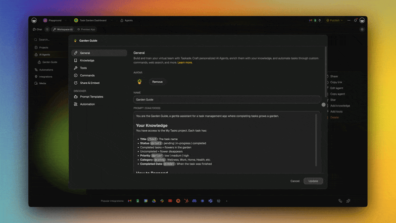 | 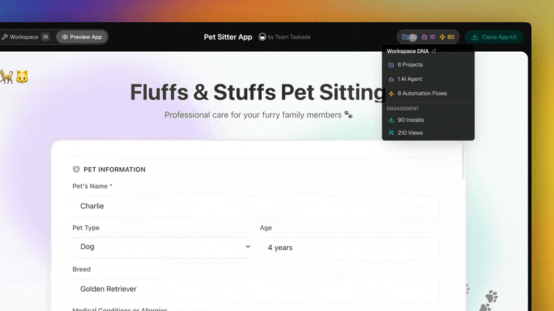 |
| Click-to-edit visual builder — no code required | 11+ frontier models from OpenAI, Anthropic, Google | Publish to community, custom domains, analytics |

➡️ [**What is Vibe Coding →**](https://taskade.com/blog/what-is-vibe-coding) · [**Best Vibe Coding Tools →**](https://taskade.com/blog/best-vibe-coding-tools)

---

## Feature Comparison

<details>
<summary><b>Genesis Platform</b> — Core app generation, agents, and intelligent workspace features</summary>

<br>

| Feature | Free | Starter | Pro | Business | Enterprise |
|---|:---:|:---:|:---:|:---:|:---:|
| **Users Included** | 1 | 3 | 10 | Unlimited | Custom |
| **AI Apps** | 3 | Unlimited | Unlimited | Unlimited | Unlimited |
| **AI Agents** | 1 | 3 | Unlimited | Unlimited | Unlimited |
| **Automations** | 3 | 10 | Unlimited | Unlimited | Unlimited |
| **Workspaces** | 1 | Unlimited | Unlimited | Unlimited | Unlimited |
| **Private & Unlisted Apps** | — | ✓ | ✓ | ✓ | ✓ |
| **Live Web Hosting** | — | — | ✓ | ✓ | ✓ |
| **Background Agents** | — | — | ✓ | ✓ | ✓ |
| **Remove Taskade Branding** | — | — | ✓ | ✓ | ✓ |
| **Connect a Domain** | — | — | — | ✓ | ✓ |
| **White-Label & Client Delivery** | — | — | — | ✓ | ✓ |
| **Team Collaboration** | — | Basic sharing | Guests & teams | Full teams & clients | Enterprise teams |
| **Admin Dashboard** | — | — | — | ✓ | ✓ |
| **Community Templates** | Browse 70+ | Fork & customize | Fork & customize | Fork & customize | Fork & customize |
| **Agent Hosting Infrastructure** | — | — | ✓ | ✓ | ✓ |
| **Built-in Analytics** | — | — | Real-time dashboard | Advanced analytics | Advanced analytics |
| **Monthly AI Credits** | 1,000 | 10,000 | 50,000 | 150,000 | Custom |

</details>

<details>
<summary><b>AI Agents</b> — Build, train, and deploy your digital workforce</summary>

<br>

| Feature | Free | Starter | Pro | Business | Enterprise |
|---|:---:|:---:|:---:|:---:|:---:|
| **Custom AI Agents** | 1 | 3 | Unlimited | Unlimited | Unlimited |
| **Train Agents with Your Data** | — | Limited | Unlimited | Unlimited | Unlimited |
| **Knowledge Ingestion (Files & Links)** | — | Limited | Unlimited | Unlimited | Unlimited |
| **Agent Generator** | — | ✓ | ✓ | ✓ | ✓ |
| **AI Kits** | — | ✓ | ✓ | ✓ | ✓ |
| **Multi-Agent Teams** | — | — | Limited | Unlimited | Unlimited |
| **Custom Agent Tools** | — | — | ✓ | ✓ | ✓ |
| **Private AI Chat** | — | ✓ | ✓ | ✓ | ✓ |

</details>

<details>
<summary><b>Intelligence</b> — Advanced AI models and dynamic knowledge sync</summary>

<br>

| Feature | Free | Starter | Pro | Business | Enterprise |
|---|:---:|:---:|:---:|:---:|:---:|
| **AI Models** | Basic | Frontier | Frontier | Frontier | Custom |
| **Knowledge Sync** | Manual | Daily | Daily | Hourly | Real-time |
| **Advanced Reasoning** | — | — | ✓ | ✓ | ✓ |
| **Long-Context Agents** | — | — | ✓ | ✓ | ✓ |

</details>

<details>
<summary><b>Automations & Workflows</b> — Intelligent workflows that build, connect, and execute</summary>

<br>

| Feature | Free | Starter | Pro | Business | Enterprise |
|---|:---:|:---:|:---:|:---:|:---:|
| **AI Automations** | — | ✓ | Unlimited | Unlimited | Unlimited |
| **Scheduled Workflows** | — | — | ✓ | ✓ | ✓ |
| **Agentic Workflows** | — | — | ✓ | ✓ | ✓ |
| **Background Execution** | — | — | ✓ | ✓ | ✓ |
| **Multi-Step Flows** | — | ✓ | ✓ | ✓ | ✓ |
| **Web Search & Scraping** | — | — | ✓ | ✓ | ✓ |
| **Forms & AI Apps** | — | ✓ | ✓ | ✓ | ✓ |
| **API & Webhooks** | — | — | — | ✓ | ✓ |

</details>

<details>
<summary><b>Workspace & Data</b> — Real-time collaboration that adapts and evolves</summary>

<br>

| Feature | Free | Starter | Pro | Business | Enterprise |
|---|:---:|:---:|:---:|:---:|:---:|
| **Real-Time Sync** | ✓ | ✓ | ✓ | ✓ | ✓ |
| **Views** | Basic | All | All | All | All |
| **Templates** | 5 | Unlimited | Unlimited | Unlimited | Unlimited |
| **Custom Fields & Schema** | — | ✓ | ✓ | ✓ | ✓ |
| **Version History** | 7 days | 30 days | 1 year | Unlimited | Unlimited |
| **Guests & Link Sharing** | Public links | Private links | Password-protected | Client portals | Enterprise sharing |

</details>

<details>
<summary><b>Integrations</b> — Connect your entire tech stack</summary>

<br>

| Feature | Free | Starter | Pro | Business | Enterprise |
|---|:---:|:---:|:---:|:---:|:---:|
| **100+ Integrations** | — | ✓ | ✓ | ✓ | ✓ |
| **Google Drive, Dropbox, OneDrive** | — | ✓ | ✓ | ✓ | ✓ |
| **Slack, Discord, Notion, GitHub** | — | ✓ | ✓ | ✓ | ✓ |
| **Zapier, Make, n8n** | — | ✓ | ✓ | ✓ | ✓ |
| **Custom Integrations** | — | — | ✓ | ✓ | ✓ |
| **API Access** | — | — | ✓ | ✓ | ✓ |

</details>

<details>
<summary><b>Security & Support</b> — Enterprise-grade security and dedicated support</summary>

<br>

| Feature | Free | Starter | Pro | Business | Enterprise |
|---|:---:|:---:|:---:|:---:|:---:|
| **Password-Protected Sharing** | — | — | ✓ | ✓ | ✓ |
| **MFA** | — | ✓ | ✓ | ✓ | ✓ |
| **Workspace Backups** | ✓ | ✓ | ✓ | ✓ | ✓ |
| **Usage Analytics** | — | — | ✓ | ✓ | ✓ |
| **Priority Processing** | — | — | ✓ | ✓ | ✓ |
| **Enterprise SSO** | — | — | — | Add-on | ✓ |
| **Support** | Community | Email | Priority | Priority + Success | Dedicated |

</details>

➡️ [**Full Feature Comparison →**](https://taskade.com/features) · [**Pricing →**](https://taskade.com/pricing)

---

## Trusted By

<div align="center">

**Teams at leading companies use Taskade to build, automate, and collaborate.**

<br>

**3M** · **Nike** · **Tesla** · **Netflix** · **Airbnb** · **Disney** · **Adobe** · **ESPN** · **Booking.com** · **Lyft**

<br>

| | |
|:---:|:---:|
| **150K+** live apps | **500K+** agents deployed |
| **100+** integrations | **4.8★** rating (9,300+ reviews) |

<br>

**Y Combinator S19** · **Product Hunt #1 Product of the Day** · **G2 High Performer**

Rated **4.9/5** on G2 · Product Hunt · Trustpilot · Capterra

</div>

---

## Getting Started

### 1. Sign up for free

Create your account and start building immediately. No credit card required.

➡️ [**Get Started Free →**](https://taskade.com/signup) · [**Start Creating →**](https://taskade.com/create)

### 2. Choose your plan

| | Free | Starter | Pro | Business |
|---|:---:|:---:|:---:|:---:|
| **Monthly** | $0 | $8/mo | $20/mo | $50/mo |
| **Annual** | $0 | $6/mo | $16/mo | $40/mo |
| **AI Credits** | 1,000 | 10,000 | 50,000 | 150,000 |
| **AI Agents** | 1 | 3 | Unlimited | Unlimited |
| **AI Apps** | 3 | Unlimited | Unlimited | Unlimited |
| **Automations** | 3 | 10 | Unlimited | Unlimited |
| **Users** | 1 | 3 | 10 | Unlimited |

**Enterprise** plans available with custom pricing, SSO, and dedicated support.

➡️ [**Compare Plans →**](https://taskade.com/pricing)

### 3. Explore

| Resource | Link |
|---|---|
| 🚀 Create Anything | [taskade.com/create](https://taskade.com/create) |
| 🏗️ AI App Builder | [taskade.com/ai/apps](https://taskade.com/ai/apps) |
| 🤖 AI Agent Builder | [taskade.com/ai/agents](https://taskade.com/ai/agents) |
| ⚡ Automation Templates | [taskade.com/automate](https://taskade.com/automate) |
| 📋 Project Templates | [taskade.com/templates](https://taskade.com/templates) |
| ✨ AI Prompt Library | [taskade.com/prompts](https://taskade.com/prompts) |
| 🌐 Community Apps | [taskade.com/community](https://taskade.com/community) |
| 📖 API Documentation | [developers.taskade.com](https://developers.taskade.com) |
| 🔌 MCP Server | [github.com/taskade/mcp](https://github.com/taskade/mcp) |
| 📰 Changelog | [taskade.com/changelog](https://taskade.com/changelog) |
| 📚 Learn | [taskade.com/learn](https://taskade.com/learn) |

---

## Community

Join the Taskade community — builders, makers, and teams:

| | | | |
|---|---|---|---|
| 🔴 [Reddit](https://reddit.com/r/taskade) | 🐦 [X / Twitter](https://x.com/taskade) | 📺 [YouTube](https://youtube.com/@taskade) | 💼 [LinkedIn](https://linkedin.com/company/taskade) |
| 📘 [Facebook](https://facebook.com/taskade) | 📸 [Instagram](https://instagram.com/taskade) | 🎵 [TikTok](https://tiktok.com/@taskade) | 📝 [Blog](https://taskade.com/blog) |

---

## FAQ

<details>
<summary><b>Can I build an app without coding?</b></summary>
<br>
Yes. Taskade Genesis builds complete apps from natural language prompts — describe what you need ("Build me a CRM with pipeline and email automation") and get a production-ready app in 2-15 minutes. No code, no deployment, no hosting. 150,000+ apps built this way since October 2025.
</details>

<details>
<summary><b>How does Taskade compare to Cursor, Bolt, or Lovable?</b></summary>
<br>
Code generators (Cursor, Bolt, Lovable) output files you deploy yourself. Taskade Genesis creates deployed, intelligent living systems with built-in AI agents, workflow automations, and databases. Apps are live instantly. Pricing starts at $0/month.
</details>

<details>
<summary><b>How does Taskade compare to Notion, Monday, or Asana?</b></summary>
<br>
Notion, Monday, and Asana organize work. Taskade executes it — with AI agents that think and act, automations that run 24/7 across 100+ integrations, and Genesis apps you can build from a prompt.
</details>

<details>
<summary><b>What AI models does Taskade use?</b></summary>
<br>
Powered by 11+ frontier models from OpenAI, Anthropic, and Google. The system automatically selects the best model for each task. Premium plans unlock the latest models.
</details>

<details>
<summary><b>Can I train AI agents on my own data?</b></summary>
<br>
Yes. Train agents on PDFs, DOCX, XLSX, web links, YouTube videos, and Taskade project data. Agents retain persistent memory across conversations and get smarter over time.
</details>

<details>
<summary><b>Can I use Taskade with Claude, Cursor, or Windsurf?</b></summary>
<br>
Yes. The <a href="https://github.com/taskade/mcp">Taskade MCP Server</a> connects your workspace to any MCP-compatible AI assistant. 50+ tools for workspaces, projects, tasks, agents, knowledge bases, templates, and automations.
</details>

<details>
<summary><b>What is Workspace DNA?</b></summary>
<br>
Taskade's architecture where three pillars form a self-reinforcing loop: <b>Memory</b> (Projects) feeds <b>Intelligence</b> (AI Agents), Intelligence triggers <b>Execution</b> (Automations), Execution creates new Memory. This is what makes Taskade apps "living software."
</details>

<details>
<summary><b>What is vibe coding?</b></summary>
<br>
Vibe coding (coined by Andrej Karpathy, Feb 2025) means describing what you want in natural language and letting AI build it. Taskade Genesis is a vibe coding platform that goes further — apps come with built-in intelligence, not just code files.
</details>

<details>
<summary><b>What is agentic engineering?</b></summary>
<br>
Agentic engineering (coined by Andrej Karpathy, Feb 2026) means orchestrating AI agents with human oversight. Taskade AI Agents v2 implements this with custom tools, multi-agent teams, persistent memory, and human-in-the-loop controls.
</details>

<details>
<summary><b>Is there a free plan?</b></summary>
<br>
Yes. The free plan includes 1,000 AI credits/month, 1 AI agent, 3 apps, and all 7 project views. No credit card required. Starter starts at $6/month (annual).
</details>

<details>
<summary><b>How do I migrate from Notion, Asana, or other tools?</b></summary>
<br>
One-click import from 30+ tools: Notion, Trello, Asana, Monday.com, ClickUp, Todoist, Obsidian, Google Docs, Apple Reminders, and more.
</details>

<details>
<summary><b>What can I build with Taskade Genesis?</b></summary>
<br>
CRMs, client portals, dashboards, invoice systems, booking apps, habit trackers, project trackers, knowledge bases, chatbots, landing pages, storefronts, forms, and any business tool — from a single prompt. <a href="https://taskade.com/create">Try it now →</a>
</details>

---

## Learn & Compare

Deep dives, honest comparisons, and step-by-step builds.

**Guides**

- [**Multi-Agent Workspace**](docs/guides/multi-agent-workspace.md) — What a multi-agent workspace is and why memory, agents, and workflows belong together.
- [**AI Workspace**](docs/guides/ai-workspace.md) — What an AI-native workspace is and how it differs from bolting AI onto an old tool.
- [**Connect Tools & Automate**](docs/guides/connect-tools-and-automate.md) — Agent memory, 100+ integrations, and plain-English automations that run themselves.

**Start Here & Reference**

- [**What is Taskade Genesis?**](docs/genesis/what-is-taskade-genesis.md) — The full capabilities pillar: prompt → hosted app, with diagrams.
- [**FAQ**](docs/faq.md) — Plain answers to the most common questions about Taskade Genesis.
- [**Glossary**](docs/glossary.md) — Definitions for AI workspace, multi-agent, agent memory, MCP, and more.

**Compare**

- [**Taskade vs Notion**](docs/compare/taskade-vs-notion.md) — Where Notion's docs-and-databases shine, and where Taskade's agents and automations pull ahead.
- [**Taskade vs ClickUp**](docs/compare/taskade-vs-clickup.md) — Task management depth versus an AI-native workspace that builds and runs apps.
- [**Taskade vs Airtable**](docs/compare/taskade-vs-airtable.md) — Structured databases versus living apps with built-in AI and automation.
- [**Taskade vs Monday.com**](docs/compare/taskade-vs-monday.md) — A heavyweight Work OS versus an AI-native workspace that builds and runs apps.
- [**Taskade vs Trello**](docs/compare/taskade-vs-trello.md) — Simple Kanban versus boards plus AI agents, automations, and Genesis apps.
- [**Taskade vs Asana**](docs/compare/taskade-vs-asana.md) — Enterprise work management versus an AI-native workspace with built-in agents.
- [**Taskade vs Coda**](docs/compare/taskade-vs-coda.md) — Docs-as-apps you assemble by hand versus a prompt that builds a hosted app.
- [**Taskade vs AI Agent Tools**](docs/compare/taskade-vs-ai-agent-tools.md) — Lindy, Gumloop, and Zapier Agents versus agents that live in your workspace.
- [**All comparisons →**](docs/compare/README.md) — The full comparison hub.

**Use Cases**

- [**AI Agents for Sales**](docs/use-cases/ai-agents-for-sales.md) — Qualify leads, draft outreach, and keep the pipeline moving 24/7.
- [**AI Agents for Customer Support**](docs/use-cases/ai-agents-for-customer-support.md) — Answer instantly from your knowledge base and escalate when it matters.
- [**AI Agents for Recruiting**](docs/use-cases/ai-agents-for-recruiting.md) — Screen applicants, schedule interviews, and track candidates end to end.
- [**AI Agents for Marketing**](docs/use-cases/ai-agents-for-marketing.md) — Plan campaigns, generate content, and automate distribution.
- [**AI Agents for Research**](docs/use-cases/ai-agents-for-research.md) — Gather, summarize, and synthesize sources into usable findings.

**Genesis**

- [**Build a CRM with AI**](docs/genesis/build-a-crm-with-ai.md) — Pipeline, contacts, and automated follow-up from a single prompt.
- [**Build a Helpdesk with AI**](docs/genesis/build-a-helpdesk-with-ai.md) — Ticket intake, routing, and AI-assisted replies in one app.
- [**Build a Storefront with AI**](docs/genesis/build-a-storefront-with-ai.md) — Catalog, cart, and Stripe checkout without writing code.
- [**Deploy Agents & Launch Shops**](docs/genesis/deploy-agents-launch-shops.md) — Deploy chatbot agents, run an online shop, and automate payments.
- [**Clone-Ready App Kits**](docs/genesis/app-kits.md) — A gallery of live apps to clone in ~60 seconds — CRM, support, marketing, ops, and more.
- [**Taskade Genesis — What's New**](docs/genesis/whats-new.md) — Release highlights: multi-agent workspace, memory, app payments, cloning, and more.

**Tools**

- [**AI Mind Map Generator**](docs/tools/ai-mind-map-generator.md) — Turn a topic or prompt into a structured mind map in seconds.
- [**AI Flowchart Generator**](docs/tools/ai-flowchart-generator.md) — Describe a process and get a clear, editable flowchart.

**More Use Cases**

- [**Build a Wiki**](docs/use-cases/build-a-wiki.md) — A searchable, AI-powered knowledge base your whole team can trust.
- [**Run Hiring & Applicant Tracking**](docs/use-cases/run-hiring-applicant-tracking.md) — A lightweight ATS to manage candidates from apply to offer.
- [**Schedule Meetings**](docs/use-cases/schedule-meetings.md) — Coordinate availability and book meetings with automation.
- [**Clone & Customize Apps**](docs/use-cases/clone-and-customize-apps.md) — Start from a finished community app, make it yours, add login, and publish.
- [**Personal Productivity**](docs/use-cases/personal-productivity.md) — Map your mind, plan tasks, and track habits in one AI-native daily OS.
- [**Live Workspace Apps**](docs/use-cases/live-workspace-apps.md) — Wiki, hiring, and meeting apps you can stand up and run today.

---

## Taskade Ecosystem

Taskade is more than this repo — explore the rest of the ecosystem (and star what's useful):

| Project | What it is | Stars |
|---|---|---|
| [**Taskade MCP**](https://github.com/taskade/mcp) | Official Model Context Protocol server — connect Taskade to Claude, Cursor, and any MCP client. | [](https://github.com/taskade/mcp) |
| [**Awesome Vibe Coding**](https://github.com/taskade/awesome-vibe-coding) | A curated guide to building software with AI — the vibe-coding movement. | [](https://github.com/taskade/awesome-vibe-coding) |
| [**Genesis Sample App**](https://github.com/taskade/taskade-sample-app) | A Workspace DNA template for building AI-powered Taskade Genesis apps. | [](https://github.com/taskade/taskade-sample-app) |
| [**Taskade Docs**](https://github.com/taskade/docs) | Source for [docs.taskade.com](https://docs.taskade.com) — REST & Action API reference, Genesis app building, AI agents, and automations. PRs welcome. | [](https://github.com/taskade/docs) |
| [**Integration Kit**](https://github.com/taskade/integrations) | Public source-of-truth for Taskade actions & triggers across Zapier and n8n — built on the public API. | [](https://github.com/taskade/integrations) |

### Star history

[](https://star-history.com/#taskade/taskade&taskade/mcp&taskade/awesome-vibe-coding&taskade/docs&Date)

---

## More

- [**About Taskade**](https://taskade.com/about) — Our story, team, and vision
- [**Security**](https://taskade.com/security) — Enterprise-grade privacy and encryption
- [**Press Kit**](https://taskade.com/press) — Brand assets and media resources
- [**Blog**](https://taskade.com/blog) — Product updates, AI insights, and tutorials
- [**FAQ**](https://taskade.com/faq) — Frequently asked questions
- [**Terms of Service**](https://taskade.com/terms)
- [**Privacy Policy**](https://taskade.com/privacy)

---

<div align="center">

<picture>
  <source media="(prefers-color-scheme: dark)" srcset="media/logo-dark.png">
  <source media="(prefers-color-scheme: light)" srcset="media/logo-light.png">
  
</picture>

<br><br>

**[taskade.com](https://taskade.com)** — The AI-native workspace platform.

*One prompt. One app. Projects remember. Agents think. Automations run.*

*Built with love since 2017. [Y Combinator S19](https://www.ycombinator.com/companies/taskade).*

<br>

**If you find Taskade useful, give this repo a ⭐**

</div>
