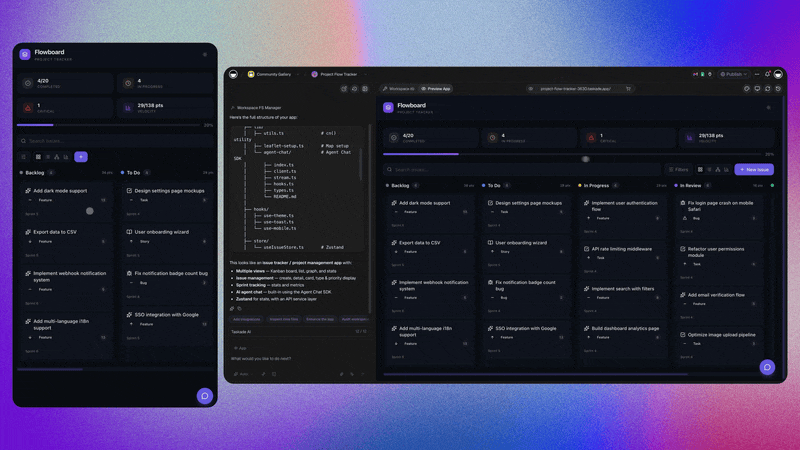

# Taskade vs Asana: An Honest Comparison (and Asana Alternative Guide)

If you're weighing an **Asana alternative**, the question usually isn't "which tool has more features." Asana has plenty. The real question is what you're trying to do next. Asana is built to run large, structured work across many teams and report on it cleanly. Taskade is built so AI agents do real work and you can ship apps without engineers.

This page is written to be fair. Asana is a genuinely strong, mature platform, and for a lot of organizations it's the right call. Below we lay out where each tool actually wins, so you can decide based on how you work — not on a feature-count race.

> Short version: **Asana** is deep enterprise work and portfolio management with AI now embedded in its work graph. **Taskade** is an AI-native workspace where memory (projects + notes), intelligence (multi-agent teams), and execution (automations + Taskade Genesis apps) live together. If you need governance-heavy portfolio management at scale, Asana is excellent. If you want AI agents that do the work and a path to ship apps without code, Taskade fits better.

---

## At a glance

| Dimension | Taskade | Asana |
| --- | --- | --- |
| **AI & agents** | AI-native core. Custom multi-agent teams you train on your own data, with model choice and tools. | AI embedded in the work graph — AI Studio (no-code agent/workflow builder) and AI Teammates, with full project context. |
| **Multi-agent** | Multi-agent workspaces — agents collaborate, hand off, and run as a team. | AI Teammates and AI Studio workflows; oriented around automating the existing work graph rather than teams of collaborating agents. |
| **AI pricing model** | AI is included in the workspace; paid plans add more usage. | Per-seat tiered pricing, with AI Studio sold as a **credit-metered add-on on top of seats**. AI is not fully bundled. |
| **App-building** | Genesis: describe an app in plain English → hosted app with database, auth, payments, UI, custom domain. | Not an app builder. You configure Asana; you don't ship standalone hosted apps. |
| **Project / portfolio depth** | 7 views: List, Board, Calendar, Table, Mind Map, Gantt, Org Chart. Lighter structure. | Timeline/Gantt, Workload, Goals/OKRs, Portfolios — genuinely deep, mature portfolio management. |
| **Enterprise governance** | Lighter, faster time-to-value. | Mature admin, permissions, reporting, and audit — built for large, governed orgs. |
| **Simplicity / onboarding** | Fast to start; plain-English setup; sensible defaults. | Powerful but heavier; more setup and administration before it fits a large org. |
| **Pricing** | Free tier; paid plans add more AI usage, agents, and automation runs. | Free Personal tier; Starter / Advanced / Enterprise per seat, plus metered AI Studio. (Check each site for current pricing.) |
| **Best for** | AI-first teams that want agents and app-building without enterprise lift. | Large organizations running governance-heavy portfolio management at scale. |

*Feature availability and pricing change often, and vendors revise both regularly. Verify current details on [taskade.com](https://www.taskade.com) and asana.com before deciding.*

---

## Where Asana shines

We'll say it plainly: Asana is one of the most mature work-management platforms available, and for large, structured organizations its depth is a real advantage. If your decision hinges on portfolio management and governance, this is its home turf.

- **Deep project and portfolio management.** Timeline and Gantt, Workload (capacity planning across people), Goals and OKRs, and Portfolios that roll many projects up into one executive view. For organizations coordinating dozens of teams, this depth is legitimate and hard to match.
- **AI embedded in the work graph.** Asana's AI isn't a detached chat panel bolted onto the side. It reads the existing work graph — projects, tasks, dependencies, and relationships — with full context, and it's permission-aware, so it respects who can see what. That's a meaningfully better foundation than a generic assistant.
- **AI Studio for no-code automation.** AI Studio lets teams build agentic workflows and "AI Teammates" without code, running them against real project context. It's a serious, well-integrated capability.
- **Enterprise governance and reporting.** Mature admin controls, granular permissions, universal reporting, and audit features built for large, governed organizations. If compliance and oversight matter, Asana is built for it.
- **Roadmap signal.** Asana acquired **StackAI in May 2026** to run agent workflows across enterprise systems — a clear bet on agents reaching beyond Asana's own walls.

If you run a large portfolio with real governance requirements and a team to administer it, Asana rewards that investment.

---

## A precise word on Asana's AI pricing

This matters enough to call out on its own, because it's easy to get wrong in either direction.

Asana's AI is genuinely well-built and context-aware — that part is real. But it isn't simply "included." Asana's core pricing is **per-seat and tiered** (a free Personal tier, then Starter, Advanced, and Enterprise). On top of that, **AI Studio is a credit-metered add-on**: a Basic level is available with rate limits, while higher Plus and Pro tiers are sold as paid credit packages. So the honest framing is: you pay per seat **and** you meter AI usage separately on top.

That's not a criticism — metered AI is a defensible model, and it lets heavy users pay for what they use. But if you're comparing tools, don't read "Asana has AI" as "AI is fully bundled." Taskade takes the other approach: AI is part of the workspace, and paid plans simply add more usage rather than charging a separate per-credit meter on top of seats. Neither is automatically cheaper — it depends on your usage. Check both vendors' current pricing pages before you decide.

---

## Where Taskade fits better

Taskade isn't trying to out-depth Asana on portfolio management. It's built around a different idea: the workspace should *do work*, not just hold and report on it.

- **AI-native, not AI-embedded-in-PM.** Asana embedded AI into an existing work-management product, and did it well. Taskade was designed around AI from the core, so agents, memory, and automation are how the product works — not a layer added to a project tool. See [the AI workspace pillar](../guides/ai-workspace.md).
- **Multi-agent teams that DO the work.** Instead of automating an existing work graph, you can run a *team* of agents that collaborate and hand off — a researcher feeding a writer feeding a reviewer — with shared memory across the workspace. Read [what a multi-agent workspace is](../guides/multi-agent-workspace.md).
- **Genesis apps.** This is the biggest difference. With [Taskade Genesis](https://www.taskade.com/ai/apps), you describe an app in plain English and get a complete, hosted, working app — database, AI agents, automations, UI, login/auth, payments, and a custom domain. Asana configures *itself*; Genesis ships a *product*. See it work in [build a CRM with AI](../genesis/build-a-crm-with-ai.md).
- **Faster time-to-value.** The fastest path from idea to running system is plain English. Asana's depth is powerful but front-loaded with setup and administration; Taskade's lighter surface gets a team — or an app — running this week.

One enterprise customer described shipping a production business app solo with Genesis this way: *"What I accomplished in a few weeks would have taken a team of 40+ and 18 months in the Fortune 500."* We share that not as a benchmark you should expect, but as an honest signal of what "build without engineers" can look like in practice.

---

## How they compare in practice

Feature tables only get you so far. Here's how the two tools tend to feel across the work people actually do.

**Standing up a new initiative.**
In Asana, you'll typically create a project, choose a structure, set up fields and dependencies, and slot it into a portfolio so it reports cleanly upward. That structure pays off when leadership needs visibility across many teams — but it's front-loaded. In Taskade, you start typing, or you ask an agent to draft the structure, and refine as you go. Asana asks you to design the system; Taskade lets you start using it.

**Getting AI to help.**
Asana's AI is context-aware and permission-aware: AI Studio can build workflows and AI Teammates that act on your real project graph, which is a strong model — just remember it's metered on top of seats. In Taskade, AI is the substrate. You can stand up a dedicated agent, train it on your own documents, choose its model, and give it tools, with usage included in the workspace. The mental model shifts from "AI that understands my projects" to "a team of teammates I assign work to."

**Managing a large portfolio.**
This is Asana's home turf. Workload, Goals, Timeline, and Portfolios are built for coordinating and reporting across many teams at once. If that's your core job, Asana is deeper here, and we won't pretend otherwise. Taskade covers project work well with 7 views, but it's lighter on executive portfolio rollups and capacity planning.

**Shipping something for people outside the team.**
This is where the products diverge most. Asana is for running work *inside* an organization. When you need a customer-facing app — a portal, a storefront, an intake tool with its own login and payments — Asana isn't built for that. Genesis is. You describe the app and it's hosted, with a database and auth, on a domain you can share.

---

## A fair word on enterprise depth vs. speed

This isn't a knock — it's a trade-off worth naming. Asana's strength is governed depth: portfolios, workload, goals, mature permissions, and reporting that hold up across a large organization. That depth requires administration and onboarding, and some of it goes unused on smaller teams.

Taskade makes the opposite bet: lighter structure, stronger defaults, AI included in the workspace, and a path to ship real apps from plain English. That bet costs you some enterprise governance and portfolio reporting. If you're a large org with real oversight requirements, Asana's depth may matter more than Taskade's speed. If your goal is to get agents — or an app — *running* this week without an enterprise rollout, the lighter surface tends to win.

Neither bet is "right." They serve different goals. Pick the one that matches yours.

---

## Which should you choose?

**Choose Asana if:**

- You run governance-heavy portfolio management across many teams and need executive rollups.
- Workload/capacity planning, Goals/OKRs, Timeline, and Portfolios are core to how you operate.
- You want AI embedded in a mature work graph and are comfortable metering AI Studio credits on top of per-seat pricing.
- You have admins to own setup, permissions, and reporting at scale.

**Choose Taskade if:**

- You want AI agents that actually do work — research, drafting, triage, execution — with AI included in the workspace.
- You want multi-agent teams that collaborate and hand off, not a single assistant.
- You want to ship apps without engineers, in weeks not months, with no code.
- You value fast time-to-value over enterprise configuration, and non-technical people need to build and run real things on their own.

**Honest middle ground:** some organizations keep Asana for heavy structured portfolio management and use Taskade for AI agents, automations, and app-building. There's no rule that says you must pick exactly one — match each tool to the job it's best at.

---

## What teams move to Taskade for

If you're evaluating a switch, these are the jobs where people most often find Taskade pulls ahead. Each links to a hands-on guide.

- **A coordinated agent team.** Multiple agents that pass work between them — research, drafting, review. See [the multi-agent workspace guide](../guides/multi-agent-workspace.md).
- **A real, shippable app.** A CRM, client portal, or storefront built from a plain-English description and hosted on your own domain, via [Taskade Genesis](https://www.taskade.com/ai/apps). Worked example: [build a CRM with AI](../genesis/build-a-crm-with-ai.md).
- **AI included, not metered separately.** A workspace where agents and automations are part of the product rather than a credit add-on layered on seats.
- **A faster general workspace.** Notes, tasks, and 7 views without the administration overhead — a lighter home base for everyday work. See [what an AI-native workspace is](../guides/ai-workspace.md).

You don't need to commit your whole org on day one. Pick one of these, run it in Taskade for a couple of weeks, and compare it honestly against how the same job feels in Asana.

---

## FAQ

**Is Taskade a real Asana alternative?**
Yes, for most teams — especially if AI agents and app-building matter to you. Taskade covers core project work (tasks, notes, and 7 views including List, Board, Calendar, Table, Mind Map, Gantt, and Org Chart) and adds multi-agent teams, automations, and Genesis app-building. It's lighter on advanced portfolio management, capacity planning, and enterprise reporting than Asana.

**Does Asana have AI agents?**
Yes. Asana's AI is embedded in its work graph, with AI Studio (a no-code agent and workflow builder) and AI Teammates that act on your real project context. It's well-integrated and permission-aware. The thing to watch on cost: AI Studio is a credit-metered add-on on top of per-seat pricing, not fully bundled.

**Is Asana's AI included in the price?**
Not fully. Asana's core plans are per-seat and tiered, and AI Studio is sold as a credit-based add-on on top (a Basic level with rate limits, then paid Plus/Pro credit tiers). Taskade includes AI in the workspace and adds more usage on paid plans. Check both vendors' current pricing before deciding, since usage patterns change the math.

**Can Taskade replace Asana's portfolio management and reporting?**
Partly. Taskade has views and tables that cover common tracking needs, but if your team relies on Workload, Goals/OKRs, Timeline, and Portfolio rollups across many teams, Asana is currently deeper there. Be honest about how much of that depth you actually use.

**What can Taskade do that Asana can't?**
Two big things: **multi-agent teams** that collaborate on work with shared memory, and **Genesis** — building a complete, hosted app (database, auth, payments, UI, custom domain) from a plain-English description. Asana is a platform you configure; Genesis ships a standalone product. See [Genesis](https://www.taskade.com/blog/introducing-taskade-genesis).

**Is migrating from Asana hard?**
Most teams start small: move one project or stand up one agent in Taskade, run it alongside Asana, and expand from there. You don't have to migrate everything at once.

**Do I need to be technical to use Taskade?**
No. The whole point is plain English. If you can describe what you want, you can build agents, automations, and apps.

---

## Related

- [What a multi-agent workspace is](../guides/multi-agent-workspace.md)
- [What is Taskade Genesis](../genesis/what-is-taskade-genesis.md)
- [Build a CRM with AI](../genesis/build-a-crm-with-ai.md)
- [What an AI-native workspace is](../guides/ai-workspace.md)
- [Compare all Taskade alternatives](../compare/README.md)

---

**Ready to try the AI-native approach?** Build your first agent or app free at [taskade.com](https://www.taskade.com) — or describe an app in plain English with [Taskade Genesis](https://www.taskade.com/ai/apps).
