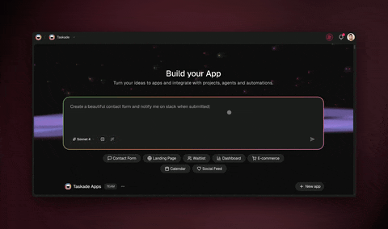

# Taskade Genesis FAQ

Short, direct answers to the questions people actually ask about Taskade Genesis and the AI-native workspace it lives in — what it builds, how AI agents work, how it compares to other tools, and how pricing, data, and integrations work. Where a question needs more depth, follow the link to its full page. Pricing changes, so we describe the model here and defer exact numbers to [taskade.com](https://www.taskade.com).

## Taskade Genesis basics

### What is Taskade Genesis?

Taskade Genesis is an AI app builder that turns a plain-English description into a complete, hosted, working application — database, AI agents, automations, UI, login and auth, payments, and a custom domain. It produces a real running app, not a mockup.

### How does Taskade Genesis work?

You open the builder, describe the outcome in plain English, and Genesis generates the projects, agent roles, automations, and UI. You run it, refine it in click-to-edit (changes are live immediately), then share with your team or publish on a custom domain.

### Can I build an app without code?

Yes. With Taskade Genesis you describe the app in plain English and it builds a complete, hosted application — database, agents, automations, UI, login, payments, and a custom domain — with no code and no setup.

### Who is Taskade Genesis for?

It's for operators, founders, and non-technical builders who know what they want shipped but don't write code — the "build without permission" idea: no ticket, no sprint, no engineer required to get a real tool live.

### Is the app actually hosted, or just a prototype?

It's a real hosted app at a live URL with login/auth built in, and it can run on your own custom domain. It's running software your team or customers can use, not a static prototype.

### Can I take payments inside an app I build?

Yes. Genesis apps support Stripe-backed checkout and paywalls built in, so an app can charge a customer, log the order, and email a receipt without bolting on third-party payment tools or hiring an engineer.

### Can I clone an existing app instead of starting from a blank prompt?

Yes. You can clone a live community app kit in about a minute — data, AI agents, and automations already wired up — then rename it, add your data, add a login, and publish on your own domain. Taskade lists 150+ community kits.

### What's the difference between vibe coding and what Genesis does?

Vibe coding (popularized by Andrej Karpathy in Feb 2025) means describing what you want in natural language and letting AI build it. Genesis goes further: apps ship with built-in intelligence — agents, automations, a database — not just code files.

## AI workspace and agents

### What is an AI workspace?

An AI workspace is a single place where your information, your AI, and your work live together, so asking for something and getting it done are the same motion. Taskade frames it as Memory + Intelligence + Execution in one workspace.

### What does "AI-native" mean versus AI bolted onto an old tool?

AI-native means AI is the substrate, not a side feature: agents share your data, take actions, and produce output back inside the workspace. AI "bolted on" is a chat panel that forgets context between sessions and only returns text you must act on yourself.

### What is Workspace DNA?

Workspace DNA is Taskade's term for the three interconnected pillars that make a workspace "alive": Memory (projects and notes), Intelligence (multi-agent teams), and Execution (automations and Genesis apps), running as one feedback loop rather than separate tools.

### What is a multi-agent workspace?

A multi-agent workspace is a team of AI agents that share one memory, hand tasks to each other, and finish a job end to end — a researcher, a writer, a reviewer working the same projects, rather than a single chatbot answering one question at a time.

### Why use multiple agents instead of one AI assistant?

A single assistant forgets between sessions, does one thing at a time, and only returns text. Specialized agents keep persistent shared memory, each own one focused job, and can take real action — creating tasks, filling databases, and triggering automations.

### What can AI agents actually do besides chat?

They create and complete tasks, fill databases, read and write your connected tools, send messages and emails, run automations, and operate inside Genesis apps. They execute work rather than only suggesting it.

### What is agent memory?

Agent memory is the shared, persistent context your agents draw on — your projects, notes, uploaded documents, and past conversations — so you stop re-explaining your business every session and agents produce work specific to your real context.

### Can AI agents work alongside my human team?

Yes. Agents live in the same projects your team uses — they can be assigned tasks, comment, complete work, and trigger the next step, sitting right next to human teammates instead of in a separate app.

## Comparisons

### Is Taskade a Notion alternative?

Yes — but a structurally different one. Notion is document-first; Taskade is AI-native, with multi-agent teams, built-in automations, and Genesis (prompt-to-hosted-app with database, auth, payments, and a custom domain). Notion isn't designed to ship standalone apps.

### Is Taskade an Asana alternative?

Yes. Asana is deep enterprise work and portfolio management; Taskade is an AI-native workspace with native multi-agent teams and Genesis app-building. Asana layers AI Studio on top of per-seat pricing as metered credits, while Taskade includes AI in the workspace.

### Is Taskade a Coda alternative?

Yes. Coda builds "docs that act like apps" by hand with formulas and Packs; Taskade Genesis turns a plain-English prompt into a standalone hosted app, and agents are first-class across the workspace. Coda's product is also mid-transition under the Superhuman/Grammarly umbrella.

### Is Taskade an Airtable alternative?

Yes. Airtable is a powerful database/spreadsheet tool; Taskade adds AI agents that read and write your data, automations described in plain English, and Genesis to turn that data into a hosted app — not just a structured table.

### How is Taskade different from AI agent tools like Lindy, Gumloop, or Zapier?

Those are automation layers that act across your other apps, where your work still lives. Taskade is an AI-native workspace where agents, projects, docs, and the apps they build live together — so agents have native context, with predictable workspace pricing instead of per-activity credits.

### What does Taskade do that Notion and ClickUp don't?

Two things stand out: multi-agent teams that take real action, and Genesis — building a complete hosted app (database, auth, payments, UI, custom domain) from a plain-English description. Those tools configure themselves; Genesis ships a product.

### Should I switch from my current tool to Taskade?

You don't have to rip anything out to start. With 100+ integrations Taskade can sit alongside the tools you already run and pull their data into shared memory, so you can adopt it incrementally rather than migrating everything at once.

## Pricing, data, and integrations

### Is Taskade free?

Yes — Taskade has a free tier, and plans start at $0/month. Paid plans add more AI usage, agents, and automation runs. Always check taskade.com for current pricing.

### Is Taskade Genesis free to try?

Yes, you can start building from a prompt for free. Higher AI usage, more agents, and more automation runs come with paid plans; verify the current details on taskade.com.

### What integrations does Taskade support?

Taskade supports 100+ integrations, covering the common stack — Slack, Stripe, Shopify, Gmail, Google Calendar, Google Drive, Google Sheets, Notion, HubSpot, GitHub, Discord, and more. Connect a tool once and your agents and flows can read and write to it.

### What is MCP (Model Context Protocol)?

MCP is a shared standard for plugging tools into AI — Taskade describes it as "USB-C for AI tools." A tool that speaks the standard can connect to your agents without a bespoke build, and Taskade can both use connected tools and be a tool other AI systems connect to.

### Is my data private and secure in Taskade?

Your workspace is yours. Memory is what you put in it — your projects, notes, and uploads — and you control which agents, apps, and connected tools can see what. Genesis apps support login and auth so what you publish isn't wide open. For current compliance specifics, check taskade.com.

## Related

- [What is Taskade Genesis](genesis/what-is-taskade-genesis.md) — the capabilities pillar
- [What an AI-native workspace is](guides/ai-workspace.md) — Memory + Intelligence + Execution
- [What a multi-agent workspace is](guides/multi-agent-workspace.md) — the intelligence layer
- [Glossary](glossary.md) — definitions for the terms above
- [Comparison hub](compare/README.md) — how Taskade stacks up against other tools

Ready to try it? [Build an app from a prompt with Taskade Genesis](https://www.taskade.com/ai/apps).
