# Clone-Ready App Kits — Taskade Genesis

Start from a finished app, not a blank page. Every app kit below is a **real, live [Taskade Genesis](https://www.taskade.com/ai/apps) app** — open it, click **Clone**, and you have your own working copy in about a minute. Each one ships complete with its data, AI agents, and automations already wired up. Then make it yours: rename it, add your data, [add a login](../use-cases/clone-and-customize-apps.md), and publish it on your own domain.

> **Three ways to start:** describe what you want and have it built, **clone one of the kits below**, or hire a pre-built AI agent (a CFO, CMO, COO, or CEO role) to run it for you.

These are picks from **Team Taskade**. There are 150+ more in the [community gallery](https://www.taskade.com/templates) and from [community creators](https://www.taskade.com).

---

## 🚀 Run your business — the founder mix

Growth, hiring, customers, and operations — the cross-section every business needs.

| | |
|---|---|
| [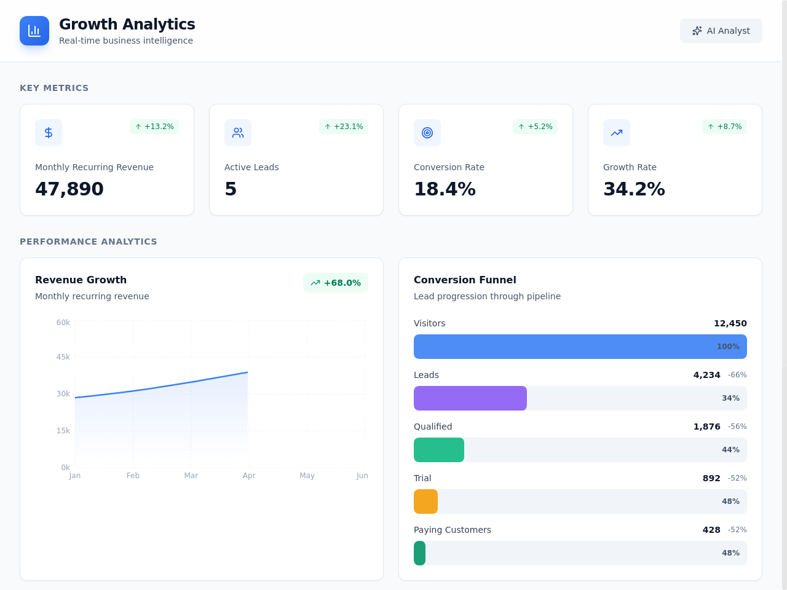](https://www.taskade.com/share/apps/h42is85vu180almu) | **[Growth Dashboard](https://www.taskade.com/share/apps/h42is85vu180almu)** Track every metric live — MRR, leads, conversion, and revenue growth in one view. [Clone this app →](https://www.taskade.com/share/apps/h42is85vu180almu) |
| [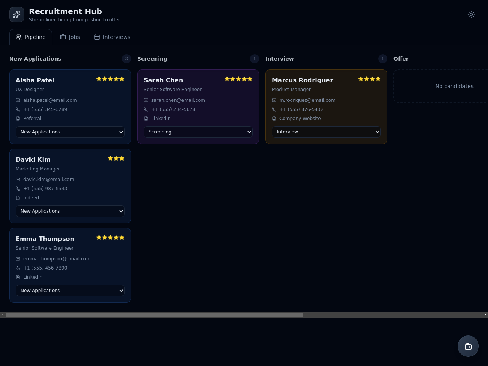](https://www.taskade.com/share/apps/b3by4yg754xrdjut) | **[Recruitment Workflow](https://www.taskade.com/share/apps/b3by4yg754xrdjut)** Pipeline candidates and hire faster, from first application to signed offer. [Clone this app →](https://www.taskade.com/share/apps/b3by4yg754xrdjut) |
| [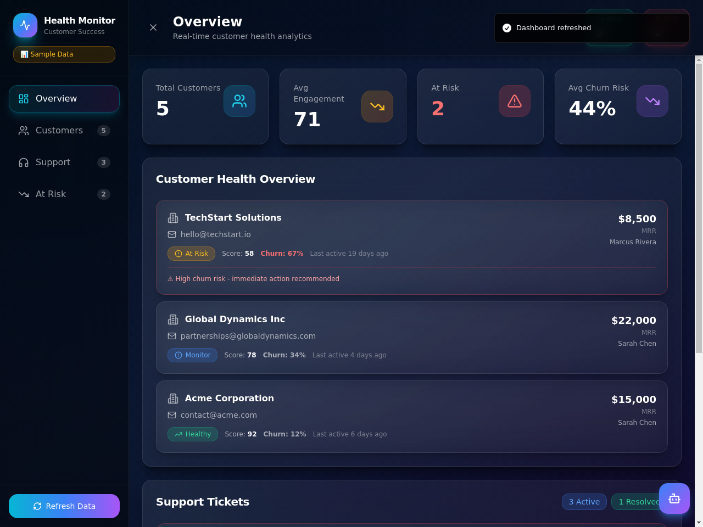](https://www.taskade.com/share/apps/564685gvoq7j7oua) | **[Customer Health Dashboard](https://www.taskade.com/share/apps/564685gvoq7j7oua)** Spot churn risk early and drive renewals before customers slip away. [Clone this app →](https://www.taskade.com/share/apps/564685gvoq7j7oua) |
| [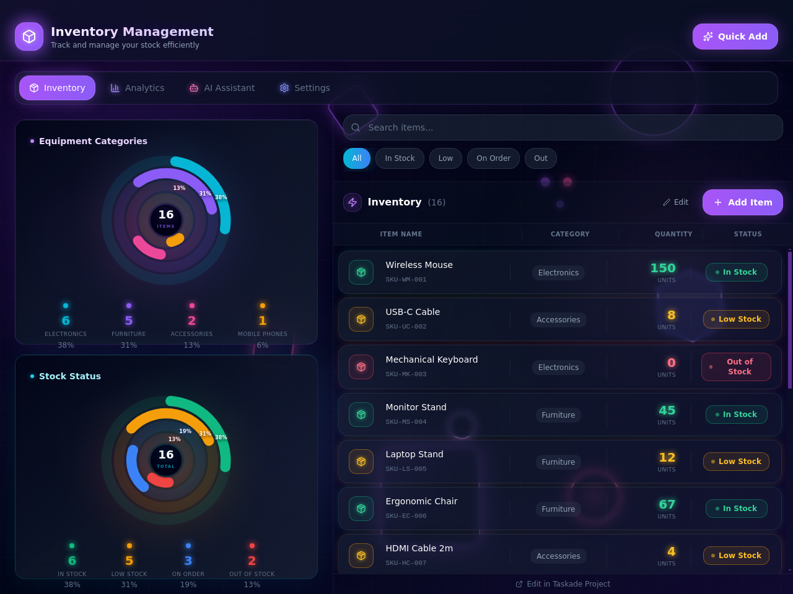](https://www.taskade.com/share/apps/94o8cjl33yz7z8ke) | **[Inventory Management](https://www.taskade.com/share/apps/94o8cjl33yz7z8ke)** Track SKUs and stock levels, with automatic low-stock alerts. [Clone this app →](https://www.taskade.com/share/apps/94o8cjl33yz7z8ke) |

## 💼 Win and keep customers — customer success

Spot health risk, route support, and onboard new users. Pairs with [AI Agents for Customer Support](../use-cases/ai-agents-for-customer-support.md).

| | |
|---|---|
| [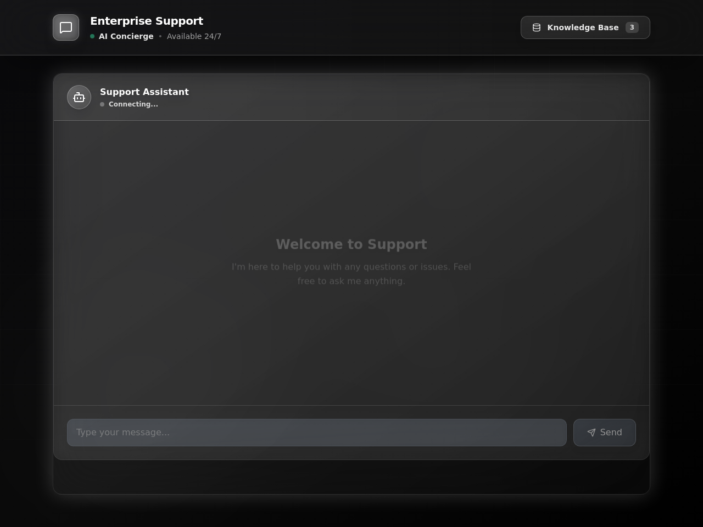](https://www.taskade.com/share/apps/et6hqn2e00ayy26n) | **[Support Agent](https://www.taskade.com/share/apps/et6hqn2e00ayy26n)** AI-first ticket triage that answers common questions around the clock. [Clone this app →](https://www.taskade.com/share/apps/et6hqn2e00ayy26n) |
| [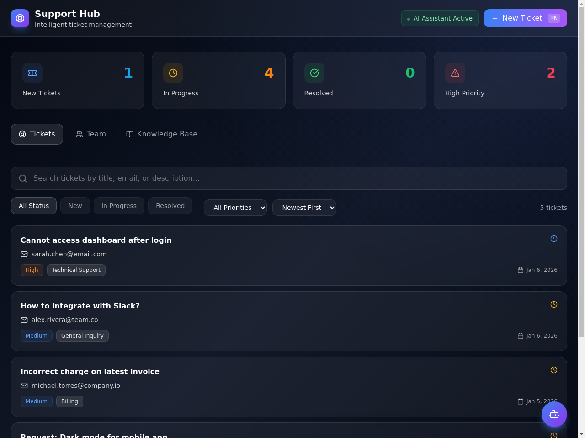](https://www.taskade.com/share/apps/s4pf46i9wi60h0rv) | **[Support Workflow Manager](https://www.taskade.com/share/apps/s4pf46i9wi60h0rv)** Route tickets to the right place and resolve them faster. [Clone this app →](https://www.taskade.com/share/apps/s4pf46i9wi60h0rv) |
| [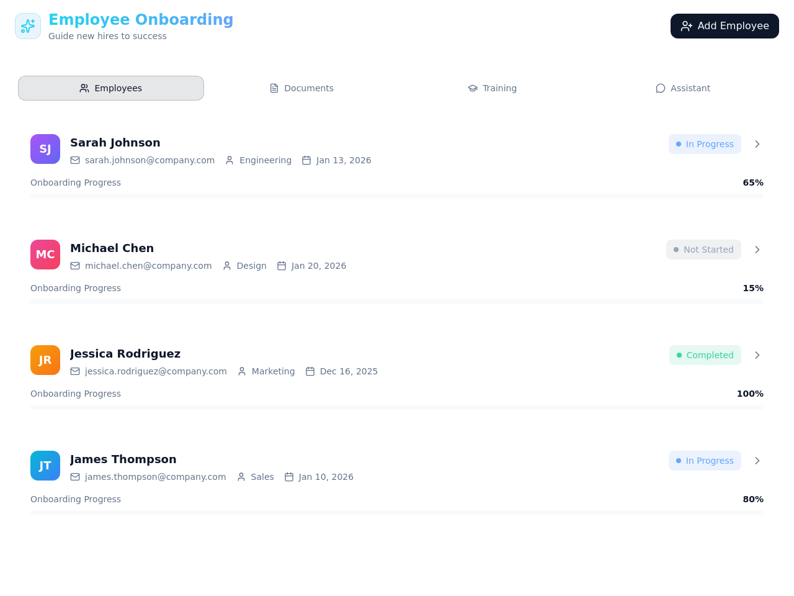](https://www.taskade.com/share/apps/cjom1t44r0lf9diu) | **[Onboarding Guide Portal](https://www.taskade.com/share/apps/cjom1t44r0lf9diu)** Guide new customers or new hires through day 1, day 7, and day 30. [Clone this app →](https://www.taskade.com/share/apps/cjom1t44r0lf9diu) |

## 📈 Lead to renewal — the sales stack

Forecast deals, work leads, and give clients a home. Pairs with [AI Agents for Sales](../use-cases/ai-agents-for-sales.md) and [Build a CRM with AI](build-a-crm-with-ai.md).

| | |
|---|---|
| [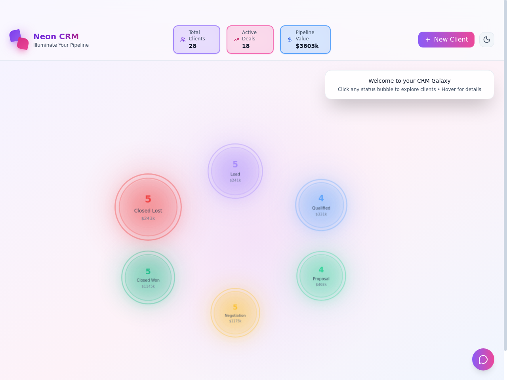](https://www.taskade.com/share/apps/nsrm12wns3e1cgni) | **[Neon CRM Dashboard](https://www.taskade.com/share/apps/nsrm12wns3e1cgni)** Track leads and close deals with a CRM you can actually see at a glance. [Clone this app →](https://www.taskade.com/share/apps/nsrm12wns3e1cgni) |
| [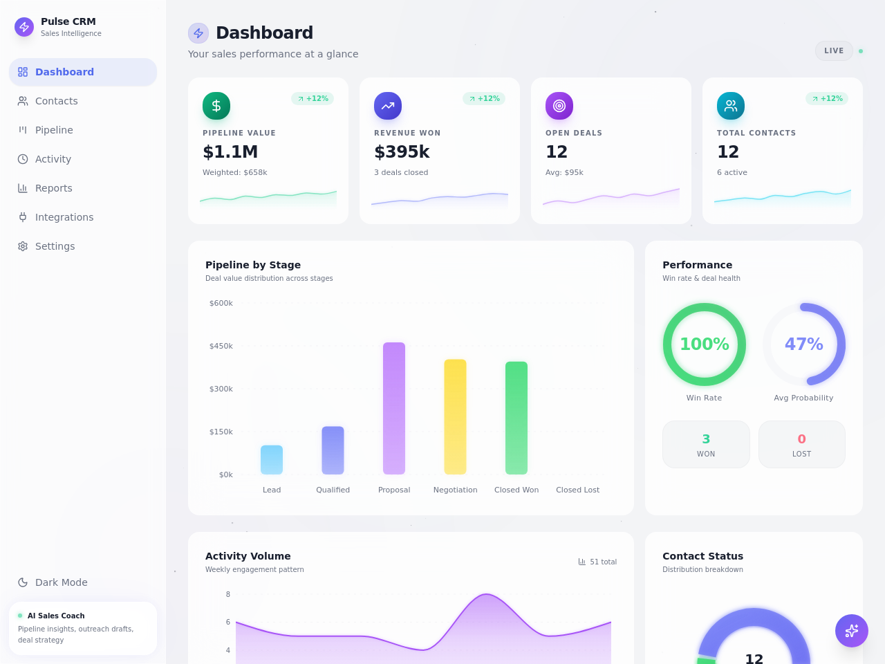](https://www.taskade.com/share/apps/avl35iqxc8t7wk3e) | **[Client Connect Dashboard](https://www.taskade.com/share/apps/avl35iqxc8t7wk3e)** See your pipeline and revenue, live, in one place. [Clone this app →](https://www.taskade.com/share/apps/avl35iqxc8t7wk3e) |
| [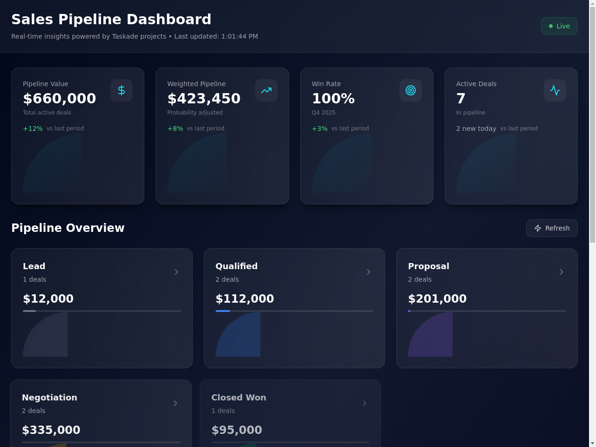](https://www.taskade.com/share/apps/j1n0746e1z0olf6r) | **[Sales Pipeline Dashboard](https://www.taskade.com/share/apps/j1n0746e1z0olf6r)** Forecast deals by stage in real time. [Clone this app →](https://www.taskade.com/share/apps/j1n0746e1z0olf6r) |
| [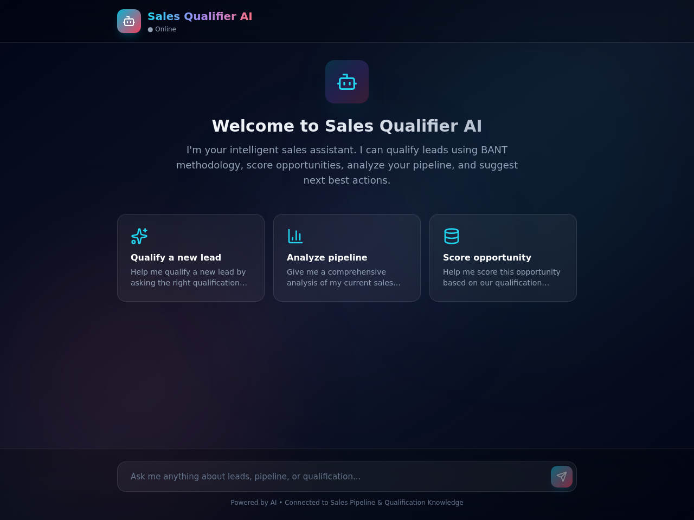](https://www.taskade.com/share/apps/uo9fc7tfidydkdw9) | **[Sales Agent Studio](https://www.taskade.com/share/apps/uo9fc7tfidydkdw9)** Your always-on AI sales rep, working leads in the background. [Clone this app →](https://www.taskade.com/share/apps/uo9fc7tfidydkdw9) |
| [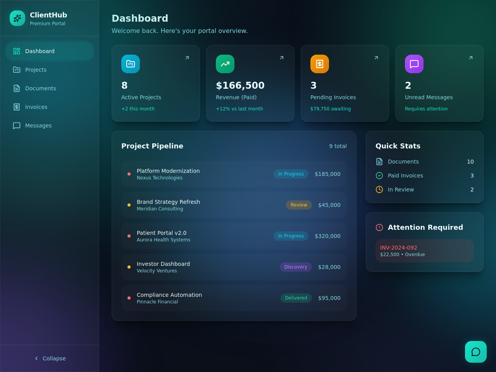](https://www.taskade.com/share/apps/1s4lv2y3jb9z7zpf) | **[Client Portal Nexus](https://www.taskade.com/share/apps/1s4lv2y3jb9z7zpf)** A branded, self-serve portal your clients can log in to. [Clone this app →](https://www.taskade.com/share/apps/1s4lv2y3jb9z7zpf) |
| [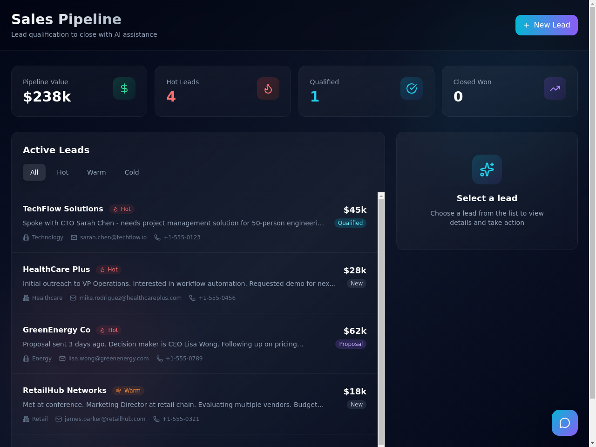](https://www.taskade.com/share/apps/dry36084slddvvrh) | **[Sales Pipeline Workflow](https://www.taskade.com/share/apps/dry36084slddvvrh)** Qualify, nurture, and close — with agent-driven follow-ups. [Clone this app →](https://www.taskade.com/share/apps/dry36084slddvvrh) |
| [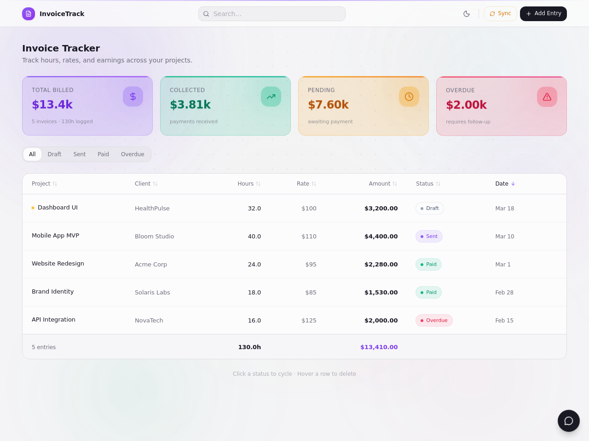](https://www.taskade.com/share/apps/rsltpd5cegha5ulc) | **[Invoice Tracker](https://www.taskade.com/share/apps/rsltpd5cegha5ulc)** Track hours, rates, and earnings — and actually get paid. [Clone this app →](https://www.taskade.com/share/apps/rsltpd5cegha5ulc) |

## 🎨 Plan, publish, measure — the marketing stack

Content, campaigns, social proof, and analytics. Pairs with [AI Agents for Marketing](../use-cases/ai-agents-for-marketing.md).

| | |
|---|---|
| [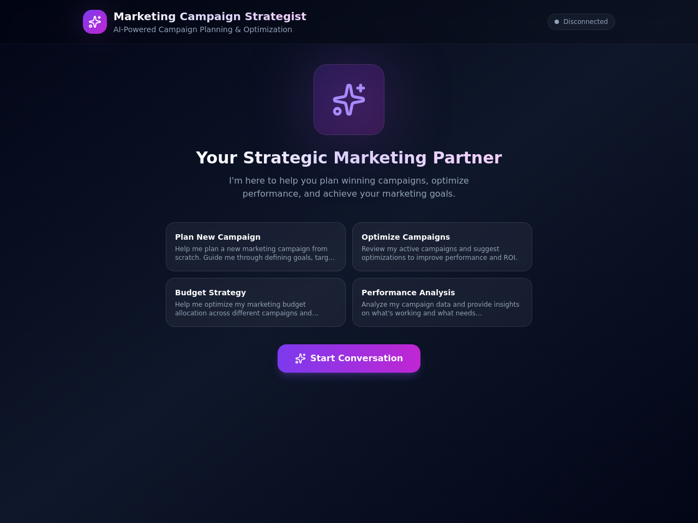](https://www.taskade.com/share/apps/r6lxd31ymwsthdmn) | **[Campaign Planning Portal](https://www.taskade.com/share/apps/r6lxd31ymwsthdmn)** Plan campaigns end to end, across every channel. [Clone this app →](https://www.taskade.com/share/apps/r6lxd31ymwsthdmn) |
| [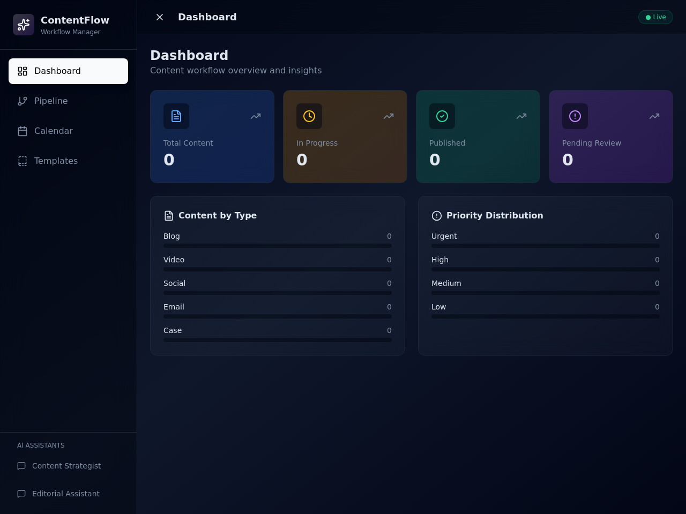](https://www.taskade.com/share/apps/hvu1z1ab0fyp9dkh) | **[Content Workflow](https://www.taskade.com/share/apps/hvu1z1ab0fyp9dkh)** Brief, draft, and ship content without juggling tools. [Clone this app →](https://www.taskade.com/share/apps/hvu1z1ab0fyp9dkh) |
| [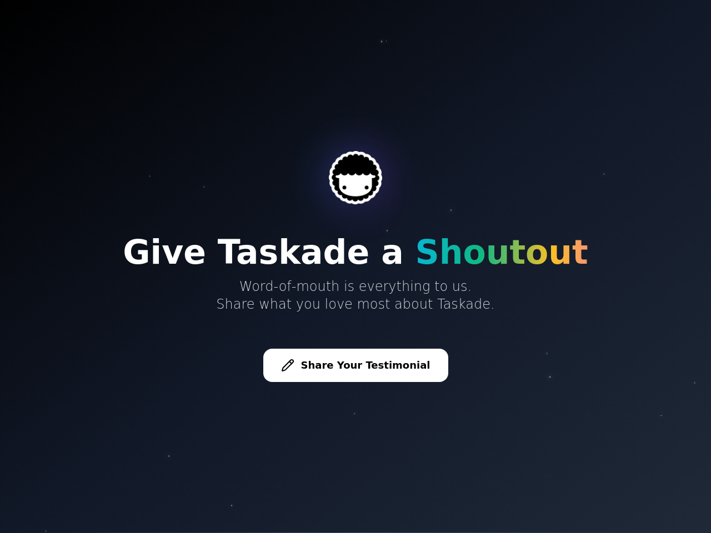](https://www.taskade.com/share/apps/3htncuaiwhxiblzn) | **[Testimonial Portal](https://www.taskade.com/share/apps/3htncuaiwhxiblzn)** Collect customer quotes and turn them into social proof. [Clone this app →](https://www.taskade.com/share/apps/3htncuaiwhxiblzn) |
| [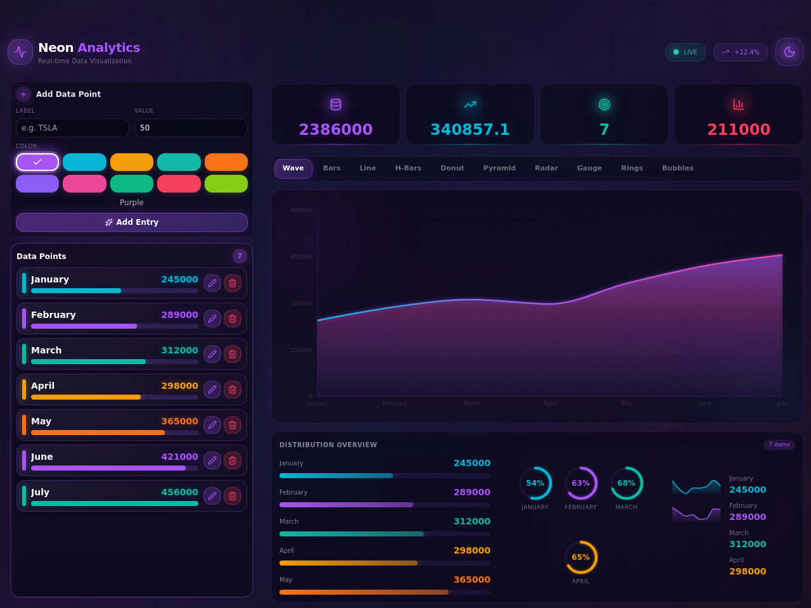](https://www.taskade.com/share/apps/7m161f2tjo6rj8ku) | **[Neon Data Visualizer](https://www.taskade.com/share/apps/7m161f2tjo6rj8ku)** Turn your numbers into charts that actually pop. [Clone this app →](https://www.taskade.com/share/apps/7m161f2tjo6rj8ku) |

## 🔧 Run the backend — the operations stack

Inventory, fleets, capacity, and headcount — the mission-critical machinery.

| | |
|---|---|
| [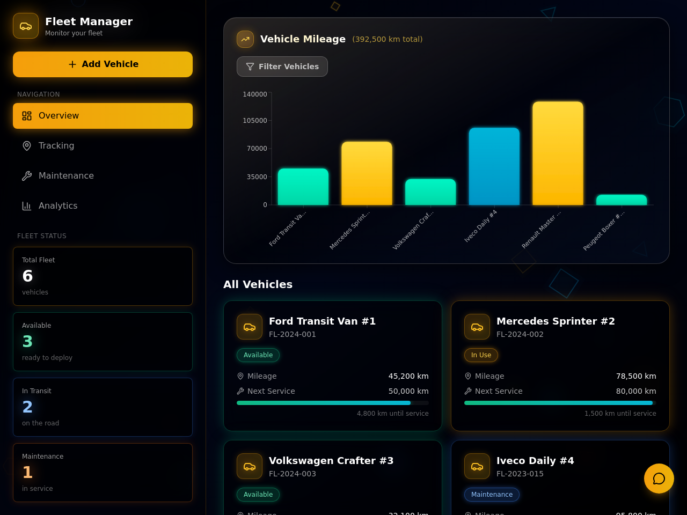](https://www.taskade.com/share/apps/4q6dihgsjc5sttbr) | **[Fleet Management](https://www.taskade.com/share/apps/4q6dihgsjc5sttbr)** Track assets, maintenance schedules, and routes. [Clone this app →](https://www.taskade.com/share/apps/4q6dihgsjc5sttbr) |
| [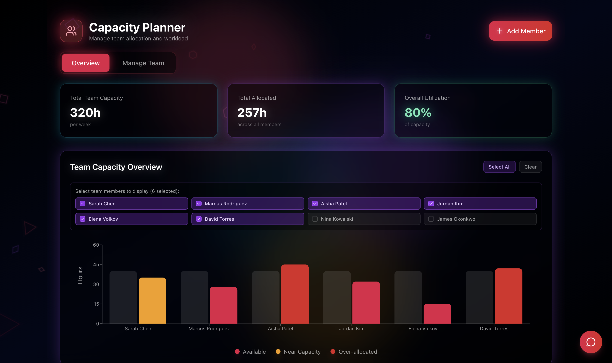](https://www.taskade.com/share/apps/8oye4ehejlokelxb) | **[Team Capacity Planner](https://www.taskade.com/share/apps/8oye4ehejlokelxb)** See who's doing what, and when — and balance the load. [Clone this app →](https://www.taskade.com/share/apps/8oye4ehejlokelxb) |
| [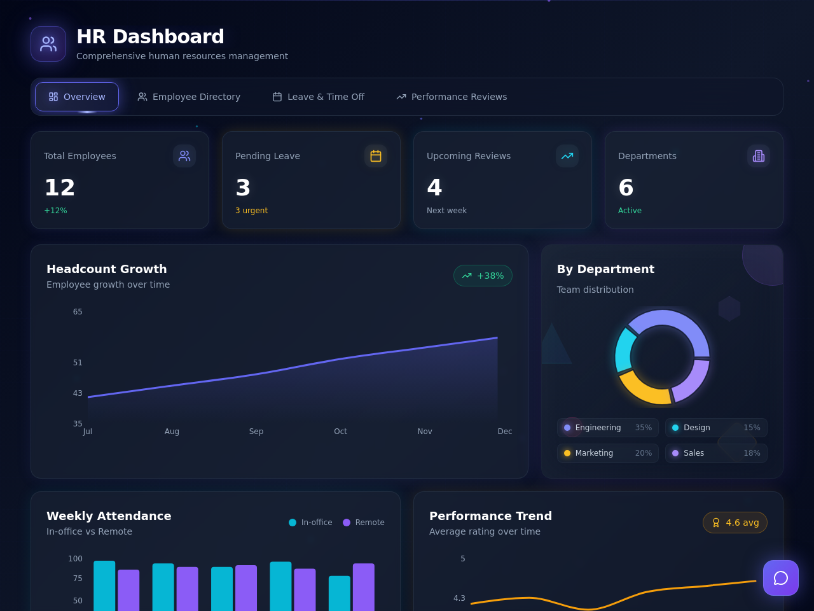](https://www.taskade.com/share/apps/ml2bqs8nmql3h3zb) | **[HR Dashboard](https://www.taskade.com/share/apps/ml2bqs8nmql3h3zb)** Manage headcount, reviews, and leave in one place. [Clone this app →](https://www.taskade.com/share/apps/ml2bqs8nmql3h3zb) |

---

## How cloning works

1. **Open** any app above and click **Clone** — you get your own copy in about a minute, agents and automations included.
2. **Make it yours** — rename it, add your data, and tweak the workflow to match how you actually work.
3. **[Add a login](../use-cases/clone-and-customize-apps.md)** so the right people can use it — no backend to set up.
4. **Publish** on your own custom domain and share the link.

No code. No setup. No starting from scratch.

## Related

- [Clone & Customize Apps](../use-cases/clone-and-customize-apps.md) — the full how-to on cloning, login, and publishing.
- [Live Workspace Apps](../use-cases/live-workspace-apps.md) — wiki, hiring, and meeting apps you can run today.
- [Build a CRM with AI](build-a-crm-with-ai.md) · [Build a Helpdesk with AI](build-a-helpdesk-with-ai.md) · [Build a Storefront with AI](build-a-storefront-with-ai.md)
- [What's New in Taskade Genesis](whats-new.md)

**Ready to start?** [Clone an app kit](https://www.taskade.com/templates) or [build your own from a prompt →](https://www.taskade.com/ai/apps)
