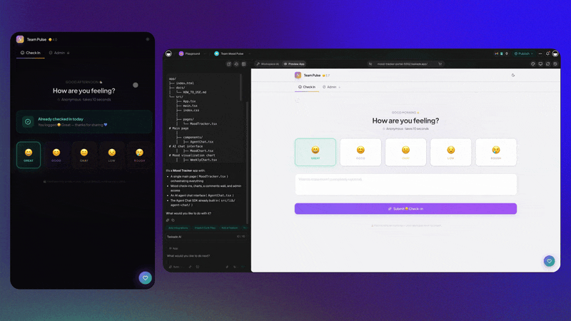
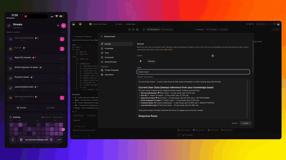

# Deploy Agents. Launch Shops. Automate Payments.

There's a loop that every small business runs on, whether the founder names it or not: **you build something, you sell it, you get paid.** Build the thing customers talk to. Sell the thing they buy. Collect the money when they buy it. Most of the time those three live in three different tools that don't talk to each other — a chatbot widget here, a store builder there, a payment processor somewhere else — and you spend your week being the duct tape between them.

This page is about closing that loop in one place. With **Taskade Genesis** you describe what you want in plain English and get a real, hosted app: a chatbot agent you can drop into Slack, a storefront that takes real orders, an invoice that gets paid. No engineers. No stack to wire together. Weeks, not months.

Three capabilities, one loop:

1. **Deploy agents** — spin up a custom AI chatbot, trained on your knowledge, and put it where your team or customers already are.
2. **Launch shops** — run an online store from one screen, with payments flowing automatically.
3. **Automate payments** — turn your notes into branded invoices, watch them get paid, and stop chasing.

Let's walk through each one the way it actually works, then show how they connect.

---

## The deploy → sell → get paid loop, in plain English

If you've ever tried to launch something small on your own, you know the shape of the problem. It isn't any single hard task. It's the *seams* — the gaps between the tools.

You set up a help chatbot in one app. You build a store in another. You connect Stripe in a third. Now an order comes in. Did the chatbot know about it? No — different tool. Did the invoice go out? Only if you remembered to make one. Did inventory go down? Only if you logged in and changed it. Every seam is a place where work leaks out and gets done by hand, by you, at 11pm.

Genesis removes the seams because it doesn't build three separate tools. It builds **one app** where the agent, the store, and the payments are parts of the same thing, sharing the same data:

```
   DEPLOY              SELL                 GET PAID
  ┌────────┐        ┌──────────┐         ┌───────────┐
  │ Agent  │  ───▶  │  Shop /  │  ───▶   │  Stripe / │
  │ (chat) │        │ catalog  │         │  invoices │
  └────┬───┘        └────┬─────┘         └─────┬─────┘
       │                 │                     │
       └─────────────────┴─────────────────────┘
                  one shared workspace
        (orders, customers, stock, payments — same data)
```

The agent can answer questions about the catalog because it's the *same* catalog the store sells from. A sale drops the stock count and creates the invoice because checkout and payments are *the same app*. You stop being the duct tape. That's the whole idea.

---

## 1. Deploy agents

[](https://www.taskade.com/ai/apps)

Start with the part customers and teammates actually talk to: an agent.

Say you want a bot called **Team Pulse** that runs daily check-ins and answers the questions people keep asking in chat — "where's the latest spec?", "what's our PTO policy?", "did the order from yesterday ship?". You describe that in plain English, and Genesis builds you a custom chatbot agent.

**You train it on your own knowledge.** This isn't a generic assistant that makes things up. You point it at your team's material — docs, notes, project data, uploaded files — and the agent answers *from that*, in your voice, with your facts. A new hire asking about onboarding gets your onboarding, not a guess.

**Then you deploy it where people already are.** The agent doesn't have to live on a page nobody visits. You can deploy it into:

- **Slack** — so it answers in the channels your team already lives in.
- **Discord** — for community servers and member support.
- **Telegram** — for fast, mobile-first conversations.
- **Taskade** — embedded right in your workspace, next to the projects it knows about.

That word — *deploy* — is the point. The agent goes live and starts working in the tools you already use, instead of being one more place to check.

For daily check-ins, Team Pulse can ask each person what they're working on, collect the answers, and roll them into a summary — so a standup happens without a meeting. For support, it fields the repetitive questions instantly and only hands off the genuinely tricky ones to a human. If you want to go deeper on the support angle — routing, escalation, drawing on your help docs — see [AI agents for customer support](../use-cases/ai-agents-for-customer-support.md).

A few things that make this practical rather than a toy:

- **It uses your real knowledge.** Upload a handbook, point it at a project, paste in your FAQ — the agent grounds its answers in that material instead of inventing.
- **It deploys, not just demos.** "Deployed into Slack" means a teammate can @-mention it in a channel and get an answer, not that there's a sandbox you have to remember to open.
- **It's editable in plain English.** Want it friendlier, stricter, or to always link the source doc? You change the instructions in a sentence — no retraining project.

The short version: **you deploy an AI agent in an afternoon, trained on what you actually know, living where your people actually are.**

---

## 2. Launch shops

[](https://www.taskade.com/ai/apps)

Now the part where money comes in.

You want to sell something — a product line, a drop, a small catalog. Normally that means assembling a commerce stack: catalog, cart, checkout, an orders database, a way to keep inventory honest. Genesis builds it as **one screen you run the whole shop from.**

Picture a product launch dashboard with **inventory and orders side by side.** On the left, what you have in stock. On the right, what's selling. You see both at once, so you're never guessing whether you can actually fulfill the orders coming in.

**Payments flow automatically because the tools are connected:**

- **Stripe** handles the checkout — real card payments, into *your* Stripe account, with the standard Stripe fee structure. Taskade isn't a middleman skimming your revenue.
- **Shopify** can connect too, so if you already run a Shopify catalog, your products and orders sync in instead of being re-entered by hand.

When a sale happens, the order lands on your dashboard and the money moves through Stripe — you don't copy anything between systems. That's what "automatically" means here: the connection does the carrying.

**And there's an agent watching the shelves.** Because the store is a Genesis app, you can put an AI agent on top of it that *warns you when stock runs low*. Instead of discovering you're out of your best seller when a customer complains, the agent flags it — "the medium hoodie is down to 3, reorder?" — before it becomes a problem. The same intelligence you deployed as a chatbot in section one can keep an eye on inventory here. Same workspace, same data, different job.

Why one screen matters: the slow death of small shops is context-switching. Stock lives in one tab, orders in another, payments in a third, and the truth — *can I actually ship what just sold?* — lives in the gap between them. A single dashboard puts the answer in front of you. You glance once and know.

For the full walkthrough of building the store itself — the prompt, the catalog, customer logins, the back-office views — see [Build a storefront with AI](./build-a-storefront-with-ai.md).

The short version: **you launch an online shop with AI, see stock and sales on one screen, and let the connections move the money so you don't have to.**

---

## 3. Automate payments

[](https://www.taskade.com/ai/apps)

Selling through a store is one way to get paid. The other is invoicing — and for a lot of founders, freelancers, and agencies, *that's* the part that quietly eats the most time and causes the most stress.

The pain isn't making one invoice. It's the cycle: format the invoice, attach it, send it, then wait, then wonder if they saw it, then feel awkward, then send the "just following up" email, then do it again. You become a part-time debt collector for your own business.

Genesis automates the cycle:

**Branded invoice PDFs from your notes.** You already have the information — the project notes, the line items, the hours, the agreed price. Genesis turns that into a clean, branded invoice PDF. You're not retyping work you already did into invoicing software; the invoice comes *from* your notes.

**Live payment status.** Once Stripe is connected, you don't have to refresh your bank account to know if you've been paid. The app shows the status live — sent, viewed, paid, overdue — so the answer to "did that invoice clear?" is right there on the screen instead of a guessing game.

**Automatic, friendly reminders.** This is the part that gives you your evenings back. When an invoice goes unpaid, the app sends a polite nudge on a schedule you set — friendly, on-brand, on time. You never have to write the awkward follow-up again, and clients get a consistent, professional reminder instead of an irritated one you fired off at midnight. When they pay, the reminders stop on their own.

Because invoicing, payment status, and reminders are all parts of one Genesis app, they share state. The reminder *knows* the invoice is unpaid. The status flips the moment Stripe confirms payment. Nothing is stitched together by you.

The short version: **you automate payments — invoices generated from your work, status you can see, and reminders that chase so you don't have to.**

---

## How it all connects

Here's why building these three things in *one* workspace matters more than building three good tools separately.

- **The agent knows the shop.** The chatbot you deployed can answer "is the blue one in stock?" because it reads the same inventory the store sells from. No integration to maintain — it's the same data.
- **The shop triggers the payment.** A checkout *is* a payment. An invoice *becomes* a paid invoice the moment Stripe confirms. The selling and the getting-paid are continuous, not two apps you reconcile.
- **The agent watches the money.** The same kind of agent that warns you about low stock can flag overdue invoices or summarize the week's revenue — because it's looking at the orders and payments tables right next to it.

That's the loop closing: **deploy** the agent that talks to people, **sell** through the shop it knows about, **get paid** through payments that move on their own — and let an agent keep watch over the whole thing.

To wire your agents and apps into the rest of your tools — connecting Stripe, Slack, Shopify, and 100+ other services, and automating the flows between them — see [Connect tools and automate](../guides/connect-tools-and-automate.md).

---

## What you'd actually do, start to finish

A realistic first afternoon, for a non-technical founder:

1. **Describe your agent.** "Build me a support chatbot named Team Pulse, trained on my help docs, that runs a daily check-in." Deploy it into Slack.
2. **Describe your shop.** "Build an online store for my product line with a dashboard showing inventory and orders side by side, Stripe checkout, and an alert when stock is low." Connect your Stripe account.
3. **Describe your invoicing.** "Generate branded invoice PDFs from my project notes, show me payment status, and send friendly reminders when an invoice is overdue."
4. **Publish.** Each app goes live on a URL — and on your own custom domain when you're ready.

You wrote sentences. Genesis built apps. The agent is answering questions, the shop is taking orders, and the invoices are getting paid — and you didn't open a code editor or hire anyone.

An enterprise customer who shipped a production business app this way put it plainly: *"What I accomplished in a few weeks would have taken a team of 40+ and 18 months in the Fortune 500."* The same approach that compresses an enterprise project also lets a solo founder run the full deploy → sell → get paid loop alone.

---

## Honest notes

A few things worth being straight about:

- **Payments are real, and the money is yours.** Stripe checkout takes real card payments into *your* Stripe account under the standard Stripe fees. Taskade doesn't take a cut of your sales.
- **Agents answer from what you give them.** An agent trained on your knowledge is only as good as that knowledge. Point it at accurate docs and keep them current; it reflects what you feed it.
- **You stay in control.** Everything Genesis builds is editable. The agent's behavior, the shop's look, the invoice template, the reminder schedule — all of it is yours to adjust in plain English, no rebuild required.

No fabricated conversion rates, no invented testimonials. The capabilities above are what the apps actually do; the results depend on your product and your customers.

---

## Clone a ready-made app kit

Prefer to start from something that already works? Clone one of these live Taskade Genesis apps — agents and automations included — then make it yours.

| App kit | What it does | |
|---|---|---|
| **[Support Agent](https://www.taskade.com/share/apps/et6hqn2e00ayy26n)** | AI-first ticket triage that answers around the clock. | [Clone →](https://www.taskade.com/share/apps/et6hqn2e00ayy26n) |
| **[Sales Agent Studio](https://www.taskade.com/share/apps/uo9fc7tfidydkdw9)** | Your always-on AI sales rep, working leads in the background. | [Clone →](https://www.taskade.com/share/apps/uo9fc7tfidydkdw9) |
| **[Inventory Management](https://www.taskade.com/share/apps/94o8cjl33yz7z8ke)** | Track SKUs and stock with low-stock alerts. | [Clone →](https://www.taskade.com/share/apps/94o8cjl33yz7z8ke) |

Browse all of them in the [App Kits Gallery →](app-kits.md).

---

## Related

- [Build a storefront with AI](./build-a-storefront-with-ai.md) — the full walkthrough of building the shop: catalog, checkout, customer logins, back-office views.
- [Connect tools and automate](../guides/connect-tools-and-automate.md) — agent memory, 100+ integrations, and automating the flows between Stripe, Slack, Shopify, and more.
- [AI agents for customer support](../use-cases/ai-agents-for-customer-support.md) — how a deployed chatbot agent handles questions, routes the hard ones, and answers from your help docs.

---

**Ready to close the loop?** Describe your agent, your shop, or your invoice in plain English and watch Genesis build it. [Start building at taskade.com/ai/apps](https://www.taskade.com/ai/apps) or [see what Genesis can do](https://www.taskade.com/blog/introducing-taskade-genesis).
