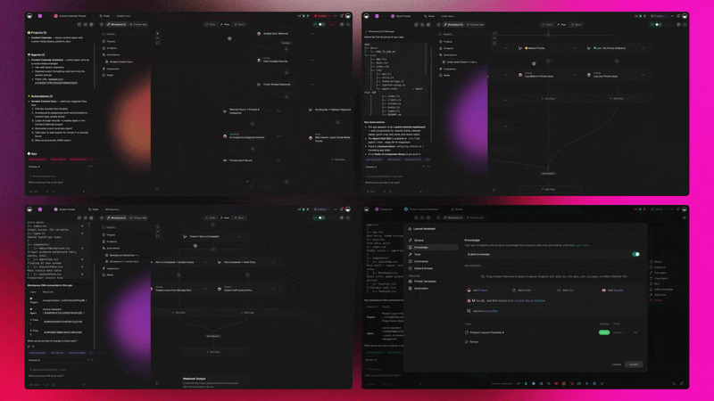
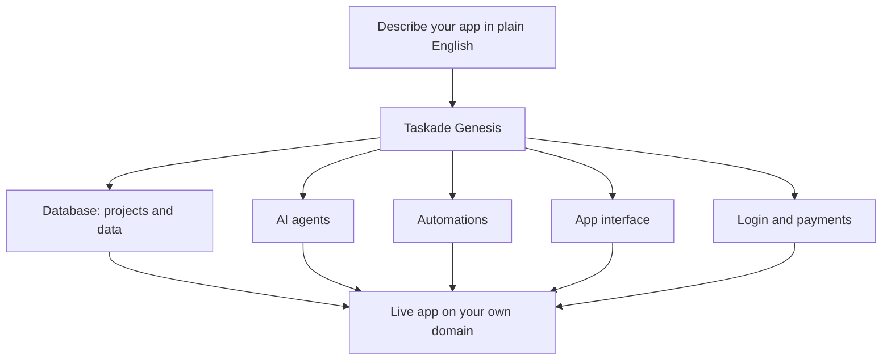
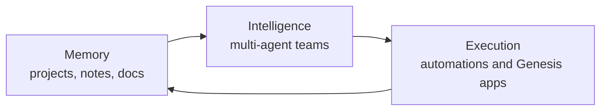

# What Is Taskade Genesis?

**Taskade Genesis is an AI app builder that turns a plain-English description into a complete, hosted, working application** — database, AI agents, automations, a real user interface, login and authentication, payments, and a custom domain. You describe the outcome you want; Genesis builds the software that delivers it.

It is not a mockup tool, a wireframe, or a folder of code you have to host yourself. The thing Genesis hands you is a live app at a real URL that your team or your customers can log into and use.

That distinction matters. One enterprise customer who shipped a production business app solo with Genesis put it plainly: *"What I accomplished in a few weeks would have taken a team of 40+ and 18 months in the Fortune 500."* He is not an engineer. He described what he needed, and the working software showed up.

This is the idea behind Genesis: **build without permission.** No ticket, no sprint, no waiting on a roadmap, no engineer required to get a real tool live.

---

## From a sentence to a running app

The whole pipeline fits in one mental model. You write a description. Genesis generates every layer of a working application around it — and wires them together so the result runs.

Most AI builders stop at one or two of those boxes — they generate a UI, or some code, and leave the rest to you. Genesis generates all of them at once and connects them, because they are already part of the same workspace. The agents can read the database. The automations can trigger the agents. The UI shows the data. Login and payments gate access. It arrives as one running system rather than parts you assemble.

---

## What Genesis builds

When you describe an app, here is what actually gets created — and what each piece does for you in plain terms.

| What Genesis builds | What it means for you |
|---|---|
| **A database** | A real place to store your projects, records, and data — not a spreadsheet you bolt on later. Your app remembers everything users put into it. |
| **AI agents** | Specialized AI workers that live inside the app, read its data, and take action — answering questions, triaging requests, drafting replies, filling records. |
| **Automations** | The recurring work runs itself: a form submission routes a lead, a new order emails a receipt, a status change notifies the right person. |
| **A user interface** | Screens your team and customers actually use — dashboards, forms, tables, and views — generated to fit the app you described. |
| **Login and authentication** | Real accounts and sign-in, so what you publish isn't wide open. You control who gets in. |
| **Payments** | Stripe-backed checkout and paywalls built in, so the app can charge customers and log orders without third-party plumbing. |
| **A custom domain** | Publish on your own web address (`yourbrand.com`) instead of a generic shared link. |
| **Hosting** | The app runs at a live URL. There is nothing to deploy, no server to rent, no DevOps to learn. |

The short version: other AI tools generate *code*. Genesis generates a *product*.

---

## How it works

The loop from idea to live app has four steps, and none of them require code.

1. **Describe the outcome.** Open the [Genesis builder](https://www.taskade.com/ai/apps) and write what you want in plain English — "a CRM that tracks leads by stage and emails me when a deal closes," or "a client portal where customers log in to see project status." Be specific about the result, not the implementation.
2. **Genesis generates the app.** It builds the projects and database, the AI agent roles, the automations, and the UI — wired together — and shows you a running app, not a spec.
3. **Refine it in click-to-edit.** Adjust anything directly in the live interface. Move a field, reword an agent's instructions, change an automation. Changes go live immediately — there is no redeploy step and no rebuild.
4. **Share or publish.** Invite your team, ship it to customers, add a login, turn on payments, and put it on your own domain.

Because the app is live the moment it is generated, the gap between "I have an idea" and "people are using it" is measured in minutes, not quarters.

---

## How Genesis fits the AI-native workspace

Genesis is not a separate product bolted onto Taskade. It is the **Execution** layer of one connected workspace — what Taskade calls Workspace DNA: Memory, Intelligence, and Execution running as a single feedback loop.

- **Memory** is everything your workspace knows — your projects, notes, and uploaded documents. It is the shared context.
- **Intelligence** is your [multi-agent teams](../guides/multi-agent-workspace.md) — AI agents that reason over that memory and decide what to do.
- **Execution** is where decisions become finished work — [automations](../guides/connect-tools-and-automate.md) and the Genesis apps they run inside.

The loop closes because the apps Genesis builds feed their data back into Memory, which the agents read, which drives the next round of Execution. That is why a Genesis app ships with agents and automations already inside it: they share the same brain. Read the foundation in the [AI-native workspace guide](../guides/ai-workspace.md).

---

## Start from a finished app, not a blank prompt

You don't have to describe everything from scratch. Taskade publishes a gallery of **app kits** — live, finished Genesis apps with their data, AI agents, and automations already wired up. Clone one in about a minute, then make it yours: rename it, add your data, add a login, and publish on your own domain.

Cloning is the fastest path for common needs — a CRM, a help desk, a client portal, a storefront. You start from something that already works and adjust, rather than starting from zero. Taskade lists 150+ community kits. Browse them in [Clone-Ready App Kits](./app-kits.md), or see a worked walkthrough in [Build a CRM with AI](./build-a-crm-with-ai.md).

There are three ways to start, then:

- **Describe it** — write a prompt and have the app built.
- **Clone it** — start from a finished app kit and customize.
- **Hire an agent to run it** — bring in a pre-built role (a CFO, CMO, COO, or CEO agent) to operate the app for you.

---

## Who Taskade Genesis is for

Genesis is for the person who knows exactly what should exist but doesn't write code:

- **Operators and program managers** who keep hitting "we'd need engineering for that" and want to stop waiting.
- **Founders** who need a real tool — a CRM, a portal, a storefront — live this week, not next quarter.
- **Non-technical builders** on any team who can describe an outcome clearly and want the software to follow.

If you have ever mapped out a tool in your head, written the requirements, and then watched it die in a backlog, Genesis is built for you. The premise is that the bottleneck was never your idea — it was access to building. That access is now a sentence.

---

## The honest trade-off: hosted on Taskade, no code export

Here is the straight version, because it matters when you choose a tool.

**Genesis apps are hosted on Taskade, and you don't get a downloadable codebase to take elsewhere.** If your requirement is "generate source code I own and deploy on my own infrastructure," Genesis is not that tool — and you should know that up front.

What you get in exchange is the reason most people choose Genesis in the first place. Prompt-to-*code* tools generate files you then have to host, secure, and maintain yourself — and they hand you no AI agents, no automation engine, and no data layer. You get a starting point and a maintenance bill. Workspace and project tools can configure themselves, but they can't ship a standalone, hosted app with its own login and payments.

Genesis trades code export for **everything being built-in and running**: the database, the agents, the automations, the auth, the payments, and the hosting all arrive together and stay maintained. For a non-technical builder who wants a working product rather than a repository, that is usually the trade worth making. For a team that needs to own and self-host source, it isn't — and that's a fair line to draw.

See how that trade compares across categories in the [comparison hub](../compare/README.md).

---

## FAQ

### What is Taskade Genesis?

Taskade Genesis is an AI app builder that turns a plain-English description into a complete, hosted, working application — database, AI agents, automations, UI, login and auth, payments, and a custom domain. It produces a real running app, not a mockup.

### How does Taskade Genesis work?

You open the builder, describe the outcome in plain English, and Genesis generates the projects, agent roles, automations, and UI. You run it, refine it in click-to-edit (changes are live immediately), then share with your team or publish on a custom domain.

### What does Genesis build that other AI builders don't?

Genesis ships built-in intelligence — AI agents, automations, and a database — not just code files you host yourself. Prompt-to-code tools generate a UI or source you then maintain; Genesis hands you a running product with the agents and data layer already wired in.

### Is the app actually hosted, or just a prototype?

It's a real hosted app at a live URL with login and auth built in, and it can run on your own custom domain. It's running software your team or customers can use, not a static prototype.

### Can I take payments inside an app I build?

Yes. Genesis apps support Stripe-backed checkout and paywalls built in, so an app can charge a customer, log the order, and email a receipt without bolting on third-party payment tools or hiring an engineer.

### Can I clone an app instead of starting from a blank prompt?

Yes. You can clone a live community app kit in about a minute — data, AI agents, and automations already wired up — then rename it, add your data, add a login, and publish on your own domain. Taskade lists 150+ community kits.

### Who is Taskade Genesis for?

It's for operators, founders, and non-technical builders who know what they want shipped but don't write code — the "build without permission" idea: no ticket, no sprint, no engineer required to get a real tool live.

### Can I build an app without code?

Yes. With Genesis you describe the app in plain English and it builds a complete, hosted application — database, agents, automations, UI, login, payments, and a custom domain — with no code and no setup.

### Is Taskade Genesis free to try?

Yes, you can start building from a prompt for free. Higher AI usage, more agents, and more automation runs come with paid plans; verify the current details on [taskade.com](https://www.taskade.com).

---

## Related

- [What is an AI-native workspace?](../guides/ai-workspace.md) — the Memory + Intelligence + Execution foundation Genesis runs on.
- [What is a multi-agent workspace?](../guides/multi-agent-workspace.md) — the intelligence layer inside every Genesis app.
- [Clone-Ready App Kits](./app-kits.md) — 150+ live apps you can clone in about a minute.
- [Build a CRM with AI](./build-a-crm-with-ai.md) — a worked, end-to-end example.
- [Comparison hub](../compare/README.md) — how Genesis stacks up against code builders, doc tools, and agent platforms.

---

**Ready to build without permission?** Describe your first app and watch it come to life at **[taskade.com/ai/apps](https://www.taskade.com/ai/apps)**.
