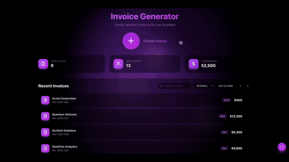
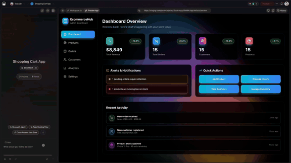

# Taskade Genesis — What's New & Release Highlights

This is the short version of where Taskade Genesis is going. Every few weeks something ships that moves the line between "I have an idea" and "it's live and people are using it" — a new way to build apps from a sentence, give your agents memory, connect the tools you already use, take real payments, or automate the work that used to sit in your inbox.

This page is a curated, scannable hub of those highlights. Each blurb says what the update *means for you* — the outcome, not the jargon — and links to the full announcement if you want the details. Skim the [Highlights](#highlights), then jump into the [Dive deeper](#dive-deeper) guides for the how-to.

If you're new here: **Taskade Genesis** turns a plain-English description into a complete, hosted, working app — database, AI agents, automations, UI, login, payments, and a custom domain. After the first mention, we'll just call it Genesis. The releases below are the story of how it got there.

---

## The thread running through all of it

If you read the highlights below in order, you'll notice the same four words keep coming back: **memory, agents, workflows, payments.** That's not a marketing tic — it's the actual architecture of the product.

Most tools pick one of those and call it a day. A chatbot has agents but no memory. A spreadsheet has data but no agents. A storefront takes payments but can't think. Taskade's releases keep adding these pieces *to the same workspace*, so they compose: your agents remember (memory), they work together and hand off (agents + workflows), and the apps they help you build can charge a customer (payments).

So when a release says "Memory. Agents. Workflows." it's telling you which of those layers got deeper that month — not announcing a separate product you have to learn from scratch. Everything below stacks on everything above it.

---

## Highlights

Newest themes first. Each one is a real capability you can use today, not a roadmap promise.

### Introducing Live Workspace Apps — Wiki. Hiring. Meetings.

The newest release turns three jobs that usually eat a whole afternoon into apps that just run. A **wiki that answers questions across your docs** — ask it something and it reads everything you've written to reply, instead of making you hunt through pages. A **hiring board that nudges you on follow-ups** — candidates move through stages and the board reminds you who's waiting on a reply. And a **meeting scheduler with availability voting and AI-drafted invites** — people vote on the times that work, and the invite writes itself.

What it means for you: the knowledge base, the applicant tracker, and the meeting wrangling that each used to be a separate tool (and a separate subscription) are now three live apps inside the same workspace — sharing the same memory and the same agents, ready to use instead of set up.

[Read the announcement →](https://www.taskade.com/newsletters/w/00ZsB1NYPSr9A9WfJmUBEA)

### The Multi-Agent Workspace — Memory. Agents. Workflows.

For a long time an AI agent was a goldfish: smart in the moment, forgetting everything the second the chat closed. This release changed the shape of the whole product. Your workspace now has **memory** — the projects, notes, and context your agents draw on — plus **multiple agents** that can work as a team, and **workflows** that string their work into something repeatable.

What it means for you: instead of re-explaining your business to a chatbot every morning, you build a workspace that *remembers*. Agents share that memory, hand work to each other, and run on a schedule. It stops being a clever toy and starts being a small team that knows your context.

[Read the announcement →](https://www.taskade.com/newsletters/w/UEp3U763Zi24hmhZeBBC7tYA)

### Workspace Memory. Agent Workflows. App Payments.

Three pieces landed together that, between them, cover *remember*, *act*, and *get paid*. **Workspace Memory** gives your agents a shared, persistent brain. **Agent Workflows** let you chain agents into a pipeline that runs end to end. And **App Payments** means the apps you build can take real money — Stripe-backed checkout and paywalls, built in rather than bolted on.

What it means for you: you can go from "an agent that drafts replies" to "an app that charges a customer, logs the order, and emails the receipt" without leaving Taskade or hiring an engineer to wire up payments.

[Read the announcement →](https://www.taskade.com/newsletters/w/xS69BpvgSdFylcbiqCtedw)

### Agent Memory. Connect Tools. Automate Flows.

Agents got better at two things people kept asking for: **remembering** what matters across sessions, and **reaching into the tools you already use**. Connect your stack — Taskade supports 100+ integrations — and your agents can read and write in the apps where your work actually lives, then **automate the flows** that move information between them.

What it means for you: the busywork in the seams between apps — copying a form response into a spreadsheet, pinging a channel when a deal moves, kicking off a follow-up — becomes a flow that runs itself. You describe the handoff once; it happens every time after.

[Read the announcement →](https://www.taskade.com/newsletters/w/BUBjhfsitR6ebieWYOIUGw)

### Clone Apps. Add Login. Run Agents. Automate Flows.

You no longer have to start from a blank prompt. **Clone** an app the community has already built, make it yours, **add a login** so it's not wide open, drop in **agents** to do the thinking, and wire up **automations** to handle the repetitive parts.

What it means for you: the fastest way to ship something good is to start from something that already works. Find an app close to what you need, fork it, change the parts that are specific to you, and you've skipped the hardest blank-page hours entirely.

[Read the announcement →](https://www.taskade.com/newsletters/w/378uA89WkQhIqrqgotOA5Q)

### Deploy Agents. Launch Shops. Automate Payments.

This release leaned all the way into commerce. **Deploy agents** that handle real tasks for you, **launch a shop** that's actually hosted and live, and **automate the payment side** — checkout, confirmations, the orders that have to be recorded — so selling isn't a separate project from building.

What it means for you: "I want to sell this" and "I have a working storefront" can be the same afternoon. The catalog, the Stripe checkout, the orders table, and the receipt email all come out of one build instead of five integrations.

[Read the announcement →](https://www.taskade.com/newsletters/w/76392DMb515vYMtt3apr7h892g)

### Map Your Mind. Plan Tasks. Track Habits.

Not every release is about shipping software for other people — some are about getting your own head straight. This one focused on the personal side: **mind maps** to think out loud and see the shape of an idea, **task planning** to turn that into a real list, and **habit tracking** to keep the small daily things from slipping.

What it means for you: the same workspace that builds apps and runs agents is also a genuinely good place to think and plan. Map a project visually, let it become tasks, and track the routines that keep you moving — without juggling three separate apps.

[Read the announcement →](https://www.taskade.com/newsletters/w/QGCDQvGg98xnNHiRel763vCQ)

### Taskade Genesis: New Apps. Agents. Workflows.

The foundational one. This is where Genesis arrived as the through-line connecting everything else: describe an app, get an app — with the agents and workflows that make it more than a pretty page.

What it means for you: the gap between an idea and a working tool closed dramatically. You don't budget a quarter and a developer to test a concept anymore; you describe it, look at the result, and iterate the same day.

One enterprise customer who shipped a production business app this way put it plainly: *"What I accomplished in a few weeks would have taken a team of 40+ and 18 months in the Fortune 500."* That's the shift every release on this page is chasing — making real software something one person can describe and ship, instead of something a team has to staff and schedule.

[Read the announcement →](https://www.taskade.com/newsletters/w/ipn3YKX9smv3DIfmv9t6EA)

---

## A few of these in motion

Words only go so far. Here's what a couple of the releases above actually look like — each clickable if you want to try it yourself.

The first is App Payments and the invoice/billing side made concrete: an app that bills someone, generated from a description. The second is checkout — real Stripe-backed payments wired into an app you built, not a separate store you have to maintain.

---

## How to read this list

A couple of honest notes so the highlights stay useful:

- **These are capabilities, not benchmarks.** We describe what each release lets you do. We don't quote made-up adoption numbers or time savings — the point of the product is that you can verify the outcome yourself by building something.
- **The themes overlap on purpose.** Memory, agents, workflows, and payments keep showing up together because that's the actual shape of the product: one workspace where remembering, thinking, doing, and getting paid all live in the same place, instead of four tools stitched together.
- **Newest doesn't mean "only this matters."** Older releases like the original Genesis launch are still the foundation everything newer is built on. Start wherever your problem is.

This page is a highlights hub, not a changelog. It collects the releases that change *what you can accomplish* — the ones worth a paragraph and a link. Smaller fixes, polish, and incremental improvements ship constantly and don't all land here; if you want the blow-by-blow, the announcements linked above go deeper than these summaries do.

---

## Where to start

You don't need to read every announcement. Find the row that sounds like your situation and follow it.

| If you want to… | Start with this release | Then read this guide |
| --- | --- | --- |
| Ship something *today* without starting from scratch | Clone Apps. Add Login. Run Agents. | [Clone & customize apps](../use-cases/clone-and-customize-apps.md) |
| Sell something and actually take money | Deploy Agents. Launch Shops. Automate Payments. | [Build a storefront with AI](build-a-storefront-with-ai.md) |
| Stop re-explaining your business to the AI every day | The Multi-Agent Workspace — Memory. Agents. Workflows. | [The multi-agent workspace](../guides/multi-agent-workspace.md) |
| Kill the copy-paste busywork between your apps | Agent Memory. Connect Tools. Automate Flows. | [Connect tools & automate](../guides/connect-tools-and-automate.md) |
| Get your own head and to-do list in order | Map Your Mind. Plan Tasks. Track Habits. | [Personal productivity](../use-cases/personal-productivity.md) |
| Understand the whole idea from the ground up | Taskade Genesis: New Apps. Agents. Workflows. | [Introducing Taskade Genesis](https://www.taskade.com/blog/introducing-taskade-genesis) |

---

## Dive deeper

The announcements tell you *what* shipped. These guides show you *how* to use it for a real outcome.

- **[Clone & customize community apps](../use-cases/clone-and-customize-apps.md)** — start from an app that already works, add a login, drop in agents, and make it yours. The fastest path past the blank page.
- **[Connect tools & automate flows](../guides/connect-tools-and-automate.md)** — give agents memory, wire up the 100+ integrations, and turn the work between your apps into flows that run themselves.
- **[Build a storefront with AI](build-a-storefront-with-ai.md)** — the commerce releases made concrete: a real, hosted shop with Stripe checkout, an orders table, and accounts, from one prompt.
- **[The multi-agent workspace](../guides/multi-agent-workspace.md)** — what it means to have memory, multiple agents, and workflows in one place, and how to set up a team of agents that share context.
- **[Personal productivity](../use-cases/personal-productivity.md)** — mind maps, task planning, and habit tracking for getting your own work in order, not just shipping apps for others.
- **[Live workspace apps](../use-cases/live-workspace-apps.md)** — the wiki, hiring board, and meeting scheduler made concrete: three live apps that share your workspace's memory and agents instead of living in separate tools.
- **[Deploy agents & launch shops](../genesis/deploy-agents-launch-shops.md)** — take it past internal apps: deploy chatbot agents, launch a hosted shop, and automate the payment side end to end.

---

## Related

- [The multi-agent workspace](../guides/multi-agent-workspace.md) — the pillar guide on what a multi-agent workspace actually is
- [Clone & customize apps](../use-cases/clone-and-customize-apps.md)
- [Connect tools & automate](../guides/connect-tools-and-automate.md)
- [Build a storefront with AI](build-a-storefront-with-ai.md)
- [Personal productivity](../use-cases/personal-productivity.md)
- [Introducing Taskade Genesis](https://www.taskade.com/blog/introducing-taskade-genesis) — the launch story

---

**Want to see the latest for yourself?** The best way to understand a release is to build with it. → **[Open Taskade Genesis and describe your app](https://www.taskade.com/ai/apps)**
