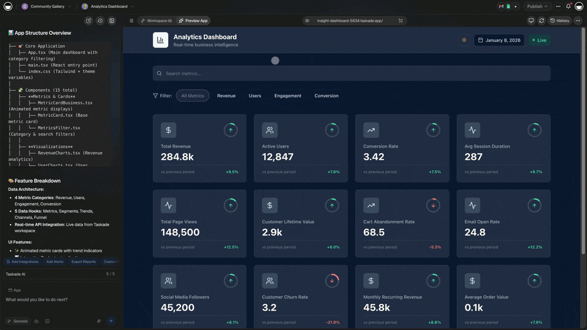
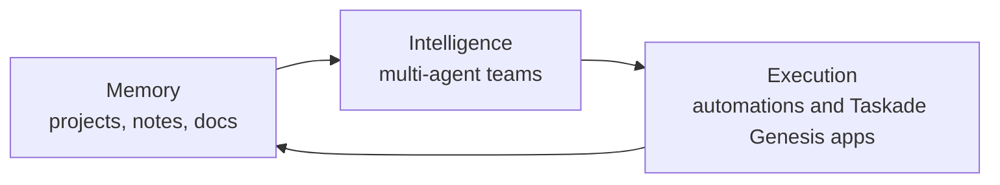

# What Is an AI Workspace? The AI-Native Workspace, Explained

An **AI workspace** is a single place where your information, your AI, and your work all live together — so that asking for something and getting it done are the same motion. Not a document tool with a chatbot stapled to the side. Not a chat assistant that forgets everything the moment you close the tab. A workspace where memory, intelligence, and execution are one system.

This page defines the term, lays out the three layers that make a workspace genuinely **AI-native**, and shows what that lets a non-technical person actually accomplish — not in theory, but in real, shipped outcomes.

---

## A clear definition

> An **AI-native workspace** is a workspace built so that AI is the substrate, not a feature. Your projects, notes, and data form a shared memory. AI agents read and write to that memory directly. And the work — the follow-ups, the reports, the apps themselves — gets produced inside the same space, not exported to somewhere else.

The shorthand we use is **Memory + Intelligence + Execution, in one workspace.**

The test is simple. In an AI-native workspace:

- The AI already knows your context, because it shares your data — you don't paste it in every time.
- You can ask for an outcome, not just an answer — "draft the follow-ups," "build the tracker," "run this every Monday" — and the workspace does it.
- What the AI produces lands *back in the workspace*, where you and your team can edit it, run it, and build on it.

If any of those three is missing, you have AI bolted onto a tool. You don't have an AI-native workspace.

### Why the category exists now

For most of software history, the data, the intelligence, and the action lived in three different places. Your files were in one app. Your "smart help" — if any — was a search box. And to make anything *happen*, a human read the file, thought about it, and clicked the buttons. The human was the integration layer between knowing and doing.

Capable, low-cost models changed the economics of that middle step. For the first time, the thinking can sit next to the data instead of in a separate product, and it can be trusted to take the next action rather than just suggest it. The AI-native workspace is the architecture that falls out of that shift: stop shuttling context between tools, and let one system hold the memory, do the reasoning, and produce the result. The term names a real structural change, not a marketing coat of paint.

---

## The three layers

An AI-native workspace stands on three layers. Remove any one and it collapses into something narrower — a notes app, a chatbot, or a no-code builder. Together, they're a workspace that thinks and acts.

The three layers form a loop — Memory feeds Intelligence, Intelligence drives Execution, and Execution writes back to Memory:

### Layer 1 — Memory: projects and notes as living context

Memory is everything your workspace knows: your projects, tasks, notes, mind maps, uploaded documents, and the way they connect. In a traditional tool this is *storage* — inert files you open and read. In an AI-native workspace it's **context the AI can use**.

That distinction matters. When your meeting notes, your roadmap, and your customer list are all part of one shared memory, an agent can answer "what did we decide about pricing in Q1?" without you re-explaining the company. The workspace remembers so you don't have to repeat yourself.

You shape this memory the normal way — by writing things down, organizing projects, and viewing them however suits the work: as a **list**, a **board**, a **calendar**, a **table**, a **mind map**, a **Gantt** timeline, or an **org chart**. Seven views over one source of truth. The mind map view, in particular, is a fast way to think out loud and hand the structure straight to an agent — see the [AI Mind Map Generator](../tools/ai-mind-map-generator.md).

The reason seven views matter to an *AI* workspace, and not just to a human one, is that the same underlying data can be read in whatever shape the task needs. A human plans on a board and reviews on a calendar; an agent reads the structured table and writes back tasks the human then sees on their list. One memory, many lenses — and nothing gets out of sync, because there's only ever one copy of the truth underneath.

### Layer 2 — Intelligence: multi-agent teams

Intelligence is the AI that reads and writes that memory. A single chatbot is a start, but real work has roles: a researcher, a writer, a reviewer, a project manager. An AI-native workspace lets you assemble **multiple specialized agents** — each with its own instructions, knowledge, and tools — and have them work together on a project the way a team would.

One agent drafts. Another fact-checks against your uploaded sources. A third turns the result into tasks and assigns them. Because they share the same memory (Layer 1), there's no copy-pasting between tools and no losing the thread. This is the heart of the platform, and it gets its own deep dive in [The Multi-Agent Workspace](../guides/multi-agent-workspace.md).

### Layer 3 — Execution: automations and Genesis apps

Knowing and thinking are worthless if nothing happens. Execution is the layer that turns intent into action.

- **Automations / workflows** handle the recurring work: when a form comes in, route it; every Monday, compile the report; when a task is marked done, notify the channel. You describe the trigger and the steps in plain English; the workspace runs them on its own.
- **Taskade Genesis** goes further. Describe an app in plain English and Genesis builds a complete, hosted, working application — database, AI agents, automations, UI, login and auth, payments, and a custom domain. Not a mockup. A real app your team or customers can use today. See it at the [Genesis app builder](https://www.taskade.com/ai/apps).

This is the layer that separates an AI-native workspace from a smarter notebook. The output isn't just text — it's running software and live processes.

### How the three layers feed each other

The layers aren't a stack you climb once. They form a loop. Execution produces new information — a submitted form, a closed deal, an app's usage data — which becomes Memory. Intelligence reads that fresh Memory to decide what matters. And those decisions trigger more Execution. Around it goes.

A worked example, end to end:

1. **Memory** — you keep a project of inbound leads. Each lead is a row with a few notes.
2. **Intelligence** — an agent reads new leads, scores them against your ideal-customer profile (which also lives in the workspace), and drafts a tailored first reply.
3. **Execution** — an automation sends the reply, schedules a follow-up, and a Genesis app gives the sales team a live dashboard of the pipeline.
4. **Back to Memory** — every reply and outcome is written back, so next week the agent scores better because it has more to learn from.

No single one of those steps is new. Having them in *one workspace*, with no copy-paste seams between them, is.

---

## AI-native vs. "AI bolted onto an old product"

The phrase gets used loosely, so here is the honest distinction.

Most established tools added AI the only way they could without rebuilding: a panel on the side, a "summarize" button, a chat box. It's useful, and sometimes that's all you need. But the AI sits *outside* the product's core. It doesn't share the data model, it can't take actions, and it forgets context between sessions. You're still the integration layer — copying its answer out, pasting it where it belongs, doing the actual work yourself.

| | AI bolted on | AI-native workspace |
|---|---|---|
| **Where AI lives** | A feature beside the product | The substrate the product runs on |
| **Context** | You paste it in each time | Shared memory the AI already has |
| **What you get** | An answer to read | An outcome that lands in the workspace |
| **Can it act?** | Suggests; you execute | Runs automations and builds apps |
| **Memory** | Resets between chats | Persists across the whole workspace |

We're not claiming the incumbents are bad at what they were built for. A great document editor is a great document editor. The point is architectural: you can't retrofit a shared-memory, agent-driven, self-executing workspace onto a product that was designed around static documents — you'd have to start from the data model up. That's the difference, and it's why the comparison with document-first tools is worth reading honestly: [Taskade vs. Notion](../compare/taskade-vs-notion.md).

---

## What a non-technical person can actually accomplish

This is the part that sounds too good until you watch it happen. The promise of an AI-native workspace isn't "type less." It's **ship things you previously needed a team and a budget to ship.**

The positioning we hold ourselves to is *build without permission* — you shouldn't have to file a ticket, wait for a sprint, or hire an engineer to get a real tool into your team's hands.

Concretely, without writing code, one person can:

- **Stand up a real internal app.** A CRM, a client portal, a helpdesk, an inventory tracker — described in plain English, built by Genesis, hosted and ready to use. Start with [Build a CRM with AI](../genesis/build-a-crm-with-ai.md).
- **Put a team of agents on a recurring job.** Research, draft, review, and publish — running on a schedule, writing results back into your projects.
- **Automate the busywork between people.** Intake, routing, reminders, status reports — the connective tissue that usually eats a coordinator's week.
- **Charge money.** Genesis apps support login, auth, and payments, so an idea can become something you actually run a small business on.

An enterprise customer who built a production business app solo with Genesis put the outcome plainly: *"What I accomplished in a few weeks would have taken a team of 40+ and 18 months in the Fortune 500."* That's the shape of the change — not incremental speed, but a different order of what one person can do.

David's framing — the IT program manager who's systems-literate but doesn't write code — is the right one to hold in your head. He doesn't want a model. He wants the app live by Friday. An AI-native workspace is the first kind of tool that makes "by Friday, by myself" a reasonable answer.

### An honest note on limits

Build-without-permission is a real shift, not magic. You still have to know *what* you want — the clearer your description of the outcome, the better the result, exactly like briefing a sharp new hire. Genesis builds genuinely working apps, but anything mission-critical still deserves a human reading the output before it goes live. And the workspace is only as smart as the memory you give it; an agent with no context is a generic assistant. The honest pitch isn't "no thinking required." It's "no waiting, no budget approval, and no engineer required" — your judgment, finally unblocked.

---

## Getting started in 3 steps

You don't have to adopt all three layers at once. Start with whichever is most painful and grow into the rest.

**1. Capture your memory.** Create a workspace and put one real project in it — your current launch, your hiring pipeline, your client list. Use whatever view fits (try the [mind map generator](../tools/ai-mind-map-generator.md) if you're thinking, the table view if you're tracking). The goal is to get real context into the workspace so the AI has something to work with.

**2. Add intelligence.** Bring in an agent and give it your project as context. Ask it for an outcome, not just an answer — "turn this brief into a task list," "review these notes against our goals." When one agent isn't enough, assemble a few into a team; the [multi-agent workspace guide](../guides/multi-agent-workspace.md) walks through how.

**3. Make it execute.** Pick one recurring task and automate it, or describe an app you wish existed and let Genesis build it. This is where the workspace stops being a place you visit and becomes a place that works for you. Open the [Genesis app builder](https://www.taskade.com/ai/apps) and describe one thing.

---

## FAQ

**Is an AI workspace just a notes app with ChatGPT inside?**
No. A notes app with a chatbot can answer questions about text you paste in. An AI-native workspace shares its memory with the AI, lets agents take actions, and produces running apps and automations — not just answers.

**Do I need to know how to code?**
No. The entire premise is plain-English in, working outcome out. Genesis builds real apps — with a database, auth, and payments — from a description, and automations are configured by saying what should happen.

**What's the difference between an agent and an automation?**
An agent reasons — it reads context and decides what to write or do. An automation is a fixed sequence that runs on a trigger. The two compose: an automation can hand work to an agent, and an agent can kick off an automation.

**Can a team use it together?**
Yes. The workspace is collaborative and real-time across web, desktop, and mobile, with 100+ integrations to connect the tools you already use.

**How is this different from a no-code app builder?**
A no-code builder gives you Layer 3 (execution) only. An AI-native workspace gives you all three — the apps you build sit on top of the same memory your team works in and the same agents that help run it.

**Does my data stay private?**
Your workspace is yours. Memory is what *you* put in it — your projects, notes, and uploads — and you control which agents and apps can see what. Think of it as your team's brain, not a public one.

**What if I already use other tools?**
You don't have to rip anything out to start. With 100+ integrations, an AI-native workspace can sit alongside the tools you already run and pull their data into shared memory — so you can adopt the layers one at a time instead of migrating everything at once.

---

## Related

- [The Multi-Agent Workspace](../guides/multi-agent-workspace.md) — how teams of agents work together
- [Taskade vs. Notion](../compare/taskade-vs-notion.md) — AI-native vs. document-first, honestly compared
- [Build a CRM with AI](../genesis/build-a-crm-with-ai.md) — Execution layer, start to finish
- [AI Mind Map Generator](../tools/ai-mind-map-generator.md) — a fast way to feed the Memory layer
- [Introducing Taskade Genesis](https://www.taskade.com/blog/introducing-taskade-genesis) — the announcement and the thinking behind it

---

**Ready to build without permission?** [Describe your first app in the Genesis builder](https://www.taskade.com/ai/apps) — or [explore the workspace at taskade.com](https://www.taskade.com).
