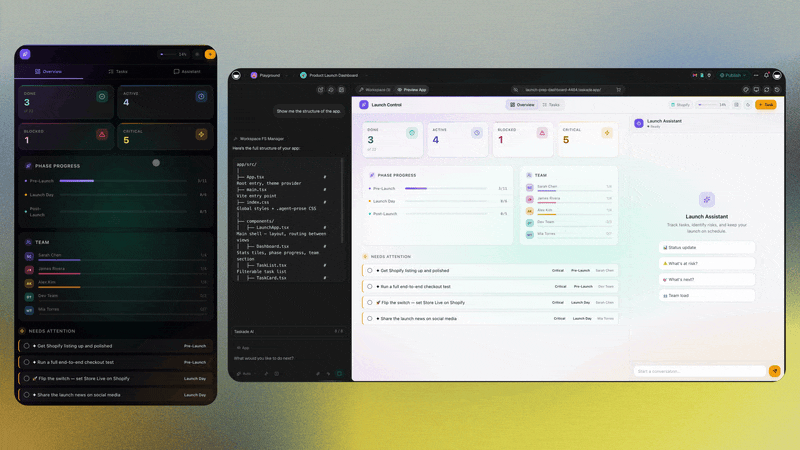

# Connect Your Tools and Automate the Work: AI Workflow Automation, Explained

The tools you already use — Slack, Stripe, Shopify, Gmail, Google Calendar, your CRM — keep working exactly as they do now. The difference is that your AI can finally read them and update them for you. You describe a process in plain English, and it runs: on a schedule, or the moment something happens. No node editor, no scripts, no "talk to engineering first."

This page is for the operator who has a process in their head and no patience for plumbing. It explains, in plain English, three things that usually get buried in jargon: what **agent memory** is and why it matters, what "**connect tools**" actually means, and how **AI workflow automation** lets you hand off the repetitive work without learning to code.

---

## The short version

In **Taskade Genesis** and the workspace around it, three things finally live together:

- **Memory** — your AI remembers context across conversations and projects, so you stop re-explaining yourself.
- **Connected tools** — your agents can read from and write to the 100+ apps you already run, so work doesn't get stranded in one place.
- **Automated flows** — you describe a process once, in plain English, and it runs itself on a schedule or a trigger.

Most tools give you one of these. The point here is that you don't have to choose, and you don't have to wire them together yourself.

---

## Agent memory: your AI stops forgetting

The single most frustrating thing about most AI tools is that they have amnesia. You explain your company, your customers, your tone of voice — and the next time you open the tab, it's a stranger again. You become the memory: copying context in, every single time.

**Agent memory** fixes that. Your projects, notes, uploaded documents, and past conversations form a shared context that your agents can draw on. Ask "what did we promise the Henderson account?" and the agent already knows, because the answer lives in the same workspace it works in. You're not pasting a brief into a chat box — the brief is already there.

Why this matters for automation specifically: an automated flow is only as smart as what it remembers. A "follow up with new leads" flow that forgets your product, your pricing, and last week's conversation writes generic junk. One that shares your workspace memory writes a follow-up that sounds like you, references the right deal, and picks up where the last touch left off.

You shape this memory the normal way — by working. Write notes, organize projects, upload the PDFs your team actually uses. The more real context lives in the workspace, the better every agent and every flow performs. For the full picture of how memory, agents, and execution fit together, see [What Is an AI Workspace?](../guides/ai-workspace.md).

---

## "Connect tools" in plain English

Strip away the jargon and a connected tool means one thing: **your agents can read and update your other apps for you.**

That's it. Not "configure an OAuth scope." Not "map the webhook payload." When Taskade is connected to your tools, an agent can:

- **Read** — pull the new orders from Shopify, the unread emails in Gmail, the deals that moved in your CRM, the messages in a Slack channel.
- **Write** — post a message to Slack, create a Stripe invoice, add a row to a Google Sheet, draft and send an email, create a calendar event.

So instead of you being the bridge between your apps — checking one, copying into another, updating a third — the agent crosses those bridges. Your tools stay where they are and keep doing their job; the difference is who's doing the clicking.

With **100+ integrations**, the common stack is covered: Slack, Stripe, Shopify, Gmail, Google Calendar, Google Drive, Google Sheets, Notion, HubSpot, and more. You connect a tool once, and from then on your agents and flows can use it. You can browse what's available and start connecting from the [Genesis app builder](https://www.taskade.com/ai/apps).

A few examples of what "read and update" looks like in practice:

| Tool | An agent can read | An agent can write |
|---|---|---|
| **Slack** | Messages in a channel | Post updates, alerts, summaries |
| **Stripe** | Payments and customers | Create invoices, log revenue |
| **Shopify** | New orders, inventory | Flag low stock, confirm orders |
| **Gmail** | Unread and inbound mail | Draft and send replies |
| **Google Calendar** | Upcoming events | Create and reschedule meetings |
| **Google Sheets** | Rows and tables | Append rows, update cells |

The pattern is the same across all of them: the agent does the reading and the writing so you don't have to be the one switching tabs.

### A note on MCP — "USB-C for AI tools"

You may run into the term **MCP** (Model Context Protocol). Here's the only explanation you need: it's a shared standard for plugging tools into AI, the way **USB-C is a shared standard for plugging devices into a laptop.**

Before USB-C, every device had its own connector and you hunted for the right cable. Before a standard like MCP, every AI integration was a one-off custom job. MCP means a tool that speaks the standard can plug into your agents without a bespoke build — and it means Taskade can act as both a place that *uses* connected tools and a tool other AI systems can connect *to*. You don't have to think about any of this to get value; it's just why "connect tools" keeps getting easier. If you want the technical depth, it lives at [developers.taskade.com](https://developers.taskade.com).

---

## Automate flows: describe it, don't build it

Most automation tools hand you a blank canvas of nodes and arrows and wish you luck. That's a builder's tool. If you're an operator with a process to run, the last thing you want is to learn a flowcharting app to express "email me the new sign-ups every morning."

**AI workflow automation** in Taskade flips that. You describe the process in plain English, and the workspace assembles the flow:

> "Every weekday at 8am, summarize yesterday's new Stripe payments and post the total to our #revenue Slack channel."

> "When a new lead comes in through the form, research the company, draft a personalized intro email, and create a follow-up task for the owner in three days."

You don't draw the nodes. You say what should happen, and when. Two things decide *when*:

- **Schedule** — the flow runs on a clock: every morning, every Monday, the first of the month.
- **Trigger** — the flow runs when something happens: a form is submitted, a deal closes, a file lands in a folder, a task is marked done.

Between the trigger and the result, an agent does the thinking — reading your connected tools, drawing on workspace memory, deciding what to write. That's the part a plain node editor can't do, and it's why these flows produce work that reads like a person did it, not a macro.

---

## Concrete example flows

Abstract automation talk is cheap. Here are flows an operator can actually stand up, end to end, without code.

### New lead → enrich → notify → follow up

1. **Trigger** — a new lead arrives (a form submission, a new row in your CRM, an inbound email).
2. **Enrich** — an agent researches the company and the contact, then writes a short brief into the lead's record.
3. **Notify** — a message posts to your sales Slack channel: who came in, what they want, and the agent's read on fit.
4. **Follow up** — the agent drafts a tailored first reply and schedules a follow-up task three days out, so nothing slips.

Because the agent shares your workspace memory, the brief and the draft reference your real product and pricing — not boilerplate. This exact pattern is the backbone of [AI Agents for Sales](../use-cases/ai-agents-for-sales.md).

### New order → fulfill → thank → restock check

1. **Trigger** — a Shopify order comes in.
2. **Act** — an agent confirms the order, drafts a thank-you email matched to what the customer bought, and logs the sale to a Google Sheet.
3. **Watch** — if the order pushes an item below your restock threshold, the agent flags it in Slack so you reorder before you sell out.

### Monday rollup → report → distribute

1. **Schedule** — every Monday at 7am.
2. **Compile** — an agent reads the past week across your connected tools (closed deals, support tickets, payments) and writes a plain-language summary.
3. **Distribute** — the report posts to a project, emails the leadership list, and creates this week's priorities as tasks.

None of these need a person to remember to do them, and none need a person to wire them. You describe the outcome; the flow handles the motion. For more recurring jobs framed this way, see [AI Agents for Customer Support](../use-cases/ai-agents-for-customer-support.md).

---

## Where this fits with everything else

Connected tools and automated flows are the **execution** layer of an AI-native workspace — the part that turns intent into action. They sit on top of two things that make them actually good:

- **Memory** gives flows context, so the work they produce is specific and on-brand instead of generic.
- **Agents** give flows judgment, so a step can read a messy real-world situation and decide, rather than blindly following a fixed script. When one agent isn't enough, a team of them can split a job — see [The Multi-Agent Workspace](../guides/multi-agent-workspace.md).

And when a recurring flow isn't enough — when you need a full app with a database, login, and payments wrapped around it — that's where Genesis comes in. Describe an app in plain English and Genesis builds a complete, hosted, working application: database, AI agents, automations, UI, auth, payments, and a custom domain. The flows you automated become the engine inside a real product. See it at the [Genesis app builder](https://www.taskade.com/ai/apps).

---

## Outcomes

What does all of this actually buy a non-technical operator? Concrete, measurable relief:

- **You stop being the integration layer.** The hours spent copying between Slack, your CRM, and a spreadsheet go away, because the agent crosses those gaps for you.
- **Nothing slips through the cracks.** Follow-ups, restock checks, and weekly reports happen whether or not anyone remembers them.
- **The work sounds like you.** Because flows draw on workspace memory, the emails and summaries reference your real context, not a template.
- **You ship the process the day you think of it.** No ticket, no sprint, no engineer. You describe it and it runs — the *build without permission* idea, applied to your operations.

An enterprise customer who built a production business app solo with Genesis described the shift this way: *"What I accomplished in a few weeks would have taken a team of 40+ and 18 months in the Fortune 500."* The same principle scales down to a single flow — the leverage is real even when the project is small.

### An honest note on limits

This isn't magic, and pretending it is would be a disservice. A flow is only as good as the description you give it — vague in, vague out, exactly like briefing a new hire. Anything that touches money or customers deserves a human reading the output before it goes live, at least until you trust a given flow. And an agent with an empty workspace is just a generic assistant; the memory you feed it is what makes it sharp. The honest pitch isn't "no thinking required." It's "no waiting, no budget, and no engineer required."

---

## Getting started in 3 steps

**1. Connect one tool.** Pick the app you check most — Slack, Gmail, your CRM — and connect it from the [Genesis app builder](https://www.taskade.com/ai/apps). One tool is enough to feel the difference.

**2. Give your agent context.** Put one real project in the workspace and add the notes or documents an agent would need to do a task well. This is the memory the flow will draw on.

**3. Automate one painful, repetitive thing.** Not your whole operation — one flow. The morning report. The new-lead notification. Describe it in plain English, pick a schedule or a trigger, and let it run. Then add the next one.

---

## FAQ

**Do I have to replace my current tools?**
No. The whole point is the opposite — your tools keep working as they are. Taskade reads and updates them through 100+ integrations, so you connect what you already use instead of migrating off it.

**What's the difference between connecting a tool and automating a flow?**
Connecting a tool gives your agents permission to read and write that app. Automating a flow is the recurring process that *uses* that permission — on a schedule or a trigger. You connect once; you can build many flows on top of that connection.

**Do I need to use a node editor or drag-and-drop builder?**
No. You describe the process in plain English and the workspace assembles it. There's no flowchart to draw and no syntax to learn.

**What's the difference between an agent and an automation?**
An automation is a fixed sequence that fires on a trigger. An agent reasons — it reads context and decides what to write or do. They compose: an automation can hand a step to an agent, and an agent can kick off an automation.

**What is MCP, in one sentence?**
It's a shared standard for plugging tools into AI — "USB-C for AI tools" — so connections work without a custom build for every app.

**Is my data safe when I connect tools?**
You control which tools are connected and what your agents and flows can see. Memory is what *you* put in the workspace — your projects, notes, and uploads — and access stays in your hands.

**What if my exact tool isn't in the 100+ integrations?**
The list keeps growing, and because the workspace speaks open standards like MCP, more tools connect over time. The developer docs at [developers.taskade.com](https://developers.taskade.com) cover the technical paths for connecting custom systems.

---

## Related

- [What Is an AI Workspace?](../guides/ai-workspace.md) — where memory, tools, and flows fit in the bigger picture
- [The Multi-Agent Workspace](../guides/multi-agent-workspace.md) — how teams of agents split and finish a job
- [AI Agents for Sales](../use-cases/ai-agents-for-sales.md) — the lead → enrich → notify → follow-up flow, in depth
- [AI Agents for Customer Support](../use-cases/ai-agents-for-customer-support.md) — automating recurring support work
- [Introducing Taskade Genesis](https://www.taskade.com/blog/introducing-taskade-genesis) — the announcement and the thinking behind it

---

**Ready to connect your tools and automate the work?** [Start in the Genesis app builder](https://www.taskade.com/ai/apps) — or [explore the workspace at taskade.com](https://www.taskade.com).
