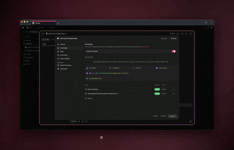

# AI Agents for Research

Research rarely fails for lack of information. It fails because there's too much of it, in too many places, with no time to make sense of it all. The report, the PDF, the saved article, the meeting notes, the email thread — the answer you need is in there somewhere. Finding it, again, is the job that never ends.

**AI agents for research** change that. Instead of you reading, highlighting, and re-reading every source by hand, a team of agents gathers the material, summarizes the long documents, pulls out the points that matter, and keeps it all in one living knowledge base you can simply *ask*. You stop hunting through files and start getting answers grounded in your own sources.

This page is written for the knowledge worker — the analyst, program manager, consultant, or founder who has to turn a pile of documents into a decision. No code required. It shows what an **AI research assistant** looks like in practice inside Taskade, the AI-native workspace where your documents, your agents, and your answers live in the same place.

[](https://www.taskade.com/ai/apps)

---

## The problem: information is scattered, synthesis is slow

If you do research for a living, two things are almost always true at once.

**The sources are scattered.** A useful answer is spread across a dozen artifacts — a 60-page PDF, three browser tabs, a shared drive folder, a Slack thread, last quarter's report, and a transcript someone pasted into a doc. Nothing is in one place, and nothing agrees on format. Before you can think, you have to go collect.

**Synthesis is the bottleneck.** Reading is the easy part. The hard, slow part is turning everything you read into something usable: the three findings that matter, the contradictions between sources, the gap nobody has addressed, the answer to the specific question your boss actually asked. That synthesis happens in your head, which means it doesn't scale and it doesn't survive — when you move on, it's gone, and the next person starts over.

The usual fixes don't remove the work. A better folder structure still leaves you reading everything yourself. A summarizer tool gives you one summary of one document, then it's done. A chatbot answers from the open internet, not from *your* sources, so you can't trust it for anything specific.

AI research agents remove the work itself — and they keep the result.

---

## What AI research agents actually do

An AI agent in Taskade is a configured worker: it has a role, instructions, a chosen model, and its own knowledge — the documents *you* give it. You create one by describing it in plain English. No setup project, no code. Here is the concrete work a research agent takes off your plate.

### Gather sources into one place
Point an agent at your material — uploaded files, pasted text, links, notes — and it pulls everything into a single workspace instead of leaving it strewn across tools. The collection step that used to eat an afternoon becomes the act of dropping files in one place.

### Summarize long documents
Hand an agent a 50-page report, a research paper, or a meeting transcript and it returns a tight summary: what the document argues, the evidence behind it, and what it means for your question. You read a paragraph to decide whether you need the page.

### Extract the key points that matter
Beyond summarizing, an agent can pull structured findings out of a body of sources — claims, data points, quotes, open questions — so the signal is separated from the volume. Instead of "here are ten documents," you get "here are the eight findings across all of them, with where each came from."

### Build a living knowledge base
This is the part that compounds. As you add sources, agents organize them into a structured, searchable knowledge base — a research hub that grows instead of a folder that just gets bigger. It's a [wiki](../use-cases/build-a-wiki.md) that maintains itself: new material gets summarized and filed where it belongs, and the whole thing stays current.

### Answer questions grounded in your files
Once your sources are in the workspace, you can ask plain-language questions — *"What did the three vendor reports say about implementation timelines?"* — and get an answer drawn from **your** documents, not the open web. The answer points back to the sources it came from, so you can check it. That grounding is the difference between a research assistant you can trust and a chatbot you can't.

A finding from a research agent typically comes back structured, so you can use it immediately:

- **Claim** — the point being made, in one line
- **Source** — which document or sources it came from
- **Evidence** — the data, quote, or passage that backs it
- **Confidence** — strong, mixed, or contested across sources
- **Open question** — what this raises that's still unanswered

That structure is the difference between "I read everything" and "here is what we now know, and how we know it."

---

## A concrete agent team: Gatherer → Summarizer → Knowledge-Keeper

A single agent is useful. A **multi-agent team** is where research becomes a system. In Taskade you can run several agents together in one workspace, each owning a stage and handing work to the next — the way a real research team divides the labor of finding, distilling, and organizing.

Here is a research pipeline you can build today:

```
   YOU (question + judgment)
        │
        ▼
 ┌──────────────┐     ┌──────────────┐     ┌────────────────┐
 │   GATHERER   │ ──▶ │  SUMMARIZER  │ ──▶ │ KNOWLEDGE-KEEPER│
 │ collects     │     │ distills each│     │ files findings, │
 │ sources into │     │ source to    │     │ builds the hub, │
 │ the workspace│     │ key points   │     │ answers queries │
 └──────────────┘     └──────────────┘     └────────────────┘
        │                    │                      │
        └────────────────────┴── one workspace, one knowledge base ─┘
```

**1. Gatherer.** Collects the raw material — uploaded documents, pasted text, links, notes — and drops it into the workspace in one consistent place. Its job is to make sure nothing is left in a tab or a folder you'll forget.

**2. Summarizer.** Takes each source and distills it: a short summary plus the structured findings (claim, source, evidence). It turns a stack of long documents into a set of readable, comparable points.

**3. Knowledge-Keeper.** Files the findings into the living knowledge base, organizes them by topic, and is the agent you actually talk to. Ask it a question and it answers from the filed sources, pointing back to where each answer came from.

You sit at the top. You bring the question and the judgment; the agents handle the gathering, distilling, and filing in between.

### How to set this up

You don't configure this with a wizard or a config file — you describe it.

1. **Create the workspace.** Start a project that will hold your research — the sources, the summaries, the knowledge base, and the agent team in one place.
2. **Generate each agent in plain English.** Describe the role: *"You are a research summarizer. Given a document, return a short summary and a list of structured findings: claim, source, evidence, confidence, open question."* Repeat for the Gatherer and the Knowledge-Keeper.
3. **Give them knowledge.** Upload your reports, PDFs, transcripts, and notes so the agents work from your sources, not the open internet.
4. **Wire the handoffs with automations.** When a new source lands, the Gatherer passes it to the Summarizer; once summarized, the Knowledge-Keeper files the findings and updates the hub.
5. **Run it and ask.** Kick off the pipeline against your sources, then ask the Knowledge-Keeper your questions. Refine the agents' instructions as you learn what a good finding looks like.

The whole setup is iterative and reversible — tweak an agent's instructions any time and the next run improves. For a deeper walkthrough of running agents together, see the [multi-agent workspace guide](../guides/multi-agent-workspace.md).

### A worked example

Say you're evaluating three vendors and you have nine documents: three proposals, three case studies, and three security questionnaires. You drop all nine into the workspace.

- The **Gatherer** collects them into one place and tags each by vendor and document type.
- The **Summarizer** distills each one — so instead of nine long files, you have nine tight summaries plus a flat list of findings (pricing terms, timelines, security posture, references).
- The **Knowledge-Keeper** files those findings into a comparison hub and answers the questions you actually have: *"Which vendor commits to the shortest implementation timeline, and what's the source?"* — with the answer linked back to the exact proposal it came from.

Nine documents, one afternoon of dropping files in, and a knowledge base you can interrogate instead of re-read. That's the leverage a research team of agents creates — and it compounds with every source you add.

---

## What changes (the outcomes)

When this pipeline is running, the day-to-day shifts in concrete ways:

- **From a pile of files to answers in minutes.** You ask a question and get a grounded answer instead of opening ten documents to reconstruct one.
- **Synthesis stops being a bottleneck.** The agents do the distilling; you do the deciding. The slow part scales.
- **Your knowledge survives.** The findings live in a knowledge base, not in your head, so the next project — and the next person — starts from what you already learned.
- **Answers are grounded and checkable.** Because the agents answer from your sources and cite them, you can verify rather than trust blindly.
- **Everything lives in one place.** Sources, summaries, the knowledge base, and the agents share a workspace, so research stops leaking hours into coordination.

These are leverage outcomes, not magic. The agents don't replace research judgment — they remove the gathering and distilling that stands between a stack of sources and a clear answer.

---

## Build a research hub with Taskade Genesis

Agents and automations run inside your workspace. **[Genesis](https://www.taskade.com/blog/introducing-taskade-genesis)** lets you go one step further and build a real, hosted application around them — described in plain English, with no code.

The walkthrough is simple:

1. **Upload your documents.** Bring in the reports, PDFs, transcripts, and notes that hold your knowledge — drop them into the workspace.
2. **Agents organize.** The Gatherer, Summarizer, and Knowledge-Keeper distill each source and file the findings into a structured, searchable hub. The library organizes itself.
3. **Ask anything.** Query the hub in plain language and get answers grounded in your files, pointing back to the sources they came from.

Describe what you want — *"a research hub where my team uploads documents, AI agents summarize and file them, and anyone can ask plain-language questions and get answers grounded in our own sources"* — and Genesis builds a working app: a database, the AI agents, the automations, the UI, login, and a custom domain. You get a research portal your whole team logs into, not a shared folder nobody can search.

That's the difference between *using AI features* and *owning an AI-powered system*. An enterprise customer who shipped a production business app this way put it plainly: *"What I accomplished in a few weeks would have taken a team of 40+ and 18 months in the Fortune 500."* The same approach applies to a research hub — build it yourself, in weeks, without engineers.

[**Start building with Genesis →**](https://www.taskade.com/ai/apps)

---

## A note on verifying sources and human judgment

AI research agents are powerful, and that power comes with a responsibility you can't delegate. Two rules keep this honest:

**Verify the sources.** Agents summarize what you give them, but they can still misread a passage, blur a nuance, or overstate a finding. That's why a good research agent cites where each answer came from — so you can open the original and confirm. Treat agent output as a fast first pass, not a final citation. When a finding is going into a decision, a report, or anything public, check it against the source.

**Keep the judgment human.** The model here is "agents distill, you decide." An agent can tell you that two sources disagree; it can't tell you which one your organization should believe, or what the finding means for *your* situation. The taste, the skepticism, the strategic call — that stays with you. The agents remove the reading and re-reading so you have more time for the part that actually requires a human.

Used this way, agents make you a faster, better-informed researcher. They don't make you a credulous one.

---

## Templates to start from

You don't have to build from a blank workspace. Taskade's [template library](https://www.taskade.com/templates) includes research trackers, knowledge bases, literature-review structures, and agent-ready layouts you can clone and point your agents at. Start from a template, upload your sources, and customize from there.

[Browse templates →](https://www.taskade.com/templates)

---

## Frequently asked questions

**Do I need to know how to code?**
No. You create agents by describing them in plain English, and you build a full research hub with Genesis the same way. This page is written for the non-technical-but-systems-literate knowledge worker who wants answers without waiting on a tool or a team.

**Does the agent answer from my documents or the open web?**
From your documents. When you upload sources as the agent's knowledge, its answers are grounded in *your* files — and it points back to the source each answer came from, so you can check it. You stay in control of what it references.

**What file types can I use as sources?**
You can bring in documents, pasted text, links, and notes as an agent's knowledge, then point the team at them. The Gatherer's job is to pull all of it into one consistent place.

**How is this different from a single AI summarizer?**
A summarizer gives you one summary of one document, then it's finished. A multi-agent team owns the whole pipeline — gather, summarize, file, answer — and the result is a living knowledge base you can keep asking, not a one-off output.

**Can I trust the answers for important decisions?**
Trust, but verify. The agents cite their sources precisely so you can confirm before you act. For anything going into a decision or a report, open the original source and check it. The judgment stays human.

**What does it cost to try?**
You can start at [taskade.com](https://www.taskade.com) and explore agents, knowledge bases, and Genesis in one workspace.

---

## Related

- [Build a Wiki](../use-cases/build-a-wiki.md) — turn your scattered docs into a single, self-maintaining knowledge base
- [Multi-Agent Workspace](../guides/multi-agent-workspace.md) — how to run a team of agents that hand work to each other
- [AI Agents for Marketing](../use-cases/ai-agents-for-marketing.md) — the same agent-team model applied to content and campaigns

---

**Ready to stop hunting through files?** [Build your research hub with Genesis →](https://www.taskade.com/ai/apps)
