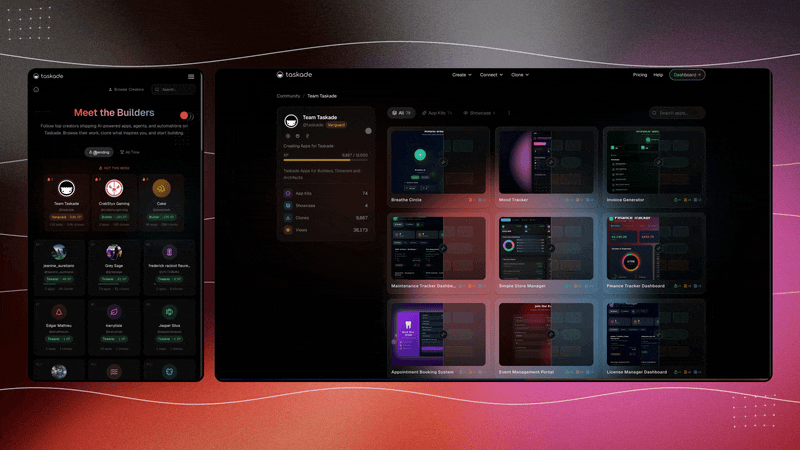

# Clone Apps. Add Login. Run Agents.

The hardest part of building anything is the blank page. A finished app you can clone in one click is the opposite of a blank page — it already has the tables, the screens, the agents, and the automations someone smart already thought through. You start from *working*, not from *nothing*.

That is the whole idea behind cloning community apps in **Taskade Genesis**. Instead of describing an app from scratch, you browse a gallery of complete, working apps other builders have shared, clone the one closest to what you need, and make it yours: rename it, swap in your data, add secure sign-in so the right people can use it, and turn on the AI agents that came baked in. No engineers. No backend. No blank page.

This guide is for the builder who would rather remix than reinvent. It covers what a clone actually copies (more than you'd guess), how to make a cloned app your own, how to add login without touching a server, how to run the built-in agents, how to publish on a domain you own, and which community apps are worth cloning first.

[](https://www.taskade.com/templates)

> Start from a finished app, not a blank screen — [browse clonable apps in the template gallery](https://www.taskade.com/templates).

---

## The promise: start from a finished app

Here is the honest claim, stated plainly.

You do not have to build a business app from zero. Other people — and Taskade itself — have already built CRMs, invoice generators, client portals, knowledge bases, and storefronts as real, working Genesis apps. You can clone any of them in one click and get the *entire* app, not a screenshot or an empty shell: the data structure, the AI agents, the automations, and the UI, all wired together and running the moment it lands in your workspace.

From there you do the part only you can do — make it about *your* business. Rename it. Replace the sample data with yours. Adjust a field, tighten an agent's instructions, add a sign-in gate. None of that requires code, a deploy step, or someone on a payroll who knows what a deploy step is.

The leverage is the head start. A blank prompt gets you a working app in an afternoon. A clone gets you to "now I'm just customizing" in about a minute, because the architecture decisions — what tables to have, how they link, what the agents should do — are already made by someone who shipped it. You inherit their thinking and bend it to your case.

What you still bring is judgment about your own business. The clone removes the construction. It does not remove the part where you decide what *your* version should be — and that is exactly the part you're good at.

---

## What one click actually clones

This is the part people underestimate. Cloning a community app is not "copy the layout." It copies the whole machine, intact and connected.

| What you get | What it means | Why it matters |
| --- | --- | --- |
| **The full data structure** | Every table, field, and the relationships between them (e.g. a deal links to a customer, an invoice links to a client). | You inherit a data model that already works — not a flat list you have to normalize by hand. |
| **The AI agents** | The agents the original builder wired in, with their instructions and the data they read and act on. | The app does work *for* you from minute one, not just store what you type. |
| **The automations** | The rules that fire on their own — a follow-up when something goes quiet, a task created when a record changes state. | The boring hygiene that makes an app actually get used comes along for the ride. |
| **The UI / screens** | The views, forms, and dashboards over that data — list, board, table, calendar, and any summary screens. | Your team gets something clickable, not raw rows. |
| **The structure, not the secrets** | You clone the *app*, not the original builder's private records or their connected accounts. | You start with a clean app shaped right, then fill it with your own data and connect your own tools. |

So when you clone a CRM app from the gallery, you get the Customers / Deals / Activities tables, the pipeline dashboard, the "draft a follow-up after 7 quiet days" automation, and the Deal Coach agent — as a fresh, empty app you now own. You did not draw any of it. You just decided it was close, and clicked.

```
         ┌──────────────────────────────────────────┐
         │        COMMUNITY GALLERY (clonable)        │
         │   CRM · Invoices · Client Portal · Wiki    │
         └─────────────────────┬──────────────────────┘
                               │  one click
                               ▼
         ┌──────────────────────────────────────────┐
         │            YOUR NEW APP (a copy)           │
         │  data structure · agents · automations ·   │
         │                   UI / screens              │
         └─────────────────────┬──────────────────────┘
                  rename · add data · add login · run agents
                               ▼
         ┌──────────────────────────────────────────┐
         │     YOUR LIVE APP on your own domain        │
         └──────────────────────────────────────────┘
```

Everything in that middle box arrives connected. When you later change a field or add a record, the dashboard, the automations, and the agents all stay in sync — because they're parts of one app, not three tools you stitched together.

---

## Where to find apps worth cloning

Clonable apps live in two places, and both are open to browse before you commit.

- **The template gallery.** The [Taskade template gallery](https://www.taskade.com/templates) is the front door — a browsable shelf of complete apps and layouts you can clone and bend to your needs. Skim by category, open one to see how it's built, and clone it if it's close.
- **Apps shared by other builders.** Community creators publish working Genesis apps for others to clone. You are not just getting Taskade's official starters — you're getting real apps real people shipped, which means you often find something closer to your exact case than a generic template.

A good cloning instinct: do not hunt for the *perfect* match. Find the one that's 70% there — the right shape, the right kind of agents — and clone it. The last 30% is faster to customize than it is to find.

---

## Making it yours

A cloned app is a starting point you own, not a fixed template you're stuck inside. Here's the order that works.

1. **Rename it.** Give the app, and the tables inside it, names that match how your team actually talks. "Deals" might become "Opportunities"; "Clients" might become "Members." Small thing, big difference in whether people use it.
2. **Clear the sample data, add yours.** Delete the demo records and drop in three or four real ones. Nothing tells you whether an app fits like seeing your own data in it — you'll immediately spot what's missing or misnamed.
3. **Tweak the structure.** Add a field the original didn't have (a "Renewal date," a "Region"). Remove one you'll never use. Add or drop a view. In Genesis, you do this by describing the change in plain English, not by hunting through settings — editing is the same skill as building.
4. **Point the agents at your knowledge.** Give the built-in agents your tone of voice, your best past examples, your product one-pager. Agents are only as good as the brief and the memory you feed them — make them sound like your company, not a generic assistant. More on agent memory and connecting your tools in [Connect tools and automate](../guides/connect-tools-and-automate.md).

The principle: every change is a description or a click, not a development ticket. The cloned app stays as malleable as the day it landed in your workspace.

---

## Adding secure sign-in, no backend needed

A cloned app is useful the moment it's yours. It becomes a *real* business app the moment the right people can sign in and the wrong people can't.

Normally, adding login is the part that quietly summons an engineer — user accounts, password resets, sessions, a database to store all of it, a server to run it on. Genesis includes that layer. You add login by asking for it, and it works.

- **Add sign-in to the cloned app.** Turn on authentication so the app requires a login to open. There's no auth service to wire up, no user table to design, no backend to stand up — the login layer is part of the app Genesis hosts for you.
- **Decide who gets in.** Invite your team, your clients, or your members and control who can see and edit what. A client portal lets each client see only their own records; an internal CRM stays gated to staff.
- **Keep your data behind the gate.** Your workspace data stays in your workspace, and the login you turned on decides who can reach the app at all. You also control what each agent can see and which tools it connects to.

The point is the absence of plumbing. You wanted "only the right people can use this." You got it without standing up a single piece of infrastructure.

---

## Running the built-in agents

The agents came with the clone — now put them to work. This is what separates a Genesis app from a static template: the app *does things*, it doesn't just hold things.

1. **See what the agents do.** Open each agent and read its job. A cloned CRM might include a Deal Coach (reads a deal's activity, suggests the next step) and a Follow-up Writer (drafts outreach when a deal goes quiet). Know what each one is for before you turn it loose.
2. **Re-brief them for your business.** Adjust each agent's instructions to match your process and voice. The original builder wrote a brief for *their* company; rewrite it for yours.
3. **Start in draft-and-approve mode.** Let an agent draft what it *would* send or do, and review it first. Watch a few rounds. Trust is earned one good week at a time.
4. **Let them run — and let them work together.** Once the output is consistently right, let agents act on their own and hand work to each other, so the app keeps moving without you watching it. The full pattern for agent teams is in [What is an AI workspace?](../guides/ai-workspace.md).

You didn't build these agents. You inherited them, pointed them at your data and your voice, and now they run your app's busywork while you do the thinking.

---

## Publishing on your own domain

An app that lives at a random URL feels like a tool you rent. One on your own domain feels like software you own — and that difference matters when people log in every day.

1. **Finish and test it.** Add real data, click through the screens, confirm the agents and automations behave, check that login gates the app. Publish only what you'd actually use.
2. **Publish from Genesis.** The cloned-and-customized app becomes a hosted, live application with sign-in — no deploy step, no server to manage, no engineer to ask.
3. **Connect a domain you own.** Point an address like `portal.yourcompany.com` at the published app so people reach it somewhere that looks and feels like yours.
4. **Invite people and set access.** Send the sign-in link and control who sees and edits what. The login layer you added earlier does its job from here on.

From your users' side, the result is simple: they go to your URL, sign in, and use an app that looks like yours — because it is. They never know it started as a clone.

---

## Example apps worth cloning

Five common starting points. Each is faster to clone-and-customize than to build from a blank prompt — and each can have login added in a click.

- **CRM.** Customers, deals, and activities with a pipeline dashboard and follow-up agents. Clone it, gate it to your sales team, point the agents at your voice. If you'd rather understand the full anatomy first, see [Build a CRM with AI](../genesis/build-a-crm-with-ai.md).
- **Invoice generator.** A client table, an invoice table, line items, and totals — plus an agent that drafts invoices and an automation that nudges on overdue ones. Add sign-in so only your finance folks get in.
- **Client portal.** A gated space where each client signs in to see their own projects, files, or requests. This is the clearest case for login: the whole point is that clients see *only their own* records.
- **Knowledge base / wiki.** A searchable, structured set of articles your team or your customers can read, with an agent that answers questions from the content. Gate it to staff, or publish a customer-facing version.
- **Storefront.** A product catalog with checkout, useful when your app needs to take money. Clone it, add your products, and — because Genesis includes a payments layer — start selling without building a backend.

Pick the one closest to your case, clone it, and spend your energy on what makes your version yours instead of on assembling parts.

---

## FAQ

**What does "clone an app" actually copy?**
The full app: its data structure (tables, fields, and the links between them), the AI agents and their instructions, the automations, and the UI. You get a working copy you own — empty of the original's private data, ready for yours. It's a head start, not a screenshot.

**Do I need to know how to code?**
No. You clone with a click, customize by describing changes in plain English or editing directly, add login by turning it on, and publish without a deploy step. There's no code to write and no backend to manage.

**How is cloning different from starting from a blank prompt?**
A blank prompt builds an app from your description. Cloning starts from an app someone already built and shipped, so the architecture decisions are made for you. Cloning is faster when something close exists; a fresh prompt is better when your idea is genuinely new. You can also clone first and then reshape it with a Genesis prompt — the two mix freely.

**Where do clonable apps come from?**
From the [Taskade template gallery](https://www.taskade.com/templates) and from community creators who publish their working apps for others to clone. You're often cloning a real app a real builder shipped, not just a generic starter.

**How do I add login without a backend?**
You turn on authentication in the app and invite the people who should have access. Genesis hosts the login layer for you — no auth service to integrate, no user table to design, no server to run. You decide who gets in and what they can see.

**Can the built-in agents actually do work?**
Yes. They read and act on the app's data — drafting outreach, suggesting next steps, answering from your knowledge base — and once you trust them, they run on their own and hand work to each other. Re-brief them for your business so they sound like you.

**Is my data private once I clone an app?**
Your workspace data stays in your workspace, and the login you add gates who can reach the app at all. You control what each agent can see and which tools it connects to. Start agents in read-only or draft mode if you want to watch before you trust.

**Can I sell access or take payments from a cloned app?**
Yes — Genesis includes a payments layer, so a cloned storefront or a portal that bills retainers can take money without you building a backend. Add it by describing it, or leave it out for an internal app.

---

## Related

- [Build a CRM with AI](../genesis/build-a-crm-with-ai.md) — the full anatomy of one app you can clone and customize
- [Connect tools and automate](../guides/connect-tools-and-automate.md) — give your cloned app's agents memory and wire in the tools you already use
- [What is an AI workspace?](../guides/ai-workspace.md) — the pillar concept behind memory, agents, and execution in one place
- [Browse the template gallery](https://www.taskade.com/templates) — the shelf of clonable apps and layouts

---

**Ready to remix?** [Browse clonable apps in the gallery →](https://www.taskade.com/templates), or [start from a prompt in Taskade Genesis](https://www.taskade.com/ai/apps) — clone, customize, and ship.
