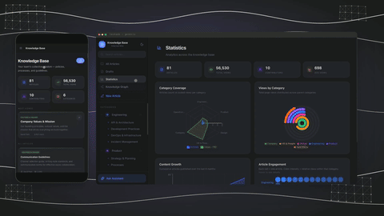

# Personal Productivity: Map Your Mind, Plan Tasks, Track Habits

Most productivity advice asks you to pick a lane. A note app for thinking. A task app for doing. A separate tracker for habits. So your day ends up scattered across three tools that don't talk to each other — and the work of keeping them in sync becomes its own chore. The promise of a **personal productivity app** is the opposite: one place to think, plan, and follow through, where the idea you had this morning becomes the task you do this afternoon and the habit you keep all month.

This page shows how to run your whole personal operating system in one workspace built around three moves: **map your mind**, **plan tasks**, and **track habits**. It's written for an individual — a student, a founder, a creator — not an IT department. You don't need to be technical, and you don't need to glue anything together. The point is to stop managing your tools and start running your life from one surface.

The workspace that makes this work is **Taskade Genesis** — an AI-native workspace where your notes, mind maps, tasks, and habits live together, with AI that can read all of it and help you move. Below, the three moves, then how AI turns them into a daily system, with example setups you can copy.

---

## The promise: one place to think, plan, and follow through

Here's the failure mode almost everyone knows by heart. You capture a great idea in a notes app. The to-dos that idea implies go into a task app — re-typed by hand, already slightly out of date. The habit you need to build to make it real goes into a third app you check for a week and then forget. Three surfaces, three logins, and the connective tissue — *this idea leads to these tasks which depend on this routine* — lives nowhere except your head, which is exactly where you didn't want it.

A real personal productivity system collapses that into one motion:

- **Think** — get the messy contents of your head into a shape you can see.
- **Plan** — turn that shape into concrete, doable tasks with dates and priorities.
- **Follow through** — build the repeatable habits that actually move the plan forward, day after day.

When all three live in the same workspace, nothing has to be copied between tools, nothing falls out of sync, and the same AI can see your thinking, your tasks, and your routines at once. That's the difference between a stack of apps and a system. The rest of this page is the three moves and how to wire them together.

---

## Map Your Mind: turn scattered thoughts into a visual map

Thinking doesn't arrive as a tidy list. It comes in clusters — half-formed, out of order, related in ways you can't see until they're in front of you. A blank document is the wrong container for that; it forces you to commit to a sequence before you understand the shape. A **mind map** is the right one. One central idea in the middle, branches for the big pieces, twigs for the details — a picture of how your thoughts actually connect.

In Taskade, the map is one of seven views over the same project, so it isn't a drawing you'll have to redo later — it's real, structured data from the moment you make it. The fastest way to start is to let the AI build the first draft:

1. **Dump the topic.** Open a project, switch to **Mind Map** view, and describe what's on your mind in plain English — *"everything I need to do to apply to grad school"* or *"my idea for a side business."*
2. **Get a branching structure back.** The AI returns a full map: central topic, main branches, sub-branches already filled in. You start from a draft instead of a blank canvas — and editing a structure is far easier than inventing one cold.
3. **Make it yours.** Drag branches around, rename them, prune what doesn't apply, and add the specifics only you know. The generic map becomes your map in a couple of minutes.

This is the thinking move — the **knowledge graph** of your own head, made visible. Seeing the shape tells you something a list never could: which part you've over-thought, which part you've been avoiding, where the real work actually sits. For the full how-to on generating and refining maps, see the [AI Mind Map Generator](../tools/ai-mind-map-generator.md).

And because the map is structured data, it doesn't dead-end. The same project you mapped is one click from becoming the plan.

---

## Plan Tasks: break goals into doable steps across views

A goal you can't see is a goal you won't finish. "Apply to grad school" is not a task — it's a fog. The job of planning is to turn the fog into a short list of next physical actions, each small enough that starting it requires no deliberation. That's the **plan** move: break the goal down until every leaf is something you could literally do today.

Because your mind map is already the same project, planning isn't a fresh start. Flip the project to **List** view and your branches are tasks. Add dates, priorities, and sub-tasks, and the picture you drew to think becomes the checklist you run. Nothing is re-entered. Nothing drifts out of sync.

The reason Taskade fits a personal system so well is that the *same* tasks can be seen however the moment needs:

- **List** — the everyday default. A clean, nestable outline for "what's next." Best for daily and weekly planning.
- **Board** — Kanban columns (To Do / Doing / Done). Best for seeing flow and limiting how much you've got in progress at once.
- **Calendar** — your tasks on dates. Best for protecting time and seeing the week honestly, instead of pretending everything fits.

There are seven views in all — List, Board, Calendar, Table, Mind Map, Gantt, and Org Chart — over one set of data. You're never copying tasks from a "planning" tool into a "calendar" tool. You're rotating one project to the angle that helps right now. That single-source-of-truth idea is the spine of the whole workspace; for the bigger picture see [What Is an AI Workspace?](../guides/ai-workspace.md).

---

## Track Habits: build streaks and routines that stick

Goals are won and lost on the boring days. A plan tells you *what* to do once; a habit makes you do the right thing *repeatedly* without re-deciding every time. The **follow-through** move is where most personal systems quietly collapse — not because the plan was wrong, but because the daily routine that powers it never took hold.

Tracking habits in the same workspace as your tasks closes that gap. Instead of a separate streak app you forget to open, your routines sit next to the work they support:

- **A recurring checklist.** Make a project for your daily or weekly routine — *morning pages, 30 minutes of deep work, gym, read 10 pages* — and check items off each day. The act of checking is the reward; the visible streak is the motivation to keep it going.
- **A habit board.** Use Board view to move habits through *Planned → Today → Done*, so the day has a clear start and a clear finish line.
- **A calendar of consistency.** Put recurring habits on the Calendar and you can *see* the streak forming — and feel the pull not to break the chain.

The honest part: a tracker doesn't build the habit *for* you — only showing up does. What the workspace gives you is the thing trackers usually lack — **context**. Your "write 500 words" habit lives right beside the book project it's feeding, so the routine never feels disconnected from the point of doing it. That's the quiet advantage of habits, tasks, and thinking sharing one home.

A small practical note on streaks: the goal isn't a perfect chain, it's a *recoverable* one. Miss a day and the system shouldn't make you feel like the whole thing is ruined — that's how trackers get abandoned. Because your habits sit next to live work rather than in a separate app you have to deliberately reopen, the cost of getting back on track is just checking the next box in a workspace you're already in. The habit survives the missed day because it never left your line of sight.

---

## How AI helps across all three

The reason to keep thinking, planning, and habits in one workspace isn't just tidiness — it's that the AI can see *all of it at once* and help you move. It's not a chatbot in a side panel that forgets your context. It reads your projects and acts inside them. A few of the most useful moves:

- **Expand a topic.** Point the AI at a thin branch of your mind map and ask it to go deeper — *"break this down further"* — and it grows the sub-tree without disturbing the rest. The blank-page problem disappears.
- **Prioritize a day.** Hand the AI your task list and ask *"what should I focus on today?"* It can sort by urgency and importance, flag what's overdue, and propose a realistic short list instead of an intimidating dump. See [AI-prioritized tasks](../guides/ai-workspace.md) in action as part of the workspace.
- **Suggest next steps.** Stuck on a project? Ask *"what's the obvious next action here?"* and get a concrete first step small enough to actually start.
- **Turn a goal into a system.** Describe an outcome and the AI can draft the mind map, the task breakdown, *and* the supporting habit checklist in one go — the three moves, generated together.

The AI's value here is leverage on the part you find hardest — usually starting, structuring, or deciding what's next. Your judgment still closes the last mile. It gets you to a strong draft in seconds; you make it true.

The honest framing matters: the AI is fast and tireless, not omniscient. It can propose a sensible order for your day, but it doesn't know that your 2pm energy crash is real or that the "quick" call always runs long — you do. So treat its suggestions the way you'd treat a sharp assistant's: a strong default you adjust, not an order you obey. Used that way, it removes the friction of starting without taking the wheel.

---

## One prompt → your daily operating system

Here's the idea that ties it together. Because the AI can see your whole workspace and build inside it, you don't have to assemble your system piece by piece. You can describe the life you're trying to run and let it draft the scaffolding.

Try a prompt like:

> *"Set me up to write a novel in a year. Make a mind map of the plot and characters, a task plan with weekly milestones, and a daily writing habit I can check off."*

What comes back isn't advice — it's a working setup inside your workspace: a **mind map** of the story, a **task plan** broken into milestones across List and Calendar views, and a **habit checklist** for the daily word count. One sentence in, your personal operating system out. From there you edit, because it's yours and it's real data — not a static template you have to copy by hand.

That's the leap a true personal productivity app makes over a stack of separate tools: the thing you describe and the thing you run are the same thing. And if a personal project ever grows up — a side business, a community, a tool other people want to use — the same workspace can take it further with **Genesis**, which builds a complete, hosted, working app from a plain-English description: database, AI agents, automations, UI, login and auth, payments, and a custom domain. Most of the time you'll never need that. But it's the difference between a planner that boxes you in and one that never becomes the ceiling. Start at the [Genesis app builder](https://www.taskade.com/ai/apps).

---

## Example setups you can copy

Same three moves, very different lives. Here's how the system looks for three kinds of people.

### The student

- **Map:** A mind map per course — topics as branches, lectures and readings as twigs. Generate the skeleton from the syllabus, then fill in as the term goes.
- **Plan:** Flip to Calendar view so assignments and exam dates sit on real dates. List view holds the week's reading and problem sets.
- **Habits:** A daily checklist — *review notes, one study block, no all-nighters.* The streak is the proof you're keeping up, not cramming.

### The founder

- **Map:** A knowledge graph of the business — product, customers, growth, ops — as the living picture of what you're building.
- **Plan:** Board view for the current sprint, Calendar for investor and launch dates. The AI prioritizes the day so you spend energy on what moves the needle, not what's loudest.
- **Habits:** A morning routine that protects deep work before the inbox eats the day — *plan top 3, one hour of building, then meetings.*

### The creator

- **Map:** A content map — pillars as branches, individual pieces as twigs — so you always have a backlog of ideas with shape.
- **Plan:** A content calendar in Calendar view; a Board to track each piece from *idea → drafting → editing → published.*
- **Habits:** A daily make-something streak — *write 500 words, sketch one concept, ship one post* — sitting right beside the projects it feeds.

Each of these is one workspace, three moves, and an AI that can see all of it. None of them require a second app. For turning a personal knowledge map into a reference others can search, see [Build a Wiki](../use-cases/build-a-wiki.md).

---

## Templates

You don't have to build from a blank project. Taskade's gallery has ready-made setups for daily planners, habit trackers, study systems, goal frameworks, and content calendars — each one a real project you can open, switch between views, and expand with the AI. Browse them at [taskade.com/templates](https://www.taskade.com/templates), pick the one closest to your life, and make it yours in a few edits.

---

## FAQ

**Is Taskade free to use as a personal productivity app?**
Yes — you can build mind maps, plan tasks across views, and run habit checklists in a personal workspace, and explore the [template gallery](https://www.taskade.com/templates) without committing to a plan. The fastest way to judge it is to set up one real goal you're working on right now.

**Do I need to be technical to use this?**
No. Everything is plain English and drag-and-drop. You describe what you want, edit by typing and dragging, and the AI handles the structure. There's nothing to configure and no code involved.

**How is this different from using a notes app plus a to-do app?**
Those are separate tools that don't share data, so you re-type tasks, drift out of sync, and the connections between your thinking and your doing live only in your head. Here, the mind map *is* the task list *is* the project — one source of truth — and one AI can see all of it at once.

**Can it really track habits, or just tasks?**
Both. A recurring checklist, a habit board, or a calendar of streaks all live in the same workspace as the projects they support — so your routines stay connected to the reason you're keeping them, which is what makes them stick.

**What does the AI actually do for me day to day?**
It expands a topic when you're stuck, prioritizes your day from your task list, suggests the obvious next step, and can draft a whole setup — map, plan, and habits — from a single sentence. It's leverage on the hard parts: starting, structuring, and deciding what's next.

**Can I use it on my phone?**
Yes. The same workspace runs on web, desktop, and mobile in real time, so you can capture a thought on your phone and find it already on your laptop — no syncing, no export.

**What if my personal project grows into something real?**
Then the same workspace scales with you. A side project can stay a simple plan, or — if it becomes a business or a tool other people use — you can take it to the [Genesis app builder](https://www.taskade.com/ai/apps) and turn it into a working app. The planner never becomes the ceiling.

---

## Related

- [AI Mind Map Generator](../tools/ai-mind-map-generator.md) — the full how-to for the "map your mind" move
- [What Is an AI Workspace?](../guides/ai-workspace.md) — how memory, intelligence, and execution live in one place
- [Build a Wiki](../use-cases/build-a-wiki.md) — turn your personal knowledge into a searchable reference
- [Introducing Taskade Genesis](https://www.taskade.com/blog/introducing-taskade-genesis) — when a personal project grows into a real app

---

**Ready to run your day from one place?** [Start your free workspace at taskade.com](https://www.taskade.com) — map your mind, plan your tasks, and build the habits that follow through.
